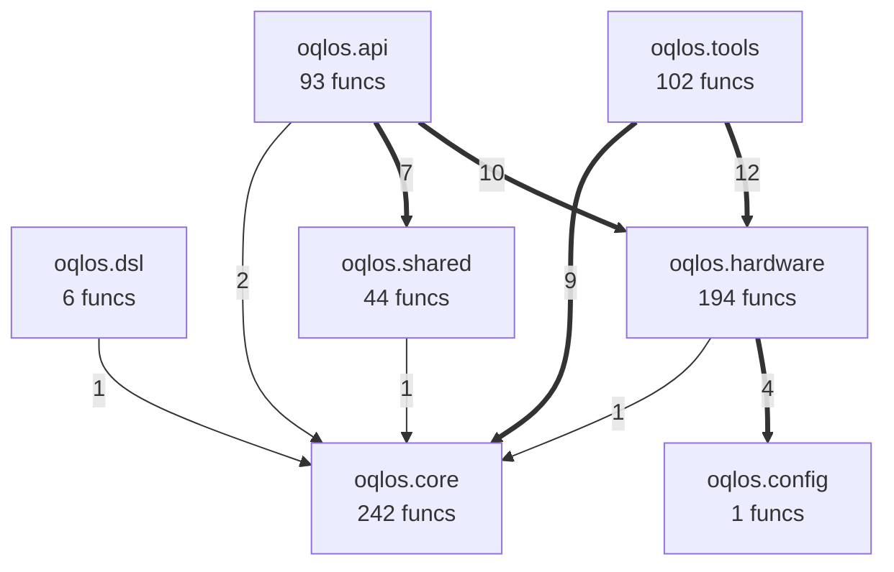

# OqlOS — Operation Query Language Runtime

OqlOS — Operation Query Language runtime for hardware testing

## Metadata

- **name**: `oqlos`
- **version**: `0.1.1`
- **python_requires**: `>=3.10`
- **license**: Apache-2.0
- **ai_model**: `openrouter/qwen/qwen3-coder-next`
- **ecosystem**: SUMD + DOQL + testql + taskfile
- **openapi_title**: oqlos API v1.0.0
- **generated_from**: pyproject.toml, Taskfile.yml, testql(6), openapi(49 ep), app.doql.less, app.doql.css, pyqual.yaml, goal.yaml, .env.example, Dockerfile, docker-compose.dev.yml, src(1 mod), project/(10 analysis files)

## Intent

OqlOS — Operation Query Language runtime for hardware testing

## Architecture

```
SUMD (description) → DOQL/source (code) → taskfile (automation) → testql (verification)
```

### DOQL Application Declaration (`app.doql.less`, `app.doql.css`)

```less
// LESS format — define @variables here as needed

app {
  name: oqlos;
  version: 0.1.1;
}

entity[name="ExecutionStatus"] {

}

entity[name="CommandEnvelope"] {

}

entity[name="Step"] {

}

entity[name="ValidationRule"] {

}

entity[name="Goal"] {

}

entity[name="Scenario"] {

}

entity[name="Peripheral"] {

}

interface[type="api"] {
  type: rest;
  framework: fastapi;
}

interface[type="cli"] {
  framework: argparse;
}
interface[type="cli"] page[name="oqlctl"] {

}

integration[name="modbus"] {
  type: hardware;
  type: hardware;
}

workflow[name="install"] {
  trigger: manual;
  step-1: run cmd=pip install -e .[dev];
}

workflow[name="quality"] {
  trigger: manual;
  step-1: run cmd=pyqual run;
}

workflow[name="quality:fix"] {
  trigger: manual;
  step-1: run cmd=pyqual run --fix;
}

workflow[name="quality:report"] {
  trigger: manual;
  step-1: run cmd=pyqual report;
}

workflow[name="test"] {
  trigger: manual;
  step-1: run cmd=pytest -q;
}

workflow[name="lint"] {
  trigger: manual;
  step-1: run cmd=ruff check .;
}

workflow[name="fmt"] {
  trigger: manual;
  step-1: run cmd=ruff format .;
}

workflow[name="build"] {
  trigger: manual;
  step-1: run cmd=python -m build;
}

workflow[name="clean"] {
  trigger: manual;
  step-1: run cmd=rm -rf build/ dist/ *.egg-info;
}

workflow[name="hardware:check"] {
  trigger: manual;
  step-1: run cmd=oqlctl --status || echo "Hardware not available (mock mode)";
}

workflow[name="hardware:identify"] {
  trigger: manual;
  step-1: run cmd=oqlctl --identify;
}

workflow[name="doql:adopt"] {
  trigger: manual;
  step-1: run cmd=if ! command -v {{.DOQL_CMD}} >/dev/null 2>&1; then
echo "⚠️  doql not installed. Install: pip install doql"
exit 1
fi;
  step-2: run cmd={{.DOQL_CMD}} adopt {{.PWD}} --output app.doql.css --force;
  step-3: run cmd={{.DOQL_CMD}} export --format less -o {{.DOQL_OUTPUT}};
  step-4: run cmd=echo "✅ Project structure captured in {{.DOQL_OUTPUT}}";
}

workflow[name="doql:validate"] {
  trigger: manual;
  step-1: run cmd=if [ ! -f "{{.DOQL_OUTPUT}}" ]; then
echo "❌ {{.DOQL_OUTPUT}} not found. Run: task doql:adopt"
exit 1
fi;
  step-2: run cmd={{.DOQL_CMD}} validate;
}

workflow[name="doql:doctor"] {
  trigger: manual;
  step-1: run cmd={{.DOQL_CMD}} doctor;
}

workflow[name="doql:build"] {
  trigger: manual;
  step-1: run cmd=if [ ! -f "{{.DOQL_OUTPUT}}" ]; then
echo "❌ {{.DOQL_OUTPUT}} not found. Run: task doql:adopt"
exit 1
fi;
  step-2: run cmd=# Regenerate LESS from CSS if CSS exists
if [ -f "app.doql.css" ]; then
{{.DOQL_CMD}} export --format less -o {{.DOQL_OUTPUT}}
fi;
  step-3: run cmd={{.DOQL_CMD}} build app.doql.css --out build/;
}

workflow[name="help"] {
  trigger: manual;
  step-1: run cmd=task --list;
}

deploy {
  target: docker-compose;
  compose_file: docker/docker-compose.dev.yml;
}

environment[name="local"] {
  runtime: docker-compose;
  env_file: .env;
}

environment[name="dev"] {
  runtime: docker-compose;
}

environment[name="prod"] {
  runtime: docker-compose;
}
```

```css
app {
  name: "oqlos";
  version: "0.1.1";
}

entity[name="ExecutionStatus"] {

}

entity[name="CommandEnvelope"] {

}

entity[name="Step"] {

}

entity[name="ValidationRule"] {

}

entity[name="Goal"] {

}

entity[name="Scenario"] {

}

entity[name="Peripheral"] {

}

interface[type="api"] {
  type: rest;
  framework: fastapi;
}

interface[type="cli"] {
  framework: argparse;
}
interface[type="cli"] page[name="oqlctl"] {

}

integration[name="modbus"] {
  type: "hardware";
}

workflow[name="install"] {
  trigger: "manual";
  step-1: run cmd=pip install -e .[dev];
}

workflow[name="quality"] {
  trigger: "manual";
  step-1: run cmd=pyqual run;
}

workflow[name="quality:fix"] {
  trigger: "manual";
  step-1: run cmd=pyqual run --fix;
}

workflow[name="quality:report"] {
  trigger: "manual";
  step-1: run cmd=pyqual report;
}

workflow[name="test"] {
  trigger: "manual";
  step-1: run cmd=pytest -q;
}

workflow[name="lint"] {
  trigger: "manual";
  step-1: run cmd=ruff check .;
}

workflow[name="fmt"] {
  trigger: "manual";
  step-1: run cmd=ruff format .;
}

workflow[name="build"] {
  trigger: "manual";
  step-1: run cmd=python -m build;
}

workflow[name="clean"] {
  trigger: "manual";
  step-1: run cmd=rm -rf build/ dist/ *.egg-info;
}

workflow[name="hardware:check"] {
  trigger: "manual";
  step-1: run cmd=oqlctl --status || echo "Hardware not available (mock mode)";
}

workflow[name="hardware:identify"] {
  trigger: "manual";
  step-1: run cmd=oqlctl --identify;
}

workflow[name="doql:adopt"] {
  trigger: "manual";
  step-1: run cmd=if ! command -v {{.DOQL_CMD}} >/dev/null 2>&1; then
  echo "⚠️  doql not installed. Install: pip install doql"
  exit 1
fi;
  step-2: run cmd={{.DOQL_CMD}} adopt {{.PWD}} --output app.doql.css --force;
  step-3: run cmd={{.DOQL_CMD}} export --format less -o {{.DOQL_OUTPUT}};
  step-4: run cmd=echo "✅ Project structure captured in {{.DOQL_OUTPUT}}";
}

workflow[name="doql:validate"] {
  trigger: "manual";
  step-1: run cmd=if [ ! -f "{{.DOQL_OUTPUT}}" ]; then
  echo "❌ {{.DOQL_OUTPUT}} not found. Run: task doql:adopt"
  exit 1
fi;
  step-2: run cmd={{.DOQL_CMD}} validate;
}

workflow[name="doql:doctor"] {
  trigger: "manual";
  step-1: run cmd={{.DOQL_CMD}} doctor;
}

workflow[name="doql:build"] {
  trigger: "manual";
  step-1: run cmd=if [ ! -f "{{.DOQL_OUTPUT}}" ]; then
  echo "❌ {{.DOQL_OUTPUT}} not found. Run: task doql:adopt"
  exit 1
fi;
  step-2: run cmd=# Regenerate LESS from CSS if CSS exists
if [ -f "app.doql.css" ]; then
  {{.DOQL_CMD}} export --format less -o {{.DOQL_OUTPUT}}
fi;
  step-3: run cmd={{.DOQL_CMD}} build app.doql.css --out build/;
}

workflow[name="help"] {
  trigger: "manual";
  step-1: run cmd=task --list;
}

deploy {
  target: docker-compose;
  compose_file: docker/docker-compose.dev.yml;
}

environment[name="local"] {
  runtime: docker-compose;
  env_file: ".env";
}

environment[name="dev"] {
  runtime: docker-compose;
}

environment[name="prod"] {
  runtime: docker-compose;
}
```

### Source Modules

- `oqlos.config`

## Interfaces

### CLI Entry Points

- `oqlos-server`
- `oqlctl`
- `oqlos-events`

### REST API (from `openapi.yaml`)

```yaml
components:
  schemas:
    Error:
      properties:
        code:
          type: integer
        error:
          type: string
        message:
          type: string
      type: object
    HealthCheck:
      properties:
        status:
          enum:
          - ok
          - error
          type: string
        timestamp:
          format: date-time
          type: string
        version:
          type: string
      type: object
info:
  description: Auto-generated OpenAPI spec for oqlos
  title: oqlos API
  version: 1.0.0
openapi: 3.0.3
paths:
  /:
    get:
      operationId: index_page
      responses:
        '200': &id001
          content:
            application/json:
              schema:
                type: object
          description: Success
        '401': &id002
          description: Unauthorized
        '404': &id003
          description: Not Found
        '500': &id004
          description: Internal Server Error
      summary: Serve the firmware UI (index.html) at root
      tags:
      - fastapi
  /api/status:
    get:
      operationId: status
      responses:
        '200': *id001
        '401': *id002
        '404': *id003
        '500': *id004
      summary: GET /api/status
      tags:
      - fastapi
      - status
  /api/v1/commands:
    post:
      operationId: post_commands
      requestBody:
        content:
          application/json:
            schema:
              properties:
                description:
                  type: string
                name:
                  type: string
              type: object
        required: true
      responses:
        '201': &id005
          content:
            application/json:
              schema:
                type: object
          description: Created
        '400': &id006
          content:
            application/json:
              schema:
                properties:
                  detail:
                    type: string
                  error:
                    type: string
                type: object
          description: Bad Request
        '401': *id002
        '404': *id003
        '500': *id004
      summary: Command bus endpoint used by frontend.
      tags:
      - v1
      - fastapi
  /api/v1/editor/execute:
    post:
      operationId: execute_scenario
      requestBody:
        content:
          application/json:
            schema:
              type: object
        required: true
      responses:
        '201': *id005
        '400': *id006
        '401': *id002
        '404': *id003
        '500': *id004
      summary: Execute a scenario file using oqlos runtime.
      tags:
      - v1
      - fastapi
  /api/v1/editor/file/{file_path:path}:
    get:
      operationId: read_file_endpoint
      parameters:
      - in: path
        name: file_path:path
        required: true
        schema:
          type: string
      - in: query
        name: file_path
        required: false
        schema:
          type: str
      responses:
        '200': *id001
        '401': *id002
        '404': *id003
        '500': *id004
      summary: Read a file's content.
      tags:
      - v1
      - fastapi
    post:
      operationId: write_file_endpoint
      parameters:
      - in: path
        name: file_path:path
        required: true
        schema:
          type: string
      - in: query
        name: file_path
        required: false
        schema:
          type: str
      requestBody:
        content:
          application/json:
            schema:
              type: object
        required: true
      responses:
        '201': *id005
        '400': *id006
        '401': *id002
        '404': *id003
        '500': *id004
      summary: Write content to a file (creates parent directories as needed).
      tags:
      - v1
      - fastapi
  /api/v1/editor/files:
    get:
      operationId: list_files
      responses:
        '200': *id001
        '401': *id002
        '404': *id003
        '500': *id004
      summary: List all entries in the scenarios directory.
      tags:
      - v1
      - fastapi
  /api/v1/execution/by-id/{execution_id}:
    get:
      operationId: get_execution
      parameters:
      - in: path
        name: execution_id
        required: true
        schema:
          type: string
      - in: query
        name: execution_id
        required: false
        schema:
          type: str
      responses:
        '200': *id001
        '401': *id002
        '404': *id003
        '500': *id004
      summary: Get execution status
      tags:
      - v1
      - fastapi
  /api/v1/execution/logs:
    get:
      operationId: get_execution_logs
      responses:
        '200': *id001
        '401': *id002
        '404': *id003
        '500': *id004
      summary: Return execution logs for frontend polling.
      tags:
      - v1
      - fastapi
  /api/v1/execution/logs/stream:
    get:
      operationId: execution_logs_stream
      responses:
        '200': *id001
        '401': *id002
        '404': *id003
        '500': *id004
      summary: Stream execution logs for terminal view
      tags:
      - v1
      - fastapi
  /api/v1/execution/projection:
    get:
      operationId: get_execution_projection
      responses:
        '200': *id001
        '401': *id002
        '404': *id003
        '500': *id004
      summary: Return a lightweight execution projection used by the frontend polling
        fallback.
      tags:
      - v1
      - fastapi
  /api/v1/execution/start:
    post:
      operationId: start_execution
      requestBody:
        content:
          application/json:
            schema:
              type: object
        required: true
      responses:
        '201': *id005
        '400': *id006
        '401': *id002
        '404': *id003
        '500': *id004
      summary: Start scenario execution
      tags:
      - v1
      - fastapi
  /api/v1/execution/status:
    get:
      operationId: get_execution_status
      responses:
        '200': *id001
        '401': *id002
        '404': *id003
        '500': *id004
      summary: Return textual logs and status for polling fallback when SSE is unavailable.
      tags:
      - v1
      - fastapi
  /api/v1/execution/step:
    post:
      operationId: execute_step
      requestBody:
        content:
          application/json:
            schema:
              type: object
        required: true
      responses:
        '201': *id005
        '400': *id006
        '401': *id002
        '404': *id003
        '500': *id004
      summary: Execute a single DSL step within the current (or new) execution.
      tags:
      - v1
      - fastapi
  /api/v1/execution/stream:
    get:
      operationId: execution_stream
      responses:
        '200': *id001
        '401': *id002
        '404': *id003
        '500': *id004
      summary: Stream execution events for frontend polling fallback
      tags:
      - v1
      - fastapi
  /api/v1/hardware/health:
    get:
      operationId: hardware_health
      responses:
        '200': *id001
        '401': *id002
        '404': *id003
        '500': *id004
      summary: Return connectivity status for all hardware services.
      tags:
      - v1
      - fastapi
  /api/v1/hardware/identify:
    get:
      operationId: hardware_identify
      responses:
        '200': *id001
        '401': *id002
        '404': *id003
        '500': *id004
      summary: 'Return full hardware identification: registry + live probe results.'
      tags:
      - v1
      - fastapi
  /api/v1/hardware/lung:
    post:
      operationId: set_lung
      parameters:
      - in: query
        name: steps
        required: false
        schema:
          type: int
      - in: query
        name: speed
        required: false
        schema:
          type: int
      - in: query
        name: cycles
        required: false
        schema:
          type: int
      - in: query
        name: pause
        required: false
        schema:
          type: float
      requestBody:
        content:
          application/json:
            schema:
              type: object
        required: true
      responses:
        '201': *id005
        '400': *id006
        '401': *id002
        '404': *id003
        '500': *id004
      summary: Start artificial lung reciprocating motion (tic249 stepper).
      tags:
      - v1
      - fastapi
  /api/v1/hardware/lung/stop:
    post:
      operationId: stop_lung
      requestBody:
        content:
          application/json:
            schema:
              type: object
        required: true
      responses:
        '201': *id005
        '400': *id006
        '401': *id002
        '404': *id003
        '500': *id004
      summary: Emergency stop the artificial lung motor.
      tags:
      - v1
      - fastapi
  /api/v1/hardware/pump:
    post:
      operationId: set_pump
      parameters:
      - in: query
        name: power_pct
        required: false
        schema:
          type: float
      requestBody:
        content:
          application/json:
            schema:
              type: object
        required: true
      responses:
        '201': *id005
        '400': *id006
        '401': *id002
        '404': *id003
        '500': *id004
      summary: Directly set pump power % (for manual testing).
      tags:
      - v1
      - fastapi
  /api/v1/hardware/sensor/{sensor_id}:
    get:
      operationId: read_sensor
      parameters:
      - in: path
        name: sensor_id
        required: true
        schema:
          type: string
      - in: query
        name: sensor_id
        required: false
        schema:
          type: str
      responses:
        '200': *id001
        '401': *id002
        '404': *id003
        '500': *id004
      summary: Read a sensor value directly from hardware.
      tags:
      - v1
      - fastapi
  /api/v1/hardware/valve/{valve_id}:
    post:
      operationId: set_valve
      parameters:
      - in: path
        name: valve_id
        required: true
        schema:
          type: string
      - in: query
        name: valve_id
        required: false
        schema:
          type: str
      - in: query
        name: value
        required: false
        schema:
          type: bool
      requestBody:
        content:
          application/json:
            schema:
              type: object
        required: true
      responses:
        '201': *id005
        '400': *id006
        '401': *id002
        '404': *id003
        '500': *id004
      summary: Directly set a valve (for manual testing).
      tags:
      - v1
      - fastapi
  /api/v1/health:
    get:
      operationId: health_check
      responses:
        '200': *id001
        '401': *id002
        '404': *id003
        '500': *id004
      summary: Health check endpoint for tests and frontend compatibility probes.
      tags:
      - v1
      - fastapi
  /api/v1/logs/stats:
    get:
      operationId: get_log_stats
      responses:
        '200': *id001
        '401': *id002
        '404': *id003
        '500': *id004
      summary: Summary statistics from logs database.
      tags:
      - v1
      - fastapi
  /api/v1/peripherals/reset:
    post:
      operationId: reset_peripherals
      requestBody:
        content:
          application/json:
            schema:
              type: object
        required: true
      responses:
        '201': *id005
        '400': *id006
        '401': *id002
        '404': *id003
        '500': *id004
      summary: Reset all peripherals
      tags:
      - v1
      - fastapi
  /api/v1/peripherals/{peripheral_id}:
    get:
      operationId: get_peripheral
      parameters:
      - in: path
        name: peripheral_id
        required: true
        schema:
          type: string
      - in: query
        name: peripheral_id
        required: false
        schema:
          type: str
      responses:
        '200': *id001
        '401': *id002
        '404': *id003
        '500': *id004
      summary: Get specific peripheral
      tags:
      - v1
      - fastapi
    put:
      operationId: update_peripheral
      parameters:
      - in: path
        name: peripheral_id
        required: true
        schema:
          type: string
      - in: query
        name: peripheral_id
        required: false
        schema:
          type: str
      requestBody:
        content:
          application/json:
            schema:
              properties:
                data:
                  type: object
                id:
                  type: string
                name:
                  type: string
              type: object
        required: true
      responses:
        '200': *id001
        '401': *id002
        '404': *id003
        '500': *id004
      summary: Update peripheral via PUT (for tests)
      tags:
      - v1
      - fastapi
  /api/v1/peripherals/{peripheral_id}/set:
    post:
      operationId: set_peripheral
      parameters:
      - in: path
        name: peripheral_id
        required: true
        schema:
          type: string
      - in: query
        name: peripheral_id
        required: false
        schema:
          type: str
      - in: query
        name: mode
        required: false
        schema:
          type: str
      requestBody:
        content:
          application/json:
            schema:
              type: object
        required: true
      responses:
        '201': *id005
        '400': *id006
        '401': *id002
        '404': *id003
        '500': *id004
      summary: Update peripheral (manual mode)
      tags:
      - v1
      - fastapi
  /api/v1/plugins/:
    get:
      operationId: list_plugins
      responses:
        '200': *id001
        '401': *id002
        '404': *id003
        '500': *id004
      summary: List all registered hardware plugins.
      tags:
      - v1
      - fastapi
  /api/v1/plugins/status:
    get:
      operationId: get_plugin_status
      responses:
        '200': *id001
        '401': *id002
        '404': *id003
        '500': *id004
      summary: Get overall status of all plugins.
      tags:
      - v1
      - fastapi
  /api/v1/plugins/validate:
    post:
      operationId: validate_plugin_configs
      requestBody:
        content:
          application/json:
            schema:
              type: object
        required: true
      responses:
        '201': *id005
        '400': *id006
        '401': *id002
        '404': *id003
        '500': *id004
      summary: Validate configurations for multiple plugins.
      tags:
      - v1
      - fastapi
  /api/v1/plugins/{plugin_id}:
    get:
      operationId: get_plugin_info
      parameters:
      - in: path
        name: plugin_id
        required: true
        schema:
          type: string
      - in: query
        name: plugin_id
        required: false
        schema:
          type: str
      responses:
        '200': *id001
        '401': *id002
        '404': *id003
        '500': *id004
      summary: Get information about a specific plugin.
      tags:
      - v1
      - fastapi
  /api/v1/plugins/{plugin_id}/connect:
    post:
      operationId: connect_plugin
      parameters:
      - in: path
        name: plugin_id
        required: true
        schema:
          type: string
      - in: query
        name: plugin_id
        required: false
        schema:
          type: str
      requestBody:
        content:
          application/json:
            schema:
              type: object
        required: true
      responses:
        '201': *id005
        '400': *id006
        '401': *id002
        '404': *id003
        '500': *id004
      summary: Connect to a hardware plugin.
      tags:
      - v1
      - fastapi
  /api/v1/plugins/{plugin_id}/disconnect:
    post:
      operationId: disconnect_plugin
      parameters:
      - in: path
        name: plugin_id
        required: true
        schema:
          type: string
      - in: query
        name: plugin_id
        required: false
        schema:
          type: str
      requestBody:
        content:
          application/json:
            schema:
              type: object
        required: true
      responses:
        '201': *id005
        '400': *id006
        '401': *id002
        '404': *id003
        '500': *id004
      summary: Disconnect from a hardware plugin.
      tags:
      - v1
      - fastapi
  /api/v1/plugins/{plugin_id}/execute:
    post:
      operationId: execute_plugin_command
      parameters:
      - in: path
        name: plugin_id
        required: true
        schema:
          type: string
      - in: query
        name: plugin_id
        required: false
        schema:
          type: str
      requestBody:
        content:
          application/json:
            schema:
              type: object
        required: true
      responses:
        '201': *id005
        '400': *id006
        '401': *id002
        '404': *id003
        '500': *id004
      summary: Execute a command on a hardware plugin.
      tags:
      - v1
      - fastapi
  /api/v1/plugins/{plugin_id}/health:
    get:
      operationId: get_plugin_health
      parameters:
      - in: path
        name: plugin_id
        required: true
        schema:
          type: string
      - in: query
        name: plugin_id
        required: false
        schema:
          type: str
      responses:
        '200': *id001
        '401': *id002
        '404': *id003
        '500': *id004
      summary: Get health status of a specific plugin.
      tags:
      - v1
      - fastapi
  /api/v1/protocol-steps/fetch:
    get:
      operationId: fetch_protocol_steps
      parameters:
      - in: query
        name: scenario
        required: false
        schema:
          type: str
      - in: query
        name: source
        required: false
        schema:
          type: str
      responses:
        '200': *id001
        '401': *id002
        '404': *id003
        '500': *id004
      summary: Fetch protocol steps for preview.
      tags:
      - v1
      - fastapi
  /api/v1/scenarios/fetch:
    get:
      operationId: fetch_scenarios
      parameters:
      - in: query
        name: source
        required: false
        schema:
          type: str
      responses:
        '200': *id001
        '401': *id002
        '404': *id003
        '500': *id004
      summary: Fetch scenarios from backend DB or external JSON and normalize shape.
      tags:
      - v1
      - fastapi
  /api/v1/scenarios/register-dsl:
    post:
      operationId: register_dsl
      requestBody:
        content:
          application/json:
            schema:
              type: object
        required: true
      responses:
        '201': *id005
        '400': *id006
        '401': *id002
        '404': *id003
        '500': *id004
      summary: Register one or many scenarios defined as DSL strings.
      tags:
      - v1
      - fastapi
  /api/v1/scenarios/{scenario_id}:
    get:
      operationId: get_scenario
      parameters:
      - in: path
        name: scenario_id
        required: true
        schema:
          type: string
      - in: query
        name: scenario_id
        required: false
        schema:
          type: str
      responses:
        '200': *id001
        '401': *id002
        '404': *id003
        '500': *id004
      summary: Get specific scenario
      tags:
      - v1
      - fastapi
  /api/v1/sim/state:
    get:
      operationId: get_sim_state
      responses:
        '200': *id001
        '401': *id002
        '404': *id003
        '500': *id004
      summary: Get simulation state in list format
      tags:
      - v1
      - fastapi
  /api/v1/state:
    get:
      operationId: get_state
      responses:
        '200': *id001
        '401': *id002
        '404': *id003
        '500': *id004
      summary: Get current system state
      tags:
      - v1
      - fastapi
  /api/v1/values/current:
    get:
      operationId: get_current_value
      parameters:
      - in: query
        name: param
        required: false
        schema:
          type: str
      responses:
        '200': *id001
        '401': *id002
        '404': *id003
        '500': *id004
      summary: Get current value for a parameter (single request, not streaming).
      tags:
      - v1
      - fastapi
  /api/v1/values/stream:
    get:
      operationId: stream_values
      parameters:
      - in: query
        name: param
        required: false
        schema:
          type: str
      - in: query
        name: min
        required: false
        schema:
          type: float
      - in: query
        name: max
        required: false
        schema:
          type: float
      - in: query
        name: period
        required: false
        schema:
          type: float
      - in: query
        name: interval
        required: false
        schema:
          type: float
      - in: query
        name: demo
        required: false
        schema:
          type: bool
      responses:
        '200': *id001
        '401': *id002
        '404': *id003
        '500': *id004
      summary: SSE endpoint for live value streaming.
      tags:
      - v1
      - fastapi
  /api/v1/variables:
    get:
      operationId: get_variables_alias
      responses:
        '200': *id001
        '401': *id002
        '404': *id003
        '500': *id004
      summary: Get variables (alias for fetch)
      tags:
      - v1
      - fastapi
  /api/v1/variables/fetch:
    get:
      operationId: fetch_variables
      parameters:
      - in: query
        name: source
        required: false
        schema:
          type: str
      responses:
        '200': *id001
        '401': *id002
        '404': *id003
        '500': *id004
      summary: Fetch variables (Peripheral State Table) from backend DB; tolerate
        dev HTML by returning [].
      tags:
      - v1
      - fastapi
  /editor:
    get:
      operationId: editor_page
      responses:
        '200': *id001
        '401': *id002
        '404': *id003
        '500': *id004
      summary: Serve the scenario editor UI
      tags:
      - fastapi
  /firmware/api/v1/health:
    get:
      operationId: health_check
      responses:
        '200': *id001
        '401': *id002
        '404': *id003
        '500': *id004
      summary: Health check endpoint for tests and frontend compatibility probes.
      tags:
      - fastapi
      - firmware
  /health:
    get:
      operationId: health_check
      responses:
        '200': *id001
        '401': *id002
        '404': *id003
        '500': *id004
      summary: Health check endpoint for tests and frontend compatibility probes.
      tags:
      - fastapi
  /http://localhost:8101/:
    get:
      operationId: index_page
      responses:
        '200': *id001
        '401': *id002
        '404': *id003
        '500': *id004
      summary: Serve the firmware UI (index.html) at root
      tags:
      - openapi
      - 'http:'
  /http://localhost:8101/api/status:
    get:
      operationId: status
      responses:
        '200': *id001
        '401': *id002
        '404': *id003
        '500': *id004
      summary: GET /api/status
      tags:
      - openapi
      - 'http:'
  /http://localhost:8101/api/v1/commands:
    post:
      operationId: post_commands
      requestBody:
        content:
          application/json:
            schema:
              properties:
                description:
                  type: string
                name:
                  type: string
              type: object
        required: true
      responses:
        '201': *id005
        '400': *id006
        '401': *id002
        '404': *id003
        '500': *id004
      summary: Command bus endpoint used by frontend.
      tags:
      - openapi
      - 'http:'
  /http://localhost:8101/api/v1/editor/execute:
    post:
      operationId: execute_scenario
      requestBody:
        content:
          application/json:
            schema:
              type: object
        required: true
      responses:
        '201': *id005
        '400': *id006
        '401': *id002
        '404': *id003
        '500': *id004
      summary: Execute a scenario file using oqlos runtime.
      tags:
      - openapi
      - 'http:'
  /http://localhost:8101/api/v1/editor/file/{file_path:path}:
    get:
      operationId: read_file_endpoint
      parameters:
      - in: path
        name: file_path:path
        required: true
        schema:
          type: string
      - in: query
        name: file_path
        required: false
        schema:
          type: string
      responses:
        '200': *id001
        '401': *id002
        '404': *id003
        '500': *id004
      summary: Read a file's content.
      tags:
      - openapi
      - 'http:'
    post:
      operationId: write_file_endpoint
      parameters:
      - in: path
        name: file_path:path
        required: true
        schema:
          type: string
      - in: query
        name: file_path
        required: false
        schema:
          type: string
      requestBody:
        content:
          application/json:
            schema:
              type: object
        required: true
      responses:
        '201': *id005
        '400': *id006
        '401': *id002
        '404': *id003
        '500': *id004
      summary: Write content to a file (creates parent directories as needed).
      tags:
      - openapi
      - 'http:'
  /http://localhost:8101/api/v1/editor/files:
    get:
      operationId: list_files
      responses:
        '200': *id001
        '401': *id002
        '404': *id003
        '500': *id004
      summary: List all entries in the scenarios directory.
      tags:
      - openapi
      - 'http:'
  /http://localhost:8101/api/v1/execution/by-id/{execution_id}:
    get:
      operationId: get_execution
      parameters:
      - in: path
        name: execution_id
        required: true
        schema:
          type: string
      - in: query
        name: execution_id
        required: false
        schema:
          type: string
      responses:
        '200': *id001
        '401': *id002
        '404': *id003
        '500': *id004
      summary: Get execution status
      tags:
      - openapi
      - 'http:'
  /http://localhost:8101/api/v1/execution/logs:
    get:
      operationId: get_execution_logs
      responses:
        '200': *id001
        '401': *id002
        '404': *id003
        '500': *id004
      summary: Return execution logs for frontend polling.
      tags:
      - openapi
      - 'http:'
  /http://localhost:8101/api/v1/execution/logs/stream:
    get:
      operationId: execution_logs_stream
      responses:
        '200': *id001
        '401': *id002
        '404': *id003
        '500': *id004
      summary: Stream execution logs for terminal view
      tags:
      - openapi
      - 'http:'
  /http://localhost:8101/api/v1/execution/projection:
    get:
      operationId: get_execution_projection
      responses:
        '200': *id001
        '401': *id002
        '404': *id003
        '500': *id004
      summary: Return a lightweight execution projection used by the frontend polling
        fallback.
      tags:
      - openapi
      - 'http:'
  /http://localhost:8101/api/v1/execution/start:
    post:
      operationId: start_execution
      requestBody:
        content:
          application/json:
            schema:
              type: object
        required: true
      responses:
        '201': *id005
        '400': *id006
        '401': *id002
        '404': *id003
        '500': *id004
      summary: Start scenario execution
      tags:
      - openapi
      - 'http:'
  /http://localhost:8101/api/v1/execution/status:
    get:
      operationId: get_execution_status
      responses:
        '200': *id001
        '401': *id002
        '404': *id003
        '500': *id004
      summary: Return textual logs and status for polling fallback when SSE is unavailable.
      tags:
      - openapi
      - 'http:'
  /http://localhost:8101/api/v1/execution/step:
    post:
      operationId: execute_step
      requestBody:
        content:
          application/json:
            schema:
              type: object
        required: true
      responses:
        '201': *id005
        '400': *id006
        '401': *id002
        '404': *id003
        '500': *id004
      summary: Execute a single DSL step within the current (or new) execution.
      tags:
      - openapi
      - 'http:'
  /http://localhost:8101/api/v1/execution/stream:
    get:
      operationId: execution_stream
      responses:
        '200': *id001
        '401': *id002
        '404': *id003
        '500': *id004
      summary: Stream execution events for frontend polling fallback
      tags:
      - openapi
      - 'http:'
  /http://localhost:8101/api/v1/hardware/health:
    get:
      operationId: hardware_health
      responses:
        '200': *id001
        '401': *id002
        '404': *id003
        '500': *id004
      summary: Return connectivity status for all hardware services.
      tags:
      - openapi
      - 'http:'
  /http://localhost:8101/api/v1/hardware/identify:
    get:
      operationId: hardware_identify
      responses:
        '200': *id001
        '401': *id002
        '404': *id003
        '500': *id004
      summary: 'Return full hardware identification: registry + live probe results.'
      tags:
      - openapi
      - 'http:'
  /http://localhost:8101/api/v1/hardware/lung:
    post:
      operationId: set_lung
      parameters:
      - in: query
        name: steps
        required: false
        schema:
          type: string
      - in: query
        name: speed
        required: false
        schema:
          type: string
      - in: query
        name: cycles
        required: false
        schema:
          type: string
      - in: query
        name: pause
        required: false
        schema:
          type: string
      requestBody:
        content:
          application/json:
            schema:
              type: object
        required: true
      responses:
        '201': *id005
        '400': *id006
        '401': *id002
        '404': *id003
        '500': *id004
      summary: Start artificial lung reciprocating motion (tic249 stepper).
      tags:
      - openapi
      - 'http:'
  /http://localhost:8101/api/v1/hardware/lung/stop:
    post:
      operationId: stop_lung
      requestBody:
        content:
          application/json:
            schema:
              type: object
        required: true
      responses:
        '201': *id005
        '400': *id006
        '401': *id002
        '404': *id003
        '500': *id004
      summary: Emergency stop the artificial lung motor.
      tags:
      - openapi
      - 'http:'
  /http://localhost:8101/api/v1/hardware/pump:
    post:
      operationId: set_pump
      parameters:
      - in: query
        name: power_pct
        required: false
        schema:
          type: string
      requestBody:
        content:
          application/json:
            schema:
              type: object
        required: true
      responses:
        '201': *id005
        '400': *id006
        '401': *id002
        '404': *id003
        '500': *id004
      summary: Directly set pump power % (for manual testing).
      tags:
      - openapi
      - 'http:'
  /http://localhost:8101/api/v1/hardware/sensor/{sensor_id}:
    get:
      operationId: read_sensor
      parameters:
      - in: path
        name: sensor_id
        required: true
        schema:
          type: string
      - in: query
        name: sensor_id
        required: false
        schema:
          type: string
      responses:
        '200': *id001
        '401': *id002
        '404': *id003
        '500': *id004
      summary: Read a sensor value directly from hardware.
      tags:
      - openapi
      - 'http:'
  /http://localhost:8101/api/v1/hardware/valve/{valve_id}:
    post:
      operationId: set_valve
      parameters:
      - in: path
        name: valve_id
        required: true
        schema:
          type: string
      - in: query
        name: valve_id
        required: false
        schema:
          type: string
      - in: query
        name: value
        required: false
        schema:
          type: string
      requestBody:
        content:
          application/json:
            schema:
              type: object
        required: true
      responses:
        '201': *id005
        '400': *id006
        '401': *id002
        '404': *id003
        '500': *id004
      summary: Directly set a valve (for manual testing).
      tags:
      - openapi
      - 'http:'
  /http://localhost:8101/api/v1/health:
    get:
      operationId: health_check
      responses:
        '200': *id001
        '401': *id002
        '404': *id003
        '500': *id004
      summary: Health check endpoint for tests and frontend compatibility probes.
      tags:
      - openapi
      - 'http:'
  /http://localhost:8101/api/v1/logs/stats:
    get:
      operationId: get_log_stats
      responses:
        '200': *id001
        '401': *id002
        '404': *id003
        '500': *id004
      summary: Summary statistics from logs database.
      tags:
      - openapi
      - 'http:'
  /http://localhost:8101/api/v1/peripherals/reset:
    post:
      operationId: reset_peripherals
      requestBody:
        content:
          application/json:
            schema:
              type: object
        required: true
      responses:
        '201': *id005
        '400': *id006
        '401': *id002
        '404': *id003
        '500': *id004
      summary: Reset all peripherals
      tags:
      - openapi
      - 'http:'
  /http://localhost:8101/api/v1/peripherals/{peripheral_id}:
    get:
      operationId: get_peripheral
      parameters:
      - in: path
        name: peripheral_id
        required: true
        schema:
          type: string
      - in: query
        name: peripheral_id
        required: false
        schema:
          type: string
      responses:
        '200': *id001
        '401': *id002
        '404': *id003
        '500': *id004
      summary: Get specific peripheral
      tags:
      - openapi
      - 'http:'
    put:
      operationId: update_peripheral
      parameters:
      - in: path
        name: peripheral_id
        required: true
        schema:
          type: string
      - in: query
        name: peripheral_id
        required: false
        schema:
          type: string
      requestBody:
        content:
          application/json:
            schema:
              properties:
                data:
                  type: object
                id:
                  type: string
                name:
                  type: string
              type: object
        required: true
      responses:
        '200': *id001
        '401': *id002
        '404': *id003
        '500': *id004
      summary: Update peripheral via PUT (for tests)
      tags:
      - openapi
      - 'http:'
  /http://localhost:8101/api/v1/peripherals/{peripheral_id}/set:
    post:
      operationId: set_peripheral
      parameters:
      - in: path
        name: peripheral_id
        required: true
        schema:
          type: string
      - in: query
        name: peripheral_id
        required: false
        schema:
          type: string
      - in: query
        name: mode
        required: false
        schema:
          type: string
      requestBody:
        content:
          application/json:
            schema:
              type: object
        required: true
      responses:
        '201': *id005
        '400': *id006
        '401': *id002
        '404': *id003
        '500': *id004
      summary: Update peripheral (manual mode)
      tags:
      - openapi
      - 'http:'
  /http://localhost:8101/api/v1/plugins/:
    get:
      operationId: list_plugins
      responses:
        '200': *id001
        '401': *id002
        '404': *id003
        '500': *id004
      summary: List all registered hardware plugins.
      tags:
      - openapi
      - 'http:'
  /http://localhost:8101/api/v1/plugins/status:
    get:
      operationId: get_plugin_status
      responses:
        '200': *id001
        '401': *id002
        '404': *id003
        '500': *id004
      summary: Get overall status of all plugins.
      tags:
      - openapi
      - 'http:'
  /http://localhost:8101/api/v1/plugins/validate:
    post:
      operationId: validate_plugin_configs
      requestBody:
        content:
          application/json:
            schema:
              type: object
        required: true
      responses:
        '201': *id005
        '400': *id006
        '401': *id002
        '404': *id003
        '500': *id004
      summary: Validate configurations for multiple plugins.
      tags:
      - openapi
      - 'http:'
  /http://localhost:8101/api/v1/plugins/{plugin_id}:
    get:
      operationId: get_plugin_info
      parameters:
      - in: path
        name: plugin_id
        required: true
        schema:
          type: string
      - in: query
        name: plugin_id
        required: false
        schema:
          type: string
      responses:
        '200': *id001
        '401': *id002
        '404': *id003
        '500': *id004
      summary: Get information about a specific plugin.
      tags:
      - openapi
      - 'http:'
  /http://localhost:8101/api/v1/plugins/{plugin_id}/connect:
    post:
      operationId: connect_plugin
      parameters:
      - in: path
        name: plugin_id
        required: true
        schema:
          type: string
      - in: query
        name: plugin_id
        required: false
        schema:
          type: string
      requestBody:
        content:
          application/json:
            schema:
              type: object
        required: true
      responses:
        '201': *id005
        '400': *id006
        '401': *id002
        '404': *id003
        '500': *id004
      summary: Connect to a hardware plugin.
      tags:
      - openapi
      - 'http:'
  /http://localhost:8101/api/v1/plugins/{plugin_id}/disconnect:
    post:
      operationId: disconnect_plugin
      parameters:
      - in: path
        name: plugin_id
        required: true
        schema:
          type: string
      - in: query
        name: plugin_id
        required: false
        schema:
          type: string
      requestBody:
        content:
          application/json:
            schema:
              type: object
        required: true
      responses:
        '201': *id005
        '400': *id006
        '401': *id002
        '404': *id003
        '500': *id004
      summary: Disconnect from a hardware plugin.
      tags:
      - openapi
      - 'http:'
  /http://localhost:8101/api/v1/plugins/{plugin_id}/execute:
    post:
      operationId: execute_plugin_command
      parameters:
      - in: path
        name: plugin_id
        required: true
        schema:
          type: string
      - in: query
        name: plugin_id
        required: false
        schema:
          type: string
      requestBody:
        content:
          application/json:
            schema:
              type: object
        required: true
      responses:
        '201': *id005
        '400': *id006
        '401': *id002
        '404': *id003
        '500': *id004
      summary: Execute a command on a hardware plugin.
      tags:
      - openapi
      - 'http:'
  /http://localhost:8101/api/v1/plugins/{plugin_id}/health:
    get:
      operationId: get_plugin_health
      parameters:
      - in: path
        name: plugin_id
        required: true
        schema:
          type: string
      - in: query
        name: plugin_id
        required: false
        schema:
          type: string
      responses:
        '200': *id001
        '401': *id002
        '404': *id003
        '500': *id004
      summary: Get health status of a specific plugin.
      tags:
      - openapi
      - 'http:'
  /http://localhost:8101/api/v1/protocol-steps/fetch:
    get:
      operationId: fetch_protocol_steps
      parameters:
      - in: query
        name: scenario
        required: false
        schema:
          type: string
      - in: query
        name: source
        required: false
        schema:
          type: string
      responses:
        '200': *id001
        '401': *id002
        '404': *id003
        '500': *id004
      summary: Fetch protocol steps for preview.
      tags:
      - openapi
      - 'http:'
  /http://localhost:8101/api/v1/scenarios/fetch:
    get:
      operationId: fetch_scenarios
      parameters:
      - in: query
        name: source
        required: false
        schema:
          type: string
      responses:
        '200': *id001
        '401': *id002
        '404': *id003
        '500': *id004
      summary: Fetch scenarios from backend DB or external JSON and normalize shape.
      tags:
      - openapi
      - 'http:'
  /http://localhost:8101/api/v1/scenarios/register-dsl:
    post:
      operationId: register_dsl
      requestBody:
        content:
          application/json:
            schema:
              type: object
        required: true
      responses:
        '201': *id005
        '400': *id006
        '401': *id002
        '404': *id003
        '500': *id004
      summary: Register one or many scenarios defined as DSL strings.
      tags:
      - openapi
      - 'http:'
  /http://localhost:8101/api/v1/scenarios/{scenario_id}:
    get:
      operationId: get_scenario
      parameters:
      - in: path
        name: scenario_id
        required: true
        schema:
          type: string
      - in: query
        name: scenario_id
        required: false
        schema:
          type: string
      responses:
        '200': *id001
        '401': *id002
        '404': *id003
        '500': *id004
      summary: Get specific scenario
      tags:
      - openapi
      - 'http:'
  /http://localhost:8101/api/v1/sim/state:
    get:
      operationId: get_sim_state
      responses:
        '200': *id001
        '401': *id002
        '404': *id003
        '500': *id004
      summary: Get simulation state in list format
      tags:
      - openapi
      - 'http:'
  /http://localhost:8101/api/v1/state:
    get:
      operationId: get_state
      responses:
        '200': *id001
        '401': *id002
        '404': *id003
        '500': *id004
      summary: Get current system state
      tags:
      - openapi
      - 'http:'
  /http://localhost:8101/api/v1/values/current:
    get:
      operationId: get_current_value
      parameters:
      - in: query
        name: param
        required: false
        schema:
          type: string
      responses:
        '200': *id001
        '401': *id002
        '404': *id003
        '500': *id004
      summary: Get current value for a parameter (single request, not streaming).
      tags:
      - openapi
      - 'http:'
  /http://localhost:8101/api/v1/values/stream:
    get:
      operationId: stream_values
      parameters:
      - in: query
        name: param
        required: false
        schema:
          type: string
      - in: query
        name: min
        required: false
        schema:
          type: string
      - in: query
        name: max
        required: false
        schema:
          type: string
      - in: query
        name: period
        required: false
        schema:
          type: string
      - in: query
        name: interval
        required: false
        schema:
          type: string
      - in: query
        name: demo
        required: false
        schema:
          type: string
      responses:
        '200': *id001
        '401': *id002
        '404': *id003
        '500': *id004
      summary: SSE endpoint for live value streaming.
      tags:
      - openapi
      - 'http:'
  /http://localhost:8101/api/v1/variables:
    get:
      operationId: get_variables_alias
      responses:
        '200': *id001
        '401': *id002
        '404': *id003
        '500': *id004
      summary: Get variables (alias for fetch)
      tags:
      - openapi
      - 'http:'
  /http://localhost:8101/api/v1/variables/fetch:
    get:
      operationId: fetch_variables
      parameters:
      - in: query
        name: source
        required: false
        schema:
          type: string
      responses:
        '200': *id001
        '401': *id002
        '404': *id003
        '500': *id004
      summary: Fetch variables (Peripheral State Table) from backend DB; tolerate
        dev HTML by returning [].
      tags:
      - openapi
      - 'http:'
  /http://localhost:8101/editor:
    get:
      operationId: editor_page
      responses:
        '200': *id001
        '401': *id002
        '404': *id003
        '500': *id004
      summary: Serve the scenario editor UI
      tags:
      - openapi
      - 'http:'
  /http://localhost:8101/firmware/api/v1/health:
    get:
      operationId: health_check
      responses:
        '200': *id001
        '401': *id002
        '404': *id003
        '500': *id004
      summary: Health check endpoint for tests and frontend compatibility probes.
      tags:
      - openapi
      - 'http:'
  /http://localhost:8101/health:
    get:
      operationId: health_check
      responses:
        '200': *id001
        '401': *id002
        '404': *id003
        '500': *id004
      summary: Health check endpoint for tests and frontend compatibility probes.
      tags:
      - openapi
      - 'http:'
  /http://localhost:8101/ws:
    websocket:
      operationId: websocket_endpoint
      responses:
        '200': *id001
        '401': *id002
        '404': *id003
        '500': *id004
      summary: WEBSOCKET /ws
      tags:
      - openapi
      - 'http:'
  /ws:
    websocket:
      operationId: websocket_endpoint
      responses:
        '200': *id001
        '401': *id002
        '404': *id003
        '500': *id004
      summary: WEBSOCKET /ws
      tags:
      - fastapi
servers:
- description: Local development
  url: http://localhost:8101
- description: Relative
  url: /
```

### testql Scenarios

#### `testql-scenarios/cross-project-integration.testql.toon.yaml`

```toon
# SCENARIO: Cross-Project Integration Tests
# TYPE: integration
# GENERATED: true
# PROJECTS: docs, project

CONFIG[1]{key, value}:
  mode, cross-project

LOG[2]{message}:
  "Project: docs"
  "Project: project"
```

#### `testql-scenarios/generated-api-integration.testql.toon.yaml`

```toon
# SCENARIO: API Integration Tests
# TYPE: api
# GENERATED: true

CONFIG[3]{key, value}:
  base_url, http://localhost:8101
  timeout_ms, 30000
  retry_count, 3

API[4]{method, endpoint, expected_status}:
  GET, /health, 200
  GET, /api/v1/status, 200
  POST, /api/v1/test, 201
  GET, /api/v1/docs, 200

ASSERT[2]{field, operator, expected}:
  status, ==, ok
  response_time, <, 1000
```

#### `testql-scenarios/generated-api-smoke.testql.toon.yaml`

```toon
# SCENARIO: Auto-generated API Smoke Tests
# TYPE: api
# GENERATED: true
# DETECTORS: FastAPIDetector, ConfigEndpointDetector

CONFIG[4]{key, value}:
  base_url, http://localhost:8101
  timeout_ms, 10000
  retry_count, 3
  detected_frameworks, FastAPIDetector, ConfigEndpointDetector

# REST API Endpoints (36 unique)
API[25]{method, endpoint, expected_status}:
  GET, /api/v1/state, 200  # get_state - Get current system state
  GET, /api/v1/values/stream, 200  # stream_values - SSE endpoint for live value streaming.
  GET, /api/v1/values/current, 200  # get_current_value - Get current value for a parameter (single request,
  GET, /api/v1/sim/state, 200  # get_sim_state - Get simulation state in list format
  GET, /api/v1/variables, 200  # get_variables_alias - Get variables (alias for fetch)
  GET, /api/v1/variables/fetch, 200  # fetch_variables - Fetch variables (Peripheral State Table) from back
  GET, /api/v1/protocol-steps/fetch, 200  # fetch_protocol_steps - Fetch protocol steps for preview.
  POST, /api/v1/commands, 201  # post_commands - Command bus endpoint used by frontend.
  GET, /api/v1/plugins/, 200  # list_plugins - List all registered hardware plugins.
  GET, /api/v1/plugins/status, 200  # get_plugin_status - Get overall status of all plugins.
  POST, /api/v1/plugins/validate, 201  # validate_plugin_configs - Validate configurations for multiple plugins.
  GET, /api/v1/scenarios/fetch, 200  # fetch_scenarios - Fetch scenarios from backend DB or external JSON a
  POST, /api/v1/scenarios/register-dsl, 201  # register_dsl - Register one or many scenarios defined as DSL stri
  POST, /api/v1/execution/start, 201  # start_execution - Start scenario execution
  POST, /api/v1/execution/step, 201  # execute_step - Execute a single DSL step within the current (or n
  GET, /api/v1/execution/projection, 200  # get_execution_projection - Return a lightweight execution projection used by 
  GET, /api/v1/execution/status, 200  # get_execution_status - Return textual logs and status for polling fallbac
  GET, /api/v1/execution/logs, 200  # get_execution_logs - Return execution logs for frontend polling.
  GET, /api/v1/execution/stream, 200  # execution_stream - Stream execution events for frontend polling fallb
  GET, /api/v1/execution/logs/stream, 200  # execution_logs_stream - Stream execution logs for terminal view
  POST, /api/v1/peripherals/reset, 201  # reset_peripherals - Reset all peripherals
  GET, /api/v1/hardware/health, 200  # hardware_health - Return connectivity status for all hardware servic
  GET, /api/v1/hardware/identify, 200  # hardware_identify - Return full hardware identification: registry + li
  POST, /api/v1/hardware/pump, 201  # set_pump - Directly set pump power % (for manual testing).
  POST, /api/v1/hardware/lung, 201  # set_lung - Start artificial lung reciprocating motion (tic249

ASSERT[2]{field, operator, expected}:
  status, <, 500
  response_time, <, 2000

# Summary by Framework:
#   fastapi: 50 endpoints
```

#### `testql-scenarios/generated-from-pytests.testql.toon.yaml`

```toon
# SCENARIO: Auto-generated from Python Tests
# TYPE: integration
# GENERATED: true

LOG[42]{message}:
  "Test: TestVariableStore_test_interpolate_braces"
  "Test: TestCqlExecuteMode_test_execute_mode_initializes_firmware"
  "Test: TestFirmwareAdapterUnit_test_resolve_peripheral"
  "Test: TestFirmwareAdapterUnit_test_dispatch_confirm_no_http"
  "Test: TestFirmwareAdapterUnit_test_dispatch_lung_falls_back_to_direct_service_on_404"
  "Test: test_interpolate_braces"
  "Test: test_execute_mode_initializes_firmware"
  "Test: test_resolve_peripheral"
  "Test: test_dispatch_confirm_no_http"
  "Test: test_dispatch_lung_falls_back_to_direct_service_on_404"
```

#### `testql-scenarios/generated-from-scenarios.testql.toon.yaml`

```toon
# SCENARIO: Auto-generated from OQL/CQL Scenarios
# TYPE: hardware
# GENERATED: true

CONFIG[1]{key, value}:
  generated_from, oql_scenarios

LOG[41]{message}:
  "Scenario: test_iter_var"
  "Scenario: test_loops"
  "Scenario: test_nested_loops"
  "Scenario: test_technical_flat"
  "Scenario: test_block_if"
  "Scenario: hardware-lung-smoke"
  "Scenario: hardware-diagnostics"
  "Scenario: ts-temp-wilgotnosc"
  "Scenario: maskleaktest-ogledinywizualne"
  "Scenario: pss7000-testprzezadapter"
```

#### `testql-contracts.testql.toon.yaml`

```toon
# SCENARIO: API Contract Tests
# Auto-generated from OpenAPI spec
# TYPE: contract

CONFIG[3]{key, value}:
  base_url, ${api_url:-http://localhost:8101}
  timeout_ms, 10000
  strict_validation, true

API[49]{method, endpoint, expected_status}:
  GET, /api/v1/state, 200  # Get current system state
  GET, /api/v1/values/stream, 200  # SSE endpoint for live value streaming.
  GET, /api/v1/values/current, 200  # Get current value for a parameter (single request,
  GET, /api/v1/sim/state, 200  # Get simulation state in list format
  GET, /api/v1/variables, 200  # Get variables (alias for fetch)
  GET, /api/v1/variables/fetch, 200  # Fetch variables (Peripheral State Table) from back
  GET, /api/v1/protocol-steps/fetch, 200  # Fetch protocol steps for preview.
  POST, /api/v1/commands, 201  # Command bus endpoint used by frontend.
  GET, /api/v1/plugins/, 200  # List all registered hardware plugins.
  GET, /api/v1/plugins/status, 200  # Get overall status of all plugins.
  GET, /api/v1/plugins/{plugin_id}, 200  # Get information about a specific plugin.
  GET, /api/v1/plugins/{plugin_id}/health, 200  # Get health status of a specific plugin.
  POST, /api/v1/plugins/{plugin_id}/connect, 201  # Connect to a hardware plugin.
  POST, /api/v1/plugins/{plugin_id}/disconnect, 201  # Disconnect from a hardware plugin.
  POST, /api/v1/plugins/{plugin_id}/execute, 201  # Execute a command on a hardware plugin.
  POST, /api/v1/plugins/validate, 201  # Validate configurations for multiple plugins.
  GET, /api/v1/scenarios/{scenario_id}, 200  # Get specific scenario
  GET, /api/v1/scenarios/fetch, 200  # Fetch scenarios from backend DB or external JSON a
  POST, /api/v1/scenarios/register-dsl, 201  # Register one or many scenarios defined as DSL stri
  POST, /api/v1/execution/start, 201  # Start scenario execution
  POST, /api/v1/execution/step, 201  # Execute a single DSL step within the current (or n
  GET, /api/v1/execution/by-id/{execution_id}, 200  # Get execution status
  GET, /api/v1/execution/projection, 200  # Return a lightweight execution projection used by 
  GET, /api/v1/execution/status, 200  # Return textual logs and status for polling fallbac
  GET, /api/v1/execution/logs, 200  # Return execution logs for frontend polling.
  GET, /api/v1/execution/stream, 200  # Stream execution events for frontend polling fallb
  GET, /api/v1/execution/logs/stream, 200  # Stream execution logs for terminal view
  GET, /api/v1/peripherals/{peripheral_id}, 200  # Get specific peripheral
  PUT, /api/v1/peripherals/{peripheral_id}, 200  # Update peripheral via PUT (for tests)
  POST, /api/v1/peripherals/{peripheral_id}/set, 201  # Update peripheral (manual mode)

# Contract Validation
ASSERT[3]{field, operator, expected}:
  content_type, ==, application/json
  schema_valid, ==, true
  status, <, 500

PERFORMANCE[1]{metric, threshold}:
  response_time_ms, <, 1000
```

## Workflows

### Taskfile Tasks (`Taskfile.yml`)

```yaml
tasks:
  install:
    desc: "Install Python dependencies (editable)"
    cmds:
      - pip install -e .[dev]
  quality:
    desc: "Run pyqual quality pipeline"
    cmds:
      - pyqual run
  quality:fix:
    desc: "Run pyqual with auto-fix"
    cmds:
      - pyqual run --fix
  quality:report:
    desc: "Generate pyqual quality report"
    cmds:
      - pyqual report
  test:
    desc: "Run pytest suite"
    cmds:
      - pytest -q
  lint:
    desc: "Run ruff lint check"
    cmds:
      - ruff check .
  fmt:
    desc: "Auto-format with ruff"
    cmds:
      - ruff format .
  build:
    desc: "Build wheel + sdist"
    cmds:
      - python -m build
  clean:
    desc: "Remove build artefacts"
    cmds:
      - rm -rf build/ dist/ *.egg-info
  all:
    desc: "Run install, quality check"
  hardware:check:
    desc: "Check hardware status via oqlctl"
    cmds:
      - oqlctl --status || echo "Hardware not available (mock mode)"
  hardware:identify:
    desc: "Identify connected hardware"
    cmds:
      - oqlctl --identify
  doql:adopt:
    desc: "Reverse-engineer oqlos project structure"
    cmds:
      - if ! command -v {{.DOQL_CMD}} >/dev/null 2>&1; then
  echo "⚠️  doql not installed. Install: pip install doql"
  exit 1
fi
  doql:validate:
    desc: "Validate app.doql.less syntax"
    cmds:
      - if [ ! -f "{{.DOQL_OUTPUT}}" ]; then
  echo "❌ {{.DOQL_OUTPUT}} not found. Run: task doql:adopt"
  exit 1
fi
  doql:doctor:
    desc: "Run doql health checks"
    cmds:
      - {{.DOQL_CMD}} doctor
  doql:build:
    desc: "Generate code from app.doql.less"
    cmds:
      - if [ ! -f "{{.DOQL_OUTPUT}}" ]; then
  echo "❌ {{.DOQL_OUTPUT}} not found. Run: task doql:adopt"
  exit 1
fi
  analyze:
    desc: "Full doql analysis (adopt + validate + doctor)"
  help:
    desc: "Show available tasks"
    cmds:
      - task --list
```

## Quality Pipeline (`pyqual.yaml`)

```yaml
pipeline:
  name: oqlos-quality

  metrics:
    cc_max: 15
    vallm_pass_min: 65   # adjust based on actual
    # coverage disabled - pytest_cov reports null

  stages:
    - name: analyze
      tool: code2llm-filtered

    - name: validate
      tool: vallm-filtered

    - name: prefact
      tool: prefact
      optional: true
      when: any_stage_fail
      timeout: 900

    - name: fix
      tool: llx-fix
      optional: true
      when: any_stage_fail
      timeout: 1800

    - name: security
      tool: bandit
      optional: true
      timeout: 120

    - name: test
      tool: pytest
      timeout: 600

    - name: push
      tool: git-push
      optional: true
      timeout: 120

  loop:
    max_iterations: 3
    on_fail: report
    ticket_backends:
      - markdown

  env:
    LLM_MODEL: openrouter/qwen/qwen3-coder-next
```

## Configuration

```yaml
project:
  name: oqlos
  version: 0.1.1
  env: local
```

## Dependencies

### Runtime

- `fastapi>=0.110`
- `uvicorn>=0.28`
- `pydantic>=2.0`
- `pydantic-settings>=2.2.0`
- `pyserial>=3.5`
- `pymodbus>=3.6`
- `httpx>=0.25`
- `nfo>=0.2.3`
- `goal>=2.1.0`
- `costs>=0.1.20`
- `pfix>=0.1.60`
- `paho-mqtt>=1.6.1`
- `pluggy>=1.4`
- `PyYAML>=6.0`
- `testql>=0.2.0`

### Development

- `pytest`
- `pytest-asyncio`
- `httpx`
- `websockets>=13.0`
- `goal>=2.1.0`
- `costs>=0.1.20`
- `pfix>=0.1.60`
- `paho-mqtt>=1.6.1`

## Deployment

```bash
pip install oqlos

# development install
pip install -e .[dev]
```

### Docker

- **base image**: `python:3.11-slim`
- **expose**: `8200`
- **entrypoint**: `["oqlos-server", "--host", "0.0.0.0", "--port", "8200"]`

### Docker Compose (`docker-compose.dev.yml`)

- **traefik** image=`traefik:v3` ports: `80:80`, `8080:8080`
- **oqlos-api** image=`{'context': '..', 'dockerfile': 'docker/Dockerfile'}` ports: `8200:8200`

## Environment Variables (`.env.example`)

| Variable | Default | Description |
|----------|---------|-------------|
| `FIRMWARE_PORT` | `8202` | Server Configuration |
| `SERVICE_NAME` | `firmware-simulator` |  |
| `SERVICE_VERSION` | `0.1.0` |  |
| `HARDWARE_MODE` | `mock` | Hardware Mode (mock \| real) |
| `MODBUS_SERIAL_PORT` | `/dev/ttyACM1` | Modbus RTU Configuration |
| `MODBUS_BAUD` | `19200` |  |
| `MODBUS_PARITY` | `N` |  |
| `MODBUS_DEVICE_ID` | `1` |  |
| `MODBUS_HOST` | `localhost` | Modbus TCP Fallback |
| `MODBUS_PORT` | `502` |  |
| `PIADC_URL` | `http://localhost:8080` | Hardware Service URLs |
| `MOTOR_URL` | `http://localhost:49055` |  |
| `LUNG_MOTOR_URL` | `http://localhost:8205` |  |
| `PUMP_FLOW_FULL_SCALE_LPM` | `10` | Flow rate that maps to 100% PWM for `pompa 1` |
| `LOG_LEVEL` | `INFO` | Logging (DEBUG \| INFO \| WARNING \| ERROR) |
| `CORS_ORIGINS` | `*` | CORS Settings (comma-separated origins or * for all) |

## Release Management (`goal.yaml`)

- **versioning**: `semver`
- **commits**: `conventional` scope=`oqlos`
- **changelog**: `keep-a-changelog`
- **build strategies**: `python`, `nodejs`, `rust`
- **version files**: `VERSION`, `pyproject.toml:version`, `oqlos/__init__.py:__version__`

## Code Analysis

### `project/analysis.toon.yaml`

```toon
# code2llm | 102f 16524L | python:100,shell:2 | 2026-04-18
# CC̄=3.7 | critical:4/775 | dups:0 | cycles:0

HEALTH[4]:
  🟡 CC    parse_oql CC=34 (limit:15)
  🟡 CC    _cmd_to_actions CC=24 (limit:15)
  🟡 CC    main CC=15 (limit:15)
  🟡 CC    report_json CC=16 (limit:15)

REFACTOR[1]:
  1. split 4 high-CC methods  (CC>15)

PIPELINES[471]:
  [1] Src [main]: main → run_oql_scenario
      PURITY: 100% pure
  [2] Src [exec_action_task]: exec_action_task
      PURITY: 100% pure
  [3] Src [exec_action_log]: exec_action_log
      PURITY: 100% pure
  [4] Src [exec_action_error]: exec_action_error
      PURITY: 100% pure
  [5] Src [exec_action_else]: exec_action_else
      PURITY: 100% pure

LAYERS:
  ./                              CC̄=6.9    ←in:0  →out:0
  │ setup_hardware_and_run_oql   333L  0C    7m  CC=12     ←0
  │ project.sh                  35L  0C    0m  CC=0.0    ←0
  │
  oqlos/                          CC̄=3.7    ←in:4  →out:0
  │ !! _interpreter_actions       771L  0C   48m  CC=13     ←1
  │ !! interpreter                583L  1C   43m  CC=13     ←0
  │ !! oql_parser                 571L  3C   29m  CC=34     ←2
  │ cql_parser                 478L  1C   30m  CC=8      ←2
  │ generators                 442L  0C   18m  CC=14     ←0
  │ firmware_adapter           428L  1C   23m  CC=12     ←0
  │ gateway                    415L  5C   25m  CC=7      ←0
  │ !! _oql_adapter               412L  1C   14m  CC=24     ←2
  │ _cql_tokenizer             386L  0C   25m  CC=5      ←0
  │ executor                   383L  1C   21m  CC=14     ←0
  │ motor                      376L  1C   17m  CC=14     ←0
  │ state                      370L  0C   16m  CC=13     ←0
  │ execution                  354L  0C   16m  CC=11     ←0
  │ plugin_gateway             348L  1C   14m  CC=6      ←0
  │ plugin_cli                 342L  0C   13m  CC=8      ←0
  │ base                       326L  8C   19m  CC=5      ←1
  │ base                       320L  7C   28m  CC=7      ←11
  │ registry                   316L  1C   14m  CC=6      ←4
  │ schema                     296L  5C    6m  CC=7      ←0
  │ hardware                   281L  0C   16m  CC=9      ←0
  │ html_report                266L  0C    5m  CC=10     ←0
  │ preflight                  265L  0C   10m  CC=13     ←1
  │ modbus                     258L  1C    7m  CC=12     ←0
  │ scenarios                  251L  0C   16m  CC=11     ←0
  │ _line_parsers              246L  0C    9m  CC=12     ←2
  │ lung                       245L  1C   17m  CC=14     ←0
  │ discovery                  232L  0C    8m  CC=12     ←2
  │ _firmware_executor         201L  1C    9m  CC=11     ←0
  │ main                       195L  0C    6m  CC=5      ←0
  │ parser                     183L  0C    5m  CC=13     ←2
  │ commands                   178L  0C    5m  CC=8      ←1
  │ parser                     175L  0C    6m  CC=9      ←0
  │ event_server               171L  2C   11m  CC=7      ←0
  │ main                       169L  0C    6m  CC=5      ←0
  │ piadc                      150L  1C    7m  CC=9      ←0
  │ utils                      148L  0C   10m  CC=8      ←3
  │ _sensor_evaluator          145L  1C    6m  CC=10     ←0
  │ logs_query                 145L  1C    5m  CC=11     ←1
  │ safe_eval                  138L  1C   10m  CC=4      ←0
  │ shell                      138L  0C    5m  CC=6      ←1
  │ peripheral_mapping         138L  0C    4m  CC=2      ←0
  │ plugins                    137L  0C    8m  CC=3      ←0
  │ !! __main__                   135L  0C    5m  CC=15     ←0
  │ _dsl_helpers               132L  0C   12m  CC=11     ←4
  │ !! json_reporter              130L  0C    2m  CC=16     ←0
  │ _value_normalizers         126L  1C    7m  CC=8      ←0
  │ editor                     126L  3C    5m  CC=6      ←0
  │ config_schema              125L  1C    3m  CC=2      ←0
  │ release_version            125L  0C    7m  CC=11     ←1
  │ state                      124L  1C    3m  CC=4      ←0
  │ mqtt                       119L  1C    9m  CC=3      ←0
  │ discovery                  112L  1C    5m  CC=11     ←4
  │ file_ops                   108L  1C    5m  CC=4      ←1
  │ _utils                     101L  0C    6m  CC=12     ←1
  │ _func_resolver              96L  0C    4m  CC=13     ←1
  │ calibration                 92L  0C    4m  CC=5      ←3
  │ spi                         92L  1C    7m  CC=4      ←0
  │ models                      90L  5C    0m  CC=0.0    ←0
  │ gpio                        89L  1C    7m  CC=6      ←0
  │ dsl_models                  87L  8C    0m  CC=0.0    ←0
  │ junit                       86L  1C    3m  CC=8      ←0
  │ config_factory              84L  0C    1m  CC=1      ←0
  │ health                      80L  0C    5m  CC=6      ←5
  │ event_store                 77L  1C   10m  CC=3      ←0
  │ sample_data                 73L  0C    1m  CC=1      ←0
  │ peripherals                 70L  0C    4m  CC=5      ←0
  │ config                      67L  1C    1m  CC=1      ←2
  │ version_endpoint            66L  0C    2m  CC=3      ←0
  │ report                      63L  0C    2m  CC=12     ←3
  │ execution_ctrl              62L  0C    3m  CC=1      ←0
  │ _shared                     61L  0C    4m  CC=2      ←3
  │ __init__                    60L  0C    2m  CC=1      ←0
  │ protocol                    60L  2C    6m  CC=1      ←0
  │ benchmark                   55L  0C    1m  CC=6      ←2
  │ __init__                    53L  0C    0m  CC=0.0    ←0
  │ registry                    49L  1C    3m  CC=2      ←0
  │ logs                        45L  0C    3m  CC=1      ←0
  │ __init__                    43L  0C    0m  CC=0.0    ←0
  │ _compare                    40L  0C    2m  CC=3      ←2
  │ scenario                    35L  4C    0m  CC=0.0    ←0
  │ _endpoint_helpers           34L  0C    2m  CC=2      ←1
  │ peripheral                  33L  4C    0m  CC=0.0    ←0
  │ version                     24L  0C    0m  CC=0.0    ←0
  │ logger                      23L  0C    1m  CC=2      ←0
  │ execution                   22L  3C    0m  CC=0.0    ←0
  │ __init__                    19L  0C    0m  CC=0.0    ←0
  │ __init__                    17L  0C    0m  CC=0.0    ←0
  │ __init__                    17L  0C    0m  CC=0.0    ←0
  │ __init__                     6L  0C    0m  CC=0.0    ←0
  │ __init__                     5L  0C    0m  CC=0.0    ←0
  │ __init__                     3L  0C    0m  CC=0.0    ←0
  │ __init__                     3L  0C    0m  CC=0.0    ←0
  │ __init__                     0L  0C    0m  CC=0.0    ←0
  │ __init__                     0L  0C    0m  CC=0.0    ←0
  │ __init__                     0L  0C    0m  CC=0.0    ←0
  │ __init__                     0L  0C    0m  CC=0.0    ←0
  │ __init__                     0L  0C    0m  CC=0.0    ←0
  │ __init__                     0L  0C    0m  CC=0.0    ←0
  │ __init__                     0L  0C    0m  CC=0.0    ←0
  │
  scripts/                        CC̄=0.0    ←in:0  →out:0
  │ hardware-check.sh          340L  0C   11m  CC=0.0    ←0
  │
  ── zero ──
     oqlos/api/utils/__init__.py               0L
     oqlos/core/__init__.py                    0L
     oqlos/hardware/__init__.py                0L
     oqlos/ide/__init__.py                     0L
     oqlos/models/__init__.py                  0L
     oqlos/shared/__init__.py                  0L
     oqlos/tools/__init__.py                   0L

COUPLING:
                  oqlos.hardware     oqlos.tools       oqlos.api      oqlos.core    oqlos.shared           oqlos       oqlos.dsl
  oqlos.hardware              ──             ←12             ←10               1                               4                  hub
     oqlos.tools              12              ──                               9                                                  !! fan-out
       oqlos.api              10                              ──               2               7                                  !! fan-out
      oqlos.core              ←1              ←9              ←2              ──              ←1                              ←1  hub
    oqlos.shared                                              ←7               1              ──                                  hub
           oqlos              ←4                                                                              ──                
       oqlos.dsl                                                               1                                              ──
  CYCLES: none
  HUB: oqlos.core/ (fan-in=14)
  HUB: oqlos.shared/ (fan-in=7)
  HUB: oqlos.hardware/ (fan-in=22)
  SMELL: oqlos.api/ fan-out=19 → split needed
  SMELL: oqlos.tools/ fan-out=21 → split needed

EXTERNAL:
  validation: run `vallm batch .` → validation.toon
  duplication: run `redup scan .` → duplication.toon
```

### `project/project.toon.yaml`

```toon
# oqlos | 704 func | 75f | 17642L | python | 2026-04-16

HEALTH:
  CC̄=3.7  critical=51 (limit:10)  dup=1  cycles=0

ALERTS[20]:
  !!! high_fan_out     main = 26 (limit:10)
  !!! high_fan_out     exec_action_assert = 20 (limit:10)
  !!! high_fan_out     FirmwareAdapter.set_peripheral = 20 (limit:10)
  !!  cc_exceeded      CqlInterpreter._evaluate_inline_condition_expression = 24 (limit:15)
  !!  cc_exceeded      exec_action_func = 23 (limit:15)
  !!  cc_exceeded      exec_action_assert = 22 (limit:15)
  !!  high_fan_out     main = 18 (limit:10)
  !!  high_fan_out     _handle_start = 18 (limit:10)
  !!  high_fan_out     generate_goals_json = 17 (limit:10)
  !!  high_fan_out     CqlInterpreter._evaluate_inline_condition_expression = 16 (limit:10)

MODULES[98] (top by size):
  M[oqlos/core/_interpreter_actions.py] 703L C:0 F:36 CC↑23 D:1 (python)
  M[oqlos/core/interpreter.py] 530L C:1 F:38 CC↑24 D:0 (python)
  M[oqlos/tools/xml_import/generators.py] 442L C:0 F:18 CC↑14 D:0 (python)
  M[oqlos/core/cql_parser.py] 432L C:1 F:27 CC↑18 D:2 (python)
  M[oqlos/hardware/firmware_adapter.py] 428L C:1 F:23 CC↑12 D:0 (python)
  M[oqlos/hardware/gateway.py] 415L C:5 F:25 CC↑7 D:0 (python)
  M[oqlos/core/_cql_tokenizer.py] 386L C:0 F:25 CC↑5 D:0 (python)
  M[oqlos/core/executor.py] 383L C:1 F:21 CC↑14 D:0 (python)
  M[oqlos/hardware/plugins/motor.py] 376L C:1 F:17 CC↑14 D:0 (python)
  M[oqlos/api/state.py] 370L C:0 F:16 CC↑13 D:0 (python)
  M[oqlos/api/execution.py] 354L C:0 F:16 CC↑11 D:0 (python)
  M[oqlos/hardware/plugin_gateway.py] 348L C:1 F:14 CC↑6 D:0 (python)
  M[oqlos/tools/plugin_cli.py] 342L C:0 F:13 CC↑8 D:0 (python)
  M[scripts/hardware-check.sh] 340L C:0 F:11 CC↑0 D:0 (shell)
  M[setup_hardware_and_run_oql.py] 333L C:0 F:7 CC↑12 D:0 (python)
  LANGS: python:96/shell:2

HOTSPOTS[10]:
  ★ main fan=26  // Orchestrates 26 calls
  ★ exec_action_assert fan=20  // Execute ASSERT_* actions for dry-run diagnostics and API checks.
  ★ FirmwareAdapter.set_peripheral fan=20  // Set peripheral value via firmware API.

Routes pump commands to POST /api/v1/har
  ★ main fan=18  // Orchestrates 18 calls
  ★ _handle_start fan=18  // Orchestrates 18 calls

REFACTOR[10]:
  [1] H/H Split god module oqlos/core/interpreter.py (530L, 1 classes)
  [2] H/H Split god module oqlos/core/_interpreter_actions.py (703L, 0 classes)
  [3] M/L Split exec_action_func (CC=23 → target CC<10)
  [4] M/L Split exec_action_assert (CC=22 → target CC<10)
  [5] M/L Split CqlInterpreter._evaluate_inline_condition_expression (CC=24 → target CC<10)

EVOLUTION:
  2026-04-16 CC̄=3.7 crit=51 17642L // Automated analysis
```

### `project/evolution.toon.yaml`

```toon
# code2llm/evolution | 693 func | 74f | 2026-04-16

NEXT[7] (ranked by impact):
  [1] !! SPLIT           oqlos/core/_interpreter_actions.py
      WHY: 703L, 0 classes, max CC=23
      EFFORT: ~4h  IMPACT: 16169

  [2] !! SPLIT           oqlos/core/interpreter.py
      WHY: 530L, 1 classes, max CC=24
      EFFORT: ~4h  IMPACT: 12720

  [3] !  SPLIT-FUNC      exec_action_assert  CC=22  fan=20
      WHY: CC=22 exceeds 15
      EFFORT: ~1h  IMPACT: 440

  [4] !  SPLIT-FUNC      CqlInterpreter._evaluate_inline_condition_expression  CC=24  fan=16
      WHY: CC=24 exceeds 15
      EFFORT: ~1h  IMPACT: 384

  [5] !  SPLIT-FUNC      exec_action_func  CC=23  fan=14
      WHY: CC=23 exceeds 15
      EFFORT: ~1h  IMPACT: 322

  [6] !  SPLIT-FUNC      main  CC=15  fan=18
      WHY: CC=15 exceeds 15
      EFFORT: ~1h  IMPACT: 270

  [7] !  SPLIT-FUNC      _ParseState._try_hierarchy  CC=18  fan=13
      WHY: CC=18 exceeds 15
      EFFORT: ~1h  IMPACT: 234


RISKS[2]:
  ⚠ Splitting oqlos/core/_interpreter_actions.py may break 36 import paths
  ⚠ Splitting oqlos/core/interpreter.py may break 38 import paths

METRICS-TARGET:
  CC̄:          3.8 → ≤2.7
  max-CC:      24 → ≤12
  god-modules: 2 → 0
  high-CC(≥15): 5 → ≤2
  hub-types:   0 → ≤0

PATTERNS (language parser shared logic):
  _extract_declarations() in base.py — unified extraction for:
    - TypeScript: interfaces, types, classes, functions, arrow funcs
    - PHP: namespaces, traits, classes, functions, includes
    - Ruby: modules, classes, methods, requires
    - C++: classes, structs, functions, #includes
    - C#: classes, interfaces, methods, usings
    - Java: classes, interfaces, methods, imports
    - Go: packages, functions, structs
    - Rust: modules, functions, traits, use statements

  Shared regex patterns per language:
    - import: language-specific import/require/using patterns
    - class: class/struct/trait declarations with inheritance
    - function: function/method signatures with visibility
    - brace_tracking: for C-family languages ({ })
    - end_keyword_tracking: for Ruby (module/class/def...end)

  Benefits:
    - Consistent extraction logic across all languages
    - Reduced code duplication (~70% reduction in parser LOC)
    - Easier maintenance: fix once, apply everywhere
    - Standardized FunctionInfo/ClassInfo models

HISTORY:
  (first run — no previous data)
```

### `project/map.toon.yaml`

```toon
# oqlos | 98f 14970L | shell:2,python:96 | 2026-04-16
# stats: 704 func | 0 cls | 98 mod | CC̄=3.7 | critical:5 | cycles:0
# alerts[5]: fan-out main=26; fan-out FirmwareAdapter.set_peripheral=20; fan-out exec_action_assert=20; CC CqlInterpreter._evaluate_inline_condition_expression=24; CC exec_action_func=23
# hotspots[5]: main fan=26; exec_action_assert fan=20; FirmwareAdapter.set_peripheral fan=20; main fan=18; _handle_start fan=18
# evolution: baseline
# Keys: M=modules, D=details, i=imports, e=exports, c=classes, f=functions, m=methods
M[98]:
  oqlos/__init__.py,3
  oqlos/api/__init__.py,17
  oqlos/api/editor.py,126
  oqlos/api/execution.py,354
  oqlos/api/hardware.py,281
  oqlos/api/logs.py,45
  oqlos/api/main.py,169
  oqlos/api/peripherals.py,70
  oqlos/api/plugins.py,137
  oqlos/api/scenarios.py,251
  oqlos/api/state.py,370
  oqlos/api/utils/__init__.py,0
  oqlos/api/utils/execution_ctrl.py,62
  oqlos/api/version.py,24
  oqlos/config.py,67
  oqlos/core/__init__.py,0
  oqlos/core/_compare.py,40
  oqlos/core/_cql_tokenizer.py,386
  oqlos/core/_dsl_helpers.py,132
  oqlos/core/_firmware_executor.py,201
  oqlos/core/_func_resolver.py,96
  oqlos/core/_interpreter_actions.py,703
  oqlos/core/_line_parsers.py,246
  oqlos/core/_sensor_evaluator.py,145
  oqlos/core/_value_normalizers.py,126
  oqlos/core/base.py,320
  oqlos/core/cql_parser.py,432
  oqlos/core/executor.py,383
  oqlos/core/interpreter.py,530
  oqlos/core/parser.py,183
  oqlos/core/safe_eval.py,138
  oqlos/core/state.py,124
  oqlos/dsl/__init__.py,19
  oqlos/dsl/schema.py,296
  oqlos/hardware/__init__.py,0
  oqlos/hardware/config_schema.py,125
  oqlos/hardware/discovery.py,232
  oqlos/hardware/drivers/__init__.py,5
  oqlos/hardware/drivers/gpio.py,89
  oqlos/hardware/drivers/mqtt.py,119
  oqlos/hardware/drivers/spi.py,92
  oqlos/hardware/firmware_adapter.py,428
  oqlos/hardware/gateway.py,415
  oqlos/hardware/peripheral_mapping.py,138
  oqlos/hardware/plugin_gateway.py,348
  oqlos/hardware/plugins/__init__.py,43
  oqlos/hardware/plugins/_shared.py,61
  oqlos/hardware/plugins/base.py,326
  oqlos/hardware/plugins/lung.py,245
  oqlos/hardware/plugins/modbus.py,258
  oqlos/hardware/plugins/motor.py,376
  oqlos/hardware/plugins/piadc.py,150
  oqlos/hardware/plugins/registry.py,316
  oqlos/hardware/protocol.py,60
  oqlos/hardware/registry.py,49
  oqlos/ide/__init__.py,0
  oqlos/models/__init__.py,0
  oqlos/models/dsl_models.py,86
  oqlos/models/execution.py,22
  oqlos/models/peripheral.py,33
  oqlos/models/scenario.py,35
  oqlos/reporters/__init__.py,5
  oqlos/reporters/junit.py,86
  oqlos/shared/__init__.py,0
  oqlos/shared/_endpoint_helpers.py,34
  oqlos/shared/config_factory.py,84
  oqlos/shared/event_server.py,171
  oqlos/shared/event_store.py,77
  oqlos/shared/file_ops.py,108
  oqlos/shared/logger.py,23
  oqlos/shared/logs_query.py,145
  oqlos/shared/release_version.py,125
  oqlos/shared/version_endpoint.py,66
  oqlos/tools/__init__.py,0
  oqlos/tools/cql_cli/__init__.py,60
  oqlos/tools/cql_cli/commands.py,178
  oqlos/tools/cql_cli/main.py,189
  oqlos/tools/cql_cli/preflight.py,265
  oqlos/tools/cql_cli/utils.py,148
  oqlos/tools/hardware_diagnose/__init__.py,53
  oqlos/tools/hardware_diagnose/__main__.py,135
  oqlos/tools/hardware_diagnose/benchmark.py,55
  oqlos/tools/hardware_diagnose/calibration.py,92
  oqlos/tools/hardware_diagnose/discovery.py,112
  oqlos/tools/hardware_diagnose/health.py,80
  oqlos/tools/hardware_diagnose/report.py,63
  oqlos/tools/hardware_diagnose/shell.py,138
  oqlos/tools/plugin_cli.py,342
  oqlos/tools/xml_import/__init__.py,17
  oqlos/tools/xml_import/_utils.py,101
  oqlos/tools/xml_import/generators.py,442
  oqlos/tools/xml_import/models.py,90
  oqlos/tools/xml_import/parser.py,175
  oqlos/utils/__init__.py,3
  oqlos/utils/sample_data.py,73
  project.sh,35
  scripts/hardware-check.sh,340
  setup_hardware_and_run_oql.py,333
D:
  oqlos/core/interpreter.py:
    e: CqlInterpreter
    CqlInterpreter(BaseInterpreter): __init__(10),sensor_values(1),sensor_values(1),_firmware(1),_firmware(1),_firmware_url(1),_firmware_url(1),_coerce_float(1),_resolve_peripheral_id(1),_get_pump_flow_full_scale_lpm(0),_normalize_pump_power(1),_normalize_valve_value(1),_normalize_lung_value(1),parse(2),_print_header(2),_collect_warnings(2),_run_validation_mode(3),_collect_all_goals(1),_execute_single_goal(2),_execute_all_goals(1),_build_script_result(2),execute(1),_execute_step(2),_execute_action(1),_exec_flat_action(1),_do_sleep(2),_normalize_peripheral_value(2),_coerce_generic_peripheral_value(1),_exec_set_peripheral(2),_get_firmware(0),_execute_firmware_action(2),_execute_plugin_action(2),_execute_legacy_firmware_action(2),_refresh_sensors_from_firmware(0),_auto_mock_sensor(3),_compare_sensor(3),_resolve_sensor_value(1),_resolve_condition_rhs(3),_evaluate_resolved_condition(0),_evaluate_inline_condition_expression(1),_evaluate_condition(1)  # CQL interpreter with three modes:
  - validate: parse + chec...
  oqlos/core/_interpreter_actions.py:
    e: _extract_action_tokens,_drop_command_token,_coerce_expected_value,_compare_values,_get_nested_value,_record_failure,_mark_success,_normalize_bool,_lookup_peripheral_state,_mock_api_response,exec_action_task,exec_action_save,parse_wait_secs,exec_action_wait,_do_sleep,exec_action_min_max,exec_action_val,exec_action_log,exec_action_error,exec_action_else,exec_action_sample,_resolve_numeric_token,exec_action_func,exec_action_goto,exec_action_api,exec_action_expect,exec_action_assert,exec_action_shell,exec_action_var_set,exec_action_condition,exec_action_if_fail_block,exec_action_if_block,exec_action_loop_block,exec_action_set,_exec_set_wait,exec_action_action
    _extract_action_tokens(text)
    _drop_command_token(act)
    _coerce_expected_value(value)
    _compare_values(actual;operator;expected)
    _get_nested_value(payload;path)
    _record_failure(interp;key;message)
    _mark_success(interp;key)
    _normalize_bool(value)
    _lookup_peripheral_state(interp;target)
    _mock_api_response(interp;endpoint)
    exec_action_task(interp;act)
    exec_action_save(interp;act)
    parse_wait_secs(raw)
    exec_action_wait(interp;act)
    _do_sleep(interp;secs;label)
    exec_action_min_max(interp;act)
    exec_action_val(interp;act)
    exec_action_log(interp;act)
    exec_action_error(interp;act)
    exec_action_else(interp;act)
    exec_action_sample(interp;act)
    _resolve_numeric_token(interp;token)
    exec_action_func(interp;act)
    exec_action_goto(interp;act)
    exec_action_api(interp;act)
    exec_action_expect(interp;act)
    exec_action_assert(interp;act)
    exec_action_shell(interp;act)
    exec_action_var_set(interp;act)
    exec_action_condition(interp;act)
    exec_action_if_fail_block(interp;act)
    exec_action_if_block(interp;act)
    exec_action_loop_block(interp;act)
    exec_action_set(interp;act)
    _exec_set_wait(interp;act;value)
    exec_action_action(interp;act)
  oqlos/core/cql_parser.py:
    e: _ParseState,parse_cql,_collect_all_goals,_validate_intervals,validate_cql
    _ParseState: __init__(2),parse(0),_peek_next_significant_indent(0),_flush_pending_inline_if(0),_attach_pending_inline_if(2),_get_line_info(0),_process_line(0),_try_skip_block(2),_try_intervals_block(3),_try_top_level(3),_handle_scenario(1),_handle_scenario_attrs(1),_handle_goal(3),_handle_goal_attrs(1),_handle_step(1),_init_block_stack(0),_add_action_to_parent(1),_append_nested_action(1),_append_loop_action(1),_pop_block_with_warning(2),_handle_block_control(1),_handle_else_block(0),_try_hierarchy(3)  # Encapsulates the parsing state to simplify the main loop...
    parse_cql(source;filename)
    _collect_all_goals(doc)
    _validate_intervals(doc)
    validate_cql(doc)
  oqlos/tools/hardware_diagnose/__main__.py:
    e: _print_list,_print_health,_print_calibrate,_print_benchmark,main
    _print_list(url;as_json)
    _print_health(url;as_json)
    _print_calibrate(url;as_json)
    _print_benchmark(url;duration;as_json)
    main()
  oqlos/core/executor.py:
    e: ScenarioOrchestrator,_resolve_compare,_resolve_name_or_attr,_safe_resolve,safe_eval_condition
    ScenarioOrchestrator: __init__(2),_sanitize_identifier(1),_build_eval_context(0),_sanitize_expression(1),_build_step_plan(1),_execute_goal_steps(7),execute_scenario(4),execute_step(3),_execute_lung_step(2),_execute_valve_step(2),_execute_pump_step(3),_execute_wait_step(2),_execute_sensor_read_step(1),_execute_validate_step(1),update_dependent_sensors(1),validate_goal(1),log_event(2)
    _resolve_compare(node;context)
    _resolve_name_or_attr(node;context)
    _safe_resolve(node;context)
    safe_eval_condition(expr;context)
  oqlos/tools/xml_import/generators.py:
    e: _mode_symbol,_format_range,_mode_action,_emit_cql_output,_emit_cql_param,_emit_cql_sensor_param,_emit_dsl_output,_emit_dsl_param,_build_steps_from_op,_append_sensor_assertion,_build_validation_criteria,generate_dsl,_emit_dsl_test_run,_emit_dsl_sensors,_emit_dsl_metadata,generate_cql,_generate_cql_for_goal,generate_goals_json
    _mode_symbol(mode)
    _format_range(p)
    _mode_action(mode)
    _emit_cql_output(out;a)
    _emit_cql_param(p;a)
    _emit_cql_sensor_param(p;a)
    _emit_dsl_output(out;a)
    _emit_dsl_param(p;a)
    _build_steps_from_op(op)
    _append_sensor_assertion(steps;op;p)
    _build_validation_criteria(ops)
    generate_dsl(report)
    _emit_dsl_test_run(report;tr;a)
    _emit_dsl_sensors(report;a)
    _emit_dsl_metadata(report;a)
    generate_cql(report)
    _generate_cql_for_goal(ops)
    generate_goals_json(report)
  oqlos/hardware/plugins/lung.py:
    e: LungPlugin
    LungPlugin(HardwarePlugin): __init__(1),validate_config(0),connect(0),disconnect(0),health_check(0),_handle_reciprocate_http(1),_handle_reciprocate_usb(1),_handle_stop_http(0),_handle_stop_usb(0),_handle_move_http(1),_handle_move_usb(1),_handle_energize_http(1),_handle_energize_usb(1),_handle_status_http(0),_handle_status_usb(0),execute_command(2),get_capabilities(0)  # Plugin for Pololu Tic T249 stepper motor (artificial lung).
...
  oqlos/hardware/plugins/motor.py:
    e: MotorPlugin
    MotorPlugin(HardwarePlugin): __init__(1),validate_config(0),connect(0),disconnect(0),health_check(0),_validate_power_pct(1),_handle_set_speed_http(2),_handle_set_speed_cli(2),_handle_set_speed_modbus(2),_handle_stop_http(1),_handle_stop_cli(1),_handle_stop_modbus(1),_handle_status_http(1),_handle_status_cli(1),_handle_status_modbus(1),execute_command(2),get_capabilities(0)  # Plugin for DFRobot DRI0050 PWM motor driver.

Configuration:...
  oqlos/core/parser.py:
    e: _dispatch_simple_parser,_try_action_or_condition,_parse_runtime_line,parse_dsl_to_goal_with_issues,parse_dsl_to_goal
    _dispatch_simple_parser(kind;line;step_counter;steps)
    _try_action_or_condition(line;normalized_line;step_counter;steps;record_invalid)
    _parse_runtime_line(line;step_counter;steps;func_defs;indent;call_stack;invalid_lines)
    parse_dsl_to_goal_with_issues(dsl;scenario_id)
    parse_dsl_to_goal(dsl;scenario_id)
  oqlos/core/_func_resolver.py:
    e: _collect_function_definitions,_extract_func_name,_guard_recursion,_parse_func_call
    _collect_function_definitions(lines)
    _extract_func_name(line;indent)
    _guard_recursion(func_name;call_stack)
    _parse_func_call(line;step_counter;steps;func_defs;indent;call_stack;parse_line_fn)
  oqlos/tools/cql_cli/preflight.py:
    e: ensure_firmware_running,_is_firmware_running,_start_firmware_service,check_firmware_state,check_required_adapter,_emit_preflight_error,emit_preflight_success,_emit_yaml_preflight,_emit_text_preflight,preflight_hardware
    ensure_firmware_running(firmware_url)
    _is_firmware_running(firmware_url)
    _start_firmware_service(firmware_url)
    check_firmware_state(firmware_url;yaml_output;quiet)
    check_required_adapter(command;adapters;yaml_output;quiet)
    _emit_preflight_error(error_msg;yaml_output;quiet)
    emit_preflight_success(firmware_url;health;identify;required_adapter;adapter_status;yaml_output;quiet)
    _emit_yaml_preflight(firmware_url;health;identify;required_adapter;adapter_status)
    _emit_text_preflight(firmware_url;health;identify;required_adapter;adapter_status)
    preflight_hardware(command;firmware_url)
  oqlos/api/state.py:
    e: _compose_named_state,_compose_sim_state_list,get_state,_generate_sinusoidal_values,stream_values,get_current_value,get_sim_state,get_variables_alias,fetch_variables,fetch_protocol_steps,_maybe_register_dsl_from_content,_extract_scenario_id,_extract_inline_dsl,_handle_start,_make_state_handler,post_commands
    _compose_named_state()
    _compose_sim_state_list(named_state)
    get_state()
    _generate_sinusoidal_values(param;min_val;max_val;period;interval)
    stream_values(param;min;max;period;interval;demo)
    get_current_value(param)
    get_sim_state()
    get_variables_alias()
    fetch_variables(source)
    fetch_protocol_steps(scenario;source)
    _maybe_register_dsl_from_content(data;scenario_id)
    _extract_scenario_id(data)
    _extract_inline_dsl(data)
    _handle_start(env)
    _make_state_handler(ctrl_fn)
    post_commands(env;background_tasks)
  setup_hardware_and_run_oql.py:
    e: detect_serial_devices,suggest_modbus_port,generate_env_content,setup_env_file,load_env_file,run_oql_scenario,main
    detect_serial_devices()
    suggest_modbus_port(devices)
    generate_env_content(hardware_mode;modbus_port;piadc_url;motor_url;lung_motor_url)
    setup_env_file(env_path;hardware_mode;modbus_port;force)
    load_env_file(env_path)
    run_oql_scenario(scenario_path;mode;firmware_url)
    main()
  oqlos/core/_line_parsers.py:
    e: _parse_task_part,_parse_pump_line,_set_valve_step,_set_pump_step,_set_lung_step,_parse_set_line,_parse_inline_task,_parse_action_line,_parse_if_condition
    _parse_task_part(part;step_counter)
    _parse_pump_line(line;step_counter)
    _set_valve_step(peripheral;value_raw;step_counter;line)
    _set_pump_step(peripheral;value_raw;step_counter;line)
    _set_lung_step(peripheral;value_raw;step_counter;line)
    _parse_set_line(line;step_counter)
    _parse_inline_task(line;step_counter;steps)
    _parse_action_line(line;step_counter;steps)
    _parse_if_condition(line;step_counter;steps)
  oqlos/tools/hardware_diagnose/report.py:
    e: format_peripheral_table,save_diagnostic_report
    format_peripheral_table(devices)
    save_diagnostic_report(filename;url)
  oqlos/tools/xml_import/_utils.py:
    e: slugify,is_pump_output,is_compressor_output,normalize_output_name,normalize_flow_value,normalize_set_value
    slugify(text)
    is_pump_output(name)
    is_compressor_output(name)
    normalize_output_name(name)
    normalize_flow_value(raw_value)
    normalize_set_value(raw_value)
  oqlos/hardware/discovery.py:
    e: _unique_preserving_order,list_serial_ports,_build_probe_candidates,_make_pymodbus_fallback_result,_make_probe_success_result,_make_probe_failure_result,_try_modbus_connection,probe_waveshare_modbus
    _unique_preserving_order(values)
    list_serial_ports()
    _build_probe_candidates(ports;preferred_port;preferred_baud;preferred_parity)
    _make_pymodbus_fallback_result(first_port)
    _make_probe_success_result(port_meta;serial_port;baudrate;parity)
    _make_probe_failure_result(first_port;last_error)
    _try_modbus_connection(serial_port;baudrate;parity;timeout)
    probe_waveshare_modbus(preferred_port;preferred_baud;preferred_parity;timeout)
  oqlos/hardware/firmware_adapter.py:
    e: FirmwareAdapter,_parse_numeric
    FirmwareAdapter: __init__(3),_get_client(0),close(0),_get_lung_motor_url(0),is_available(0),_resolve_peripheral(1),set_peripheral(2),pump_off(1),pump_set(2),valve_open(1),valve_close(1),reset_peripherals(0),read_state(0),read_sensor(1),read_all_sensors(0),_resolve_dispatch_target(3),_handle_lung_action(4),_handle_valve_action(4),_handle_pump_action(4),_handle_common_action(3),_execute_method(4),dispatch_action(3)  # HTTP bridge between CQL interpreter and firmware simulator...
    _parse_numeric(s)
  oqlos/hardware/plugins/modbus.py:
    e: ModbusPlugin
    ModbusPlugin(HardwarePlugin): __init__(1),validate_config(0),connect(0),disconnect(0),health_check(0),execute_command(2),get_capabilities(0)  # Plugin for Waveshare Modbus RTU IO 8CH valve controller.

Co...
  oqlos/core/_dsl_helpers.py:
    e: _normalize_quote_syntax,_looks_like_valve_object,_looks_like_pump_object,_looks_like_lung_object,_looks_like_sensor_object,_map_peripheral,_parse_numeric_value,_map_valve_action,_map_pump_action,_map_wait_action,_map_lung_action,_map_action_value
    _normalize_quote_syntax(line)
    _looks_like_valve_object(obj)
    _looks_like_pump_object(obj)
    _looks_like_lung_object(obj)
    _looks_like_sensor_object(obj)
    _map_peripheral(obj)
    _parse_numeric_value(raw)
    _map_valve_action(fn)
    _map_pump_action(fn;obj_raw;line)
    _map_wait_action(fn;obj;obj_raw;line;step_counter)
    _map_lung_action(fn;obj_raw;line)
    _map_action_value(fn;obj;obj_raw;line;step_counter)
  oqlos/core/_firmware_executor.py:
    e: FirmwareExecutor
    FirmwareExecutor: __init__(6),_get_firmware(0),resolve_peripheral_id(0),normalize_peripheral_value(2),refresh_sensors_from_firmware(1),execute_firmware_action(2),_execute_plugin_action(2),_execute_legacy_firmware_action(2),exec_set_peripheral(2)  # Executes hardware actions via plugin gateway or legacy firmw...
  oqlos/tools/hardware_diagnose/discovery.py:
    e: UsbDevice,_run_shell_command,list_usb_serial_devices,list_i2c_buses,detect_chips_on_i2c
    UsbDevice: to_dict(0)  # USB device information...
    _run_shell_command(cmd)
    list_usb_serial_devices()
    list_i2c_buses()
    detect_chips_on_i2c(bus)
  oqlos/shared/release_version.py:
    e: clean_version,_run_git,_read_version_from_package_json,_read_version_from_text,_version_candidates,resolve_release_version,main
    clean_version(raw)
    _run_git(project_root)
    _read_version_from_package_json(path)
    _read_version_from_text(path)
    _version_candidates(project_root)
    resolve_release_version(project_root)
    main()
  oqlos/shared/logs_query.py:
    e: LogsQueryService,resolve_logs_db_path
    LogsQueryService: __init__(1),_connect(0),query_logs(0),get_stats(0)  # Read-only query service for nfo logs SQLite database.

Follo...
    resolve_logs_db_path(project_root_fallback)
  oqlos/api/scenarios.py:
    e: get_scenario,_fetch_raw_from_sources,_compute_slug,_extract_id,_extract_display_fields,_extract_goals,_normalize_scenario_row,fetch_scenarios,_parse_content_to_goals,_ensure_list,_normalize_dsl_payload,_collect_dsl_strings,_parse_goals_from_dsl,_merge_goals_into_scenario,_register_single_dsl_scenario,register_dsl
    get_scenario(scenario_id)
    _fetch_raw_from_sources(sources)
    _compute_slug(item;display_name;sid)
    _extract_id(item)
    _extract_display_fields(item;sid)
    _extract_goals(item)
    _normalize_scenario_row(item)
    fetch_scenarios(source)
    _parse_content_to_goals(content)
    _ensure_list(x)
    _normalize_dsl_payload(payload)
    _collect_dsl_strings(item)
    _parse_goals_from_dsl(goals_dsl;sid;parse_fn)
    _merge_goals_into_scenario(sid;item;parsed_goals)
    _register_single_dsl_scenario(item;parse_fn)
    register_dsl(payload)
  oqlos/api/execution.py:
    e: _resolve_step_label,_flatten_steps_for_scenario,_build_step_labels,_resolve_current_index,_current_projection,start_execution,execute_step,_register_dsl_scenario,_make_exec_route,get_execution,get_execution_projection,get_execution_status,get_execution_logs,_make_legacy_route,execution_stream,execution_logs_stream
    _resolve_step_label(scenario_id;goal_id;step_id)
    _flatten_steps_for_scenario(scenario_id)
    _build_step_labels(sc)
    _resolve_current_index(exec_obj;sc)
    _current_projection()
    start_execution(request)
    execute_step(payload)
    _register_dsl_scenario(scenario_id;dsl_content)
    _make_exec_route(ctrl_fn)
    get_execution(execution_id)
    get_execution_projection()
    get_execution_status()
    get_execution_logs()
    _make_legacy_route(ctrl_fn)
    execution_stream(scenario)
    execution_logs_stream(scenario)
  oqlos/core/_sensor_evaluator.py:
    e: SensorEvaluator
    SensorEvaluator: __init__(3),collect_sensor_constraints(0),seed_sensors_from_conditions(1),auto_mock_sensor(3),compare_sensor(3),get_sensor_value(1)  # Evaluates sensor conditions and manages sensor values...
  oqlos/tools/xml_import/parser.py:
    e: parse_xml,_populate_report_fields,_parse_intervals,_parse_test_run,_parse_operation,_parse_operation_params
    parse_xml(xml_path)
    _populate_report_fields(report;vars_)
    _parse_intervals(report;vars_)
    _parse_test_run(report;vars_;tr_num)
    _parse_operation(report;vars_;pfx;op_num)
    _parse_operation_params(op;vars_;opfx)
  oqlos/hardware/plugins/piadc.py:
    e: PiadcPlugin
    PiadcPlugin(HardwarePlugin): __init__(1),validate_config(0),connect(0),disconnect(0),health_check(0),execute_command(2),get_capabilities(0)  # Plugin for piADC (ADS1115) 16-bit ADC sensor.

Configuration...
  oqlos/api/hardware.py:
    e: _scan_usb_devices,_probe_tic249,_probe_dri0050,_probe_i2c_ads1115,_probe_modbus_rtu,_probe_all_hardware,_collect_hardware_diagnostics,set_hardware_gateway,_gw,hardware_health,hardware_identify,set_valve,set_pump,read_sensor,set_lung,stop_lung
    _scan_usb_devices()
    _probe_tic249(usb_devices)
    _probe_dri0050(usb_devices)
    _probe_i2c_ads1115()
    _probe_modbus_rtu()
    _probe_all_hardware()
    _collect_hardware_diagnostics()
    set_hardware_gateway(gw)
    _gw()
    hardware_health()
    hardware_identify()
    set_valve(valve_id;value)
    set_pump(power_pct)
    read_sensor(sensor_id)
    set_lung(steps;speed;cycles;pause)
    stop_lung()
  oqlos/core/_value_normalizers.py:
    e: ValueNormalizer
    ValueNormalizer: __init__(1),coerce_float(0),_get_pump_flow_full_scale_lpm(0),normalize_pump_power(1),normalize_valve_value(1),normalize_lung_value(1),coerce_generic_peripheral_value(1)  # Normalizes DSL values to hardware-compatible formats...
  oqlos/tools/plugin_cli.py:
    e: _load_config_file,_save_config_file,cmd_list,cmd_status,cmd_capabilities,cmd_validate,cmd_connect,cmd_disconnect,cmd_health,cmd_execute,cmd_reload,cmd_peripherals,main
    _load_config_file(path)
    _save_config_file(path;configs)
    cmd_list(args)
    cmd_status(args)
    cmd_capabilities(args)
    cmd_validate(args)
    cmd_connect(args)
    cmd_disconnect(args)
    cmd_health(args)
    cmd_execute(args)
    cmd_reload(args)
    cmd_peripherals(args)
    main()
  oqlos/tools/cql_cli/commands.py:
    e: run_source,run_single_command,handle_list_command,execute_command_with_cleanup,_run_continuous_mode
    run_source(source;filename)
    run_single_command(command)
    handle_list_command(argv)
    execute_command_with_cleanup(args;result;yaml_output;quiet)
    _run_continuous_mode(args;quiet)
  oqlos/tools/cql_cli/utils.py:
    e: output_yaml,parse_sensor_overrides,build_result_payload,normalize_target_name,build_single_command_scenario,_extract_first_action,_resolve_peripheral_adapter,_resolve_sensor_target,resolve_required_adapter,validate_directory
    output_yaml(data;quiet)
    parse_sensor_overrides(sensor_args)
    build_result_payload(result)
    normalize_target_name(target)
    build_single_command_scenario(command)
    _extract_first_action(command)
    _resolve_peripheral_adapter(target)
    _resolve_sensor_target(action)
    resolve_required_adapter(command)
    validate_directory(d;interpreter_class)
  oqlos/reporters/junit.py:
    e: JUnitReporter,report_junit
    JUnitReporter: generate(2),_add_testcase(2)  # Generate JUnit XML from a ScriptResult...
    report_junit(result;suite_name)
  oqlos/core/base.py:
    e: StepStatus,StepResult,ScriptResult,VariableStore,InterpreterOutput,BaseInterpreter,EventBridge
    StepStatus(Enum):
    StepResult:
    ScriptResult: summary(0)
    VariableStore: __init__(2),set(3),get(2),has(1),all(1),clear(0),interpolate(1)  # Hierarchical key-value store with interpolation support...
    InterpreterOutput: __init__(3),emit(2),_broadcast_event(2),info(1),ok(1),fail(1),warn(1),error(1),step(2),output_yaml(0)  # Collects interpreter output lines for display or testing, an...
    BaseInterpreter(ABC): __init__(4),parse(2),execute(1),run(2),run_file(1),strip_comments(0)  # Abstract base for language interpreters...
    EventBridge: __init__(1),connect(0),disconnect(0),send_event(2)  # Optional WebSocket bridge to DSL Event Server (port 8104).

...
  oqlos/hardware/gateway.py:
    e: _PiAdcAdapter,_DRI0050MotorAdapter,_Tic249LungAdapter,_ModbusAdapter,HardwareGateway
    _PiAdcAdapter: __init__(1),read_channel(1),read_sensor(1)  # Reads pressure / analog sensors via piadc REST API (ADS1115)...
    _DRI0050MotorAdapter: __init__(1),set_speed(1),_stop(0),status(0)  # Controls the pump motor via rpi-motor-DRI0050 REST API (DFRo...
    _Tic249LungAdapter: __init__(1),reciprocate(4),stop(0),move(2),energize(1),status(0)  # Controls the artificial lung stepper motor via rpi-motor-tic...
    _ModbusAdapter: __init__(5),set_coil(2),_set_coil_rtu(3),_set_coil_tcp(2),set_valve(2)  # Controls valves via Modbus RTU over RS485 (Waveshare Modbus ...
    HardwareGateway: __init__(1),set_valve(2),set_pump(1),read_sensor(1),set_lung(4),stop_lung(0),health(0)  # Single entry-point for all physical hardware I/O.

In *mock*...
  oqlos/shared/event_server.py:
    e: ConnectionManager,EventServer,main
    ConnectionManager: __init__(0),connect(2),disconnect(1),broadcast(2),get_stats(0)  # Tracks connected WebSocket clients and broadcasts messages...
    EventServer: __init__(3),handle_client(1),_handle_message(2),_normalize_event(0),start(0)  # WebSocket event broker with persistence...
    main()
  oqlos/dsl/schema.py:
    e: DslDialect,DslItem,DslFunctionBinding,DslParamUnitBinding,DslSchema,_normalize_name_list,_build_inferred_object_function_map,_build_inferred_param_unit_map,_merge_object_function_map,_merge_param_unit_map,get_default_dsl_schema
    DslDialect(BaseModel):  # Supported DSL dialect metadata...
    DslItem(BaseModel):  # A reusable schema item visible to editor clients...
    DslFunctionBinding(BaseModel):  # Object to function relationship used by visual builders...
    DslParamUnitBinding(BaseModel):  # Param to unit relationship used by visual builders...
    DslSchema(BaseModel):  # Complete editor schema shared by GUI and runtime tooling...
    _normalize_name_list(values)
    _build_inferred_object_function_map(objects;functions)
    _build_inferred_param_unit_map(params;units)
    _merge_object_function_map(explicit_map;inferred_map)
    _merge_param_unit_map(explicit_map;inferred_map)
    get_default_dsl_schema()
  oqlos/tools/hardware_diagnose/health.py:
    e: _request_firmware_json,check_firmware_health,check_firmware_identify,cmd_health,cmd_diagnose
    _request_firmware_json(url;endpoint)
    check_firmware_health(url)
    check_firmware_identify(url)
    cmd_health(url)
    cmd_diagnose(url)
  oqlos/tools/hardware_diagnose/benchmark.py:
    e: run_benchmark
    run_benchmark(url;duration)
  oqlos/tools/hardware_diagnose/shell.py:
    e: _cmd_list,_cmd_calibrate,_cmd_benchmark,_dispatch_command,interactive_shell
    _cmd_list()
    _cmd_calibrate(url)
    _cmd_benchmark(parts;url)
    _dispatch_command(cmd;parts;url)
    interactive_shell(url)
  oqlos/hardware/plugin_gateway.py:
    e: PluginHardwareGateway
    PluginHardwareGateway: __init__(2),_load_hardware_schema(0),_load_plugin_configs(1),_create_default_configs(0),_parse_plugin_configs(1),ensure_initialized(0),_initialize_plugins(0),set_valve(2),set_pump(1),read_sensor(1),set_lung(4),stop_lung(0),reload_configs(1),health(0)  # Simplified hardware gateway using plugin architecture.

Inst...
  oqlos/hardware/plugins/registry.py:
    e: PluginRegistry
    PluginRegistry: register(1),unregister(1),get_plugin_class(1),list_plugins(0),create_instance(2),get_instance(1),connect_plugin(2),disconnect_plugin(1),health_check(1),health_check_all(0),validate_all_configurations(1),get_status(0),discover_entry_point_plugins(1),load_configs_from_yaml(1)  # Central registry for hardware plugins.

Manages:
- Plugin di...
  oqlos/hardware/drivers/gpio.py:
    e: GpioDriver
    GpioDriver(HardwareProtocol): __init__(0),connect(1),read(1),write(2),discover(0),health_check(0),disconnect(0)  # Driver for direct GPIO control.
Supports basic I/O operation...
  oqlos/api/editor.py:
    e: FileInfo,FileContent,ExecutionRequest,_safe_path,list_files,read_file_endpoint,write_file_endpoint,execute_scenario
    FileInfo(BaseModel):
    FileContent(BaseModel):
    ExecutionRequest(BaseModel):
    _safe_path(file_path)
    list_files()
    read_file_endpoint(file_path)
    write_file_endpoint(file_path;file_content)
    execute_scenario(request)
  oqlos/core/_cql_tokenizer.py:
    e: _make_args_parser,_make_keyword_parser,_make_method_parser,_match_first,_parse_condition_value,_try_arrow_action,_try_task,_try_save,_try_set,_try_condition_range,_try_condition_cmp,_try_if_else,_try_if_block,_try_if_fail_block,_try_if_standalone,_try_else_standalone,_try_min_max,_try_val,_try_loop_start,_try_var,_try_func,_try_sample,_try_api,_try_goto,_try_save_ws
    _make_args_parser(regex;kind)
    _make_keyword_parser(regex;kind)
    _make_method_parser(regex;kind)
    _match_first(line)
    _parse_condition_value(raw_value)
    _try_arrow_action(line;stripped)
    _try_task(line;stripped)
    _try_save(line;stripped)
    _try_set(line;stripped)
    _try_condition_range(line;stripped)
    _try_condition_cmp(line;stripped)
    _try_if_else(line;stripped)
    _try_if_block(line;stripped)
    _try_if_fail_block(line;stripped)
    _try_if_standalone(line;stripped)
    _try_else_standalone(line;stripped)
    _try_min_max(line;stripped)
    _try_val(line;stripped)
    _try_loop_start(line;stripped)
    _try_var(line;stripped)
    _try_func(line;stripped)
    _try_sample(line;stripped)
    _try_api(line;stripped)
    _try_goto(line;stripped)
    _try_save_ws(line;stripped)
  oqlos/tools/hardware_diagnose/calibration.py:
    e: run_calibration_test,_calibrate_pump,_calibrate_valves,_calibrate_sensors
    run_calibration_test(url)
    _calibrate_pump(client;url;log)
    _calibrate_valves(client;url;log)
    _calibrate_sensors(client;url;log)
  oqlos/tools/cql_cli/main.py:
    e: create_file_parser,create_cmd_parser,run_file_mode,run_cmd_mode,main
    create_file_parser()
    create_cmd_parser()
    run_file_mode(args)
    run_cmd_mode(argv)
    main()
  oqlos/hardware/plugins/base.py:
    e: PluginStatus,HardwareDriverSpec,ScaleConfig,ConversionConfig,PeripheralConfig,PluginConfig,PluginHealth,HardwarePlugin,get_pluggy_manager,dynamic_peripheral_model
    PluginStatus(Enum):  # Status of a hardware plugin...
    HardwareDriverSpec: set_peripheral(3),read_sensor(1),get_driver_status(0)  # Pluggy hookspec for hardware drivers.

Third-party drivers i...
    ScaleConfig(BaseModel): contains(1),clamp(1)  # Scale / range definition for a peripheral parameter...
    ConversionConfig(BaseModel):  # Describes how to convert a logical value to a hardware value...
    PeripheralConfig(BaseModel): validate_value(1),convert_value(1)  # Configuration for a single peripheral (sensor / actuator).

...
    PluginConfig(BaseModel): validate(0),get_peripheral(1)  # Standardized configuration schema for hardware plugins...
    PluginHealth(BaseModel):  # Health check result for a hardware plugin...
    HardwarePlugin(ABC): __init__(1),connect(0),disconnect(0),health_check(0),validate_config(0),execute_command(2),get_capabilities(0),__repr__(0)  # Base interface for hardware integration plugins.

Each plugi...
    get_pluggy_manager()
    dynamic_peripheral_model(peripheral)
  oqlos/api/peripherals.py:
    e: get_peripheral,update_peripheral,set_peripheral,reset_peripherals
    get_peripheral(peripheral_id)
    update_peripheral(peripheral_id;update_data)
    set_peripheral(peripheral_id;value;mode)
    reset_peripherals()
  oqlos/api/main.py:
    e: index_page,editor_page,health_check,status,websocket_endpoint,run
    index_page()
    editor_page()
    health_check()
    status()
    websocket_endpoint(websocket)
    run()
  oqlos/core/state.py:
    e: StateManager
    StateManager: __init__(0),initialize_peripherals(0),broadcast_event(1)
  oqlos/core/safe_eval.py:
    e: SafeEvalError,safe_eval,_eval_constant,_eval_name,_eval_unary_op,_eval_bin_op,_eval_compare,_eval_bool_op,_eval_call,_eval_if_exp,_eval_node
    SafeEvalError(Exception):  # Raised when an expression cannot be safely evaluated...
    safe_eval(expr;context)
    _eval_constant(node;ctx)
    _eval_name(node;ctx)
    _eval_unary_op(node;ctx)
    _eval_bin_op(node;ctx)
    _eval_compare(node;ctx)
    _eval_bool_op(node;ctx)
    _eval_call(node;ctx)
    _eval_if_exp(node;ctx)
    _eval_node(node;ctx)
  oqlos/shared/file_ops.py:
    e: PathEscapeError,_ensure_safe_path,list_files,iter_entries,read_file,write_file
    PathEscapeError(PermissionError):  # Raised when a resolved path would escape the base directory...
    _ensure_safe_path(base;rel)
    list_files(base;pattern;recursive)
    iter_entries(base)
    read_file(base;rel)
    write_file(base;rel;content)
  oqlos/hardware/drivers/spi.py:
    e: SpiDriver
    SpiDriver(HardwareProtocol): __init__(0),connect(1),read(1),write(2),discover(0),health_check(0),disconnect(0)  # SPI driver for HAL.
Address format: "bus.device" (e.g. "0.0"...
  oqlos/core/_compare.py:
    e: resolve_compare,resolve_compare_chain
    resolve_compare(left;op;right)
    resolve_compare_chain(node;resolve_value)
  oqlos/hardware/drivers/mqtt.py:
    e: MqttDriver
    MqttDriver(HardwareProtocol): __init__(0),connect(1),_on_connect(4),_on_message(3),read(1),write(2),discover(0),health_check(0),disconnect(0)  # MQTT driver for the Hardware Abstraction Layer.
Mapped to Pr...
  oqlos/shared/version_endpoint.py:
    e: build_version_payload,create_version_router
    build_version_payload(service_name;version)
    create_version_router()
  oqlos/shared/event_store.py:
    e: EventStore
    EventStore: __init__(1),append(1),get_all(0),get_recent(1),get_by_correlation(1),clear(0),to_json(0),from_json(1),_save(0),_load(0)  # Append-only event store with optional JSON file persistence...
  oqlos/api/plugins.py:
    e: list_plugins,get_plugin_status,get_plugin_info,get_plugin_health,connect_plugin,disconnect_plugin,execute_plugin_command,validate_plugin_configs
    list_plugins()
    get_plugin_status()
    get_plugin_info(plugin_id)
    get_plugin_health(plugin_id)
    connect_plugin(plugin_id;config)
    disconnect_plugin(plugin_id)
    execute_plugin_command(plugin_id;command)
    validate_plugin_configs(configs)
  oqlos/hardware/config_schema.py:
    e: UnitType,get_hardware_config,register_hardware_config,load_config_from_yaml
    UnitType(Enum):  # Standard unit types for hardware parameters...
    get_hardware_config(device_id)
    register_hardware_config(config)
    load_config_from_yaml(config_path)
  oqlos/hardware/registry.py:
    e: DriverRegistry
    DriverRegistry: register(1),create(1),list_registered(0)  # Registry for hardware drivers. Allows mapping ProtocolType t...
  oqlos/hardware/peripheral_mapping.py:
    e: resolve_target_to_plugin,register_custom_mapping,get_all_mappings,generate_dynamic_valve_mappings
    resolve_target_to_plugin(target)
    register_custom_mapping(target;plugin_id)
    get_all_mappings()
    generate_dynamic_valve_mappings(max_valve_count)
  oqlos/hardware/plugins/_shared.py:
    e: http_health_check,not_connected_health,health_check_exception,http_disconnect
    http_health_check(client;base_url;label)
    not_connected_health(label)
    health_check_exception(exc)
    http_disconnect(client;label)
  oqlos/shared/_endpoint_helpers.py:
    e: serve_html_page,make_collection_route
    serve_html_page(file_path)
    make_collection_route(route_name;get_collection)
  oqlos/shared/logger.py:
    e: get_logger
    get_logger(name)
  oqlos/tools/cql_cli/__init__.py:
    e: _sync_compat_symbols,main
    _sync_compat_symbols()
    main()
  oqlos/hardware/protocol.py:
    e: ProtocolType,HardwareProtocol
    ProtocolType(Enum):  # Supported hardware communication protocols...
    HardwareProtocol(ABC): connect(1),read(1),write(2),discover(0),health_check(0),disconnect(0)  # Base class for all hardware drivers.

A driver must implemen...
  oqlos/config.py:
    e: Settings,get_settings
    Settings(BaseSettings):  # Application settings loaded from environment variables and ...
    get_settings()
  oqlos/utils/sample_data.py:
    e: load_sample_scenarios
    load_sample_scenarios(state_manager)
  oqlos/shared/config_factory.py:
    e: create_nfo_setup
    create_nfo_setup()
  oqlos/api/logs.py:
    e: _get_service,get_logs,get_log_stats
    _get_service()
    get_logs(level;function;module;q;environment;limit;offset)
    get_log_stats()
  oqlos/api/utils/execution_ctrl.py:
    e: set_dependencies,_make_getter,_make_exec_handler
    set_dependencies(sm;orch)
    _make_getter(name;label)
    _make_exec_handler(orch_attr;orch_value;target_status)
  project.sh:
  oqlos/core/__init__.py:
  oqlos/__init__.py:
  oqlos/tools/__init__.py:
  oqlos/tools/hardware_diagnose/__init__.py:
  oqlos/tools/xml_import/__init__.py:
  oqlos/tools/xml_import/models.py:
    e: SensorParam,Output,Operation,TestRun,DeviceReport
    SensorParam:  # Parameter measurement from an operation...
    Output:  # Hardware output setting...
    Operation:  # Single test operation (step)...
    TestRun:  # A test run (scenario) within a device type...
    DeviceReport:  # Parsed device test report...
  oqlos/models/dsl_models.py:
    e: CqlMetadata,CqlInterval,CqlCondition,CqlAction,CqlStep,CqlGoal,CqlScenario,CqlDocument
    CqlMetadata:
    CqlInterval:
    CqlCondition:  # Sensor condition: AI01 ∈ [min, max] unit | ACTION 'msg'...
    CqlAction:  # An action within a step: → Target.method args, TASK, SET, WA...
    CqlStep:  # A numbered step within a goal: 1. Step name:...
    CqlGoal:  # A test goal within a scenario...
    CqlScenario:  # A named scenario block: @Namespace.Name...
    CqlDocument:  # Root AST node for a .cql file...
  oqlos/models/__init__.py:
  oqlos/models/peripheral.py:
    e: PeripheralType,PeripheralStatus,PeripheralMode,Peripheral
    PeripheralType(str,Enum):
    PeripheralStatus(str,Enum):
    PeripheralMode(str,Enum):
    Peripheral(BaseModel):
  oqlos/hardware/__init__.py:
  oqlos/hardware/plugins/__init__.py:
  oqlos/models/scenario.py:
    e: Step,ValidationRule,Goal,Scenario
    Step(BaseModel):
    ValidationRule(BaseModel):
    Goal(BaseModel):
    Scenario(BaseModel):
  oqlos/hardware/drivers/__init__.py:
  oqlos/reporters/__init__.py:
  oqlos/utils/__init__.py:
  oqlos/shared/__init__.py:
  oqlos/api/version.py:
  oqlos/api/__init__.py:
  oqlos/models/execution.py:
    e: ExecutionRequest,ExecutionStatus,CommandEnvelope
    ExecutionRequest(BaseModel):
    ExecutionStatus(BaseModel):
    CommandEnvelope(BaseModel):
  oqlos/api/utils/__init__.py:
  oqlos/ide/__init__.py:
  oqlos/dsl/__init__.py:
  scripts/hardware-check.sh:
    e: log_info,log_warn,log_error,detect_usb_peripherals,detect_i2c_buses,check_firmware_health,run_smoke_test,run_calibration,generate_report,full_diagnostic,main
    log_info()
    log_warn()
    log_error()
    detect_usb_peripherals()
    detect_i2c_buses()
    check_firmware_health()
    run_smoke_test()
    run_calibration()
    generate_report()
    full_diagnostic()
    main()
```

### `project/duplication.toon.yaml`

```toon
# redup/duplication | 13 groups | 99f 14917L | 2026-04-16

SUMMARY:
  files_scanned: 99
  total_lines:   14917
  dup_groups:    13
  dup_fragments: 28
  saved_lines:   85
  scan_ms:       9436

HOTSPOTS[7] (files with most duplication):
  oqlos/hardware/plugins/lung.py  dup=26L  groups=3  frags=3  (0.2%)
  oqlos/core/_cql_tokenizer.py  dup=25L  groups=2  frags=5  (0.2%)
  oqlos/hardware/plugins/motor.py  dup=22L  groups=2  frags=2  (0.1%)
  oqlos/dsl/schema.py  dup=20L  groups=1  frags=2  (0.1%)
  oqlos/hardware/plugins/_shared.py  dup=14L  groups=1  frags=2  (0.1%)
  oqlos/core/_interpreter_actions.py  dup=12L  groups=2  frags=4  (0.1%)
  oqlos/hardware/gateway.py  dup=10L  groups=1  frags=2  (0.1%)

DUPLICATES[13] (ranked by impact):
  [f0b3386dd1ca238b]   STRU  health_check  L=17 N=2 saved=17 sim=1.00
      oqlos/hardware/plugins/lung.py:86-102  (health_check)
      oqlos/hardware/plugins/motor.py:112-128  (health_check)
  [cec388e17126d04a]   STRU  _try_task  L=5 N=3 saved=10 sim=1.00
      oqlos/core/_cql_tokenizer.py:157-161  (_try_task)
      oqlos/core/_cql_tokenizer.py:236-240  (_try_if_fail_block)
      oqlos/core/_cql_tokenizer.py:350-354  (_try_save_ws)
  [d884e769a616fa58]   STRU  _merge_object_function_map  L=10 N=2 saved=10 sim=1.00
      oqlos/dsl/schema.py:99-108  (_merge_object_function_map)
      oqlos/dsl/schema.py:111-120  (_merge_param_unit_map)
  [43e47beaf70d4a45]   STRU  disconnect  L=5 N=3 saved=10 sim=1.00
      oqlos/hardware/plugins/lung.py:80-84  (disconnect)
      oqlos/hardware/plugins/motor.py:106-110  (disconnect)
      oqlos/hardware/plugins/piadc.py:73-77  (disconnect)
  [8b32652353801ed5]   STRU  not_connected_health  L=7 N=2 saved=7 sim=1.00
      oqlos/hardware/plugins/_shared.py:39-45  (not_connected_health)
      oqlos/hardware/plugins/_shared.py:48-54  (health_check_exception)
  [c7eda7834116d40a]   EXAC  status  L=5 N=2 saved=5 sim=1.00
      oqlos/hardware/gateway.py:130-134  (status)
      oqlos/hardware/gateway.py:186-190  (status)
  [0620456dd3154e5e]   STRU  get_execution  L=5 N=2 saved=5 sim=1.00
      oqlos/api/execution.py:194-198  (get_execution)
      oqlos/api/peripherals.py:18-22  (get_peripheral)
  [b13c2884a460682f]   STRU  _try_var  L=5 N=2 saved=5 sim=1.00
      oqlos/core/_cql_tokenizer.py:304-308  (_try_var)
      oqlos/core/_cql_tokenizer.py:334-338  (_try_api)
  [137f276b5dc444f9]   STRU  __init__  L=4 N=2 saved=4 sim=1.00
      oqlos/hardware/plugins/lung.py:35-38  (__init__)
      oqlos/hardware/plugins/piadc.py:35-38  (__init__)
  [ad79a9de6949934f]   STRU  _func_sum  L=3 N=2 saved=3 sim=1.00
      oqlos/core/_interpreter_actions.py:347-349  (_func_sum)
      oqlos/core/_interpreter_actions.py:388-390  (_func_add)
  [15bf0901916bbc4e]   STRU  _func_min  L=3 N=2 saved=3 sim=1.00
      oqlos/core/_interpreter_actions.py:352-354  (_func_min)
      oqlos/core/_interpreter_actions.py:357-359  (_func_max)
  [697b748fa91d3f41]   STRU  _resolve_compare  L=3 N=2 saved=3 sim=1.00
      oqlos/core/executor.py:11-13  (_resolve_compare)
      oqlos/core/safe_eval.py:90-92  (_eval_compare)
  [a17e1e3392ea6e68]   STRU  check_firmware_health  L=3 N=2 saved=3 sim=1.00
      oqlos/tools/hardware_diagnose/health.py:19-21  (check_firmware_health)
      oqlos/tools/hardware_diagnose/health.py:24-26  (check_firmware_identify)

REFACTOR[13] (ranked by priority):
  [1] ○ extract_function   → oqlos/hardware/plugins/utils/health_check.py
      WHY: 2 occurrences of 17-line block across 2 files — saves 17 lines
      FILES: oqlos/hardware/plugins/lung.py, oqlos/hardware/plugins/motor.py
  [2] ○ extract_function   → oqlos/core/utils/_try_task.py
      WHY: 3 occurrences of 5-line block across 1 files — saves 10 lines
      FILES: oqlos/core/_cql_tokenizer.py
  [3] ○ extract_function   → oqlos/dsl/utils/_merge_object_function_map.py
      WHY: 2 occurrences of 10-line block across 1 files — saves 10 lines
      FILES: oqlos/dsl/schema.py
  [4] ○ extract_function   → oqlos/hardware/plugins/utils/disconnect.py
      WHY: 3 occurrences of 5-line block across 3 files — saves 10 lines
      FILES: oqlos/hardware/plugins/lung.py, oqlos/hardware/plugins/motor.py, oqlos/hardware/plugins/piadc.py
  [5] ○ extract_function   → oqlos/hardware/plugins/utils/not_connected_health.py
      WHY: 2 occurrences of 7-line block across 1 files — saves 7 lines
      FILES: oqlos/hardware/plugins/_shared.py
  [6] ○ extract_function   → oqlos/hardware/utils/status.py
      WHY: 2 occurrences of 5-line block across 1 files — saves 5 lines
      FILES: oqlos/hardware/gateway.py
  [7] ○ extract_function   → oqlos/api/utils/get_execution.py
      WHY: 2 occurrences of 5-line block across 2 files — saves 5 lines
      FILES: oqlos/api/execution.py, oqlos/api/peripherals.py
  [8] ○ extract_function   → oqlos/core/utils/_try_var.py
      WHY: 2 occurrences of 5-line block across 1 files — saves 5 lines
      FILES: oqlos/core/_cql_tokenizer.py
  [9] ○ extract_function   → oqlos/hardware/plugins/utils/__init__.py
      WHY: 2 occurrences of 4-line block across 2 files — saves 4 lines
      FILES: oqlos/hardware/plugins/lung.py, oqlos/hardware/plugins/piadc.py
  [10] ○ extract_function   → oqlos/core/utils/_func_sum.py
      WHY: 2 occurrences of 3-line block across 1 files — saves 3 lines
      FILES: oqlos/core/_interpreter_actions.py
  [11] ○ extract_function   → oqlos/core/utils/_func_min.py
      WHY: 2 occurrences of 3-line block across 1 files — saves 3 lines
      FILES: oqlos/core/_interpreter_actions.py
  [12] ○ extract_function   → oqlos/core/utils/_resolve_compare.py
      WHY: 2 occurrences of 3-line block across 2 files — saves 3 lines
      FILES: oqlos/core/executor.py, oqlos/core/safe_eval.py
  [13] ○ extract_function   → oqlos/tools/hardware_diagnose/utils/check_firmware_health.py
      WHY: 2 occurrences of 3-line block across 1 files — saves 3 lines
      FILES: oqlos/tools/hardware_diagnose/health.py

QUICK_WINS[5] (low risk, high savings — do first):
  [1] extract_function   saved=17L  → oqlos/hardware/plugins/utils/health_check.py
      FILES: lung.py, motor.py
  [2] extract_function   saved=10L  → oqlos/core/utils/_try_task.py
      FILES: _cql_tokenizer.py
  [3] extract_function   saved=10L  → oqlos/dsl/utils/_merge_object_function_map.py
      FILES: schema.py
  [4] extract_function   saved=10L  → oqlos/hardware/plugins/utils/disconnect.py
      FILES: lung.py, motor.py, piadc.py
  [5] extract_function   saved=7L  → oqlos/hardware/plugins/utils/not_connected_health.py
      FILES: _shared.py

EFFORT_ESTIMATE (total ≈ 2.8h):
  medium health_check                        saved=17L  ~34min
  easy   _try_task                           saved=10L  ~20min
  easy   _merge_object_function_map          saved=10L  ~20min
  easy   disconnect                          saved=10L  ~20min
  easy   not_connected_health                saved=7L  ~14min
  easy   status                              saved=5L  ~10min
  easy   get_execution                       saved=5L  ~10min
  easy   _try_var                            saved=5L  ~10min
  easy   __init__                            saved=4L  ~8min
  easy   _func_sum                           saved=3L  ~6min
  ... +3 more (~18min)

METRICS-TARGET:
  dup_groups:  13 → 0
  saved_lines: 85 lines recoverable
```

### `project/validation.toon.yaml`

```toon
# vallm batch | 203f | 134✓ 9⚠ 0✗ | 2026-04-18

SUMMARY:
  scanned: 203  passed: 134 (66.0%)  warnings: 9  errors: 0  unsupported: 69

WARNINGS[9]{path,score}:
  oqlos/core/_oql_adapter.py,0.93
    issues[3]{rule,severity,message,line}:
      complexity.cyclomatic,warning,_cmd_to_actions has cyclomatic complexity 24 (max: 15),152
      complexity.lizard_cc,warning,_cmd_to_actions: CC=23 exceeds limit 15,152
      complexity.lizard_length,warning,_cmd_to_actions: 136 lines exceeds limit 100,152
  oqlos/core/oql_parser.py,0.97
    issues[2]{rule,severity,message,line}:
      complexity.cyclomatic,warning,parse_oql has cyclomatic complexity 34 (max: 15),389
      complexity.lizard_cc,warning,parse_oql: CC=34 exceeds limit 15,389
  oqlos/dsl/schema.py,0.97
    issues[1]{rule,severity,message,line}:
      complexity.lizard_length,warning,get_default_dsl_schema: 163 lines exceeds limit 100,123
  oqlos/reporters/json_reporter.py,0.97
    issues[2]{rule,severity,message,line}:
      complexity.cyclomatic,warning,report_json has cyclomatic complexity 16 (max: 15),48
      complexity.lizard_cc,warning,report_json: CC=16 exceeds limit 15,48
  oqlos/core/_interpreter_actions.py,0.98
    issues[1]{rule,severity,message,line}:
      complexity.maintainability,warning,Low maintainability index: 1.7 (threshold: 20),
  oqlos/core/interpreter.py,0.98
    issues[1]{rule,severity,message,line}:
      complexity.maintainability,warning,Low maintainability index: 12.8 (threshold: 20),
  oqlos/tools/xml_import/generators.py,0.98
    issues[1]{rule,severity,message,line}:
      complexity.maintainability,warning,Low maintainability index: 13.3 (threshold: 20),
  tests/firmware/test_tokenizer_extended.py,0.98
    issues[1]{rule,severity,message,line}:
      complexity.maintainability,warning,Low maintainability index: 17.4 (threshold: 20),
  tests/test_core.py,0.98
    issues[1]{rule,severity,message,line}:
      complexity.maintainability,warning,Low maintainability index: 11.1 (threshold: 20),

UNSUPPORTED[6]{bucket,count}:
  *.md,12
  Dockerfile*,1
  *.txt,1
  *.yml,4
  *.example,1
  other,50
```

### `project/compact_flow.mmd`



### `project/calls.mmd`

```mermaid
flowchart LR
    subgraph oqlos__api
        oqlos__api__execution__execution_logs_stream["execution_logs_stream"]
        oqlos__api__state__stream_values["stream_values"]
        oqlos__api__state___extract_inline_dsl["_extract_inline_dsl"]
        oqlos__api__scenarios___compute_slug["_compute_slug"]
        oqlos__api__state___generate_sinusoidal_values["_generate_sinusoidal_values"]
        oqlos__api__scenarios___extract_display_fields["_extract_display_fields"]
        oqlos__api__plugins__disconnect_plugin["disconnect_plugin"]
        oqlos__api__plugins__get_plugin_info["get_plugin_info"]
        oqlos__api__scenarios___extract_goals["_extract_goals"]
        oqlos__api__logs__get_log_stats["get_log_stats"]
        oqlos__api__state___compose_named_state["_compose_named_state"]
        oqlos__api__hardware__set_valve["set_valve"]
        oqlos__api__plugins__list_plugins["list_plugins"]
        oqlos__api__plugins__validate_plugin_configs["validate_plugin_configs"]
        oqlos__api__state__fetch_variables["fetch_variables"]
        oqlos__api__scenarios___fetch_raw_from_sources["_fetch_raw_from_sources"]
        oqlos__api__editor__execute_scenario["execute_scenario"]
        oqlos__api__scenarios__fetch_scenarios["fetch_scenarios"]
        oqlos__api__state__get_variables_alias["get_variables_alias"]
        oqlos__api__scenarios___merge_goals_into_scenario["_merge_goals_into_scenario"]
        oqlos__api__plugins__connect_plugin["connect_plugin"]
        oqlos__api__execution___build_step_labels["_build_step_labels"]
        oqlos__api__editor__read_file_endpoint["read_file_endpoint"]
        oqlos__api__scenarios___normalize_scenario_row["_normalize_scenario_row"]
        oqlos__api__editor__write_file_endpoint["write_file_endpoint"]
        oqlos__api__main__editor_page["editor_page"]
        oqlos__api__hardware__set_lung["set_lung"]
        oqlos__api__plugins__get_plugin_status["get_plugin_status"]
        oqlos__api__execution___resolve_current_index["_resolve_current_index"]
        oqlos__api__hardware___probe_tic249["_probe_tic249"]
        oqlos__api__execution__execution_stream["execution_stream"]
        oqlos__api__plugins__get_plugin_health["get_plugin_health"]
        oqlos__api__main__index_page["index_page"]
        oqlos__api__hardware___gw["_gw"]
        oqlos__api__scenarios__register_dsl["register_dsl"]
        oqlos__api__execution___resolve_step_label["_resolve_step_label"]
        oqlos__api__logs___get_service["_get_service"]
        oqlos__api__editor___safe_path["_safe_path"]
        oqlos__api__scenarios___parse_goals_from_dsl["_parse_goals_from_dsl"]
        oqlos__api__hardware__set_pump["set_pump"]
        oqlos__api__state___handle_start["_handle_start"]
        oqlos__api__scenarios___extract_id["_extract_id"]
        oqlos__api__hardware__stop_lung["stop_lung"]
        oqlos__api__scenarios___register_single_dsl_scenario["_register_single_dsl_scenario"]
        oqlos__api__hardware___probe_dri0050["_probe_dri0050"]
        oqlos__api__state___extract_scenario_id["_extract_scenario_id"]
        oqlos__api__state__get_sim_state["get_sim_state"]
        oqlos__api__scenarios___normalize_dsl_payload["_normalize_dsl_payload"]
        oqlos__api__state___compose_sim_state_list["_compose_sim_state_list"]
        oqlos__api__execution__start_execution["start_execution"]
        oqlos__api__state___maybe_register_dsl_from_content["_maybe_register_dsl_from_conte"]
        oqlos__api__scenarios__get_scenario["get_scenario"]
        oqlos__api__execution___current_projection["_current_projection"]
        oqlos__api__hardware__hardware_health["hardware_health"]
        oqlos__api__execution__get_execution_projection["get_execution_projection"]
        oqlos__api__execution___register_dsl_scenario["_register_dsl_scenario"]
        oqlos__api__scenarios___collect_dsl_strings["_collect_dsl_strings"]
        oqlos__api__scenarios___parse_content_to_goals["_parse_content_to_goals"]
        oqlos__api__logs__get_logs["get_logs"]
        oqlos__api__hardware___probe_i2c_ads1115["_probe_i2c_ads1115"]
        oqlos__api__state__get_state["get_state"]
        oqlos__api__hardware___collect_hardware_diagnostics["_collect_hardware_diagnostics"]
        oqlos__api__editor__list_files["list_files"]
        oqlos__api__hardware__read_sensor["read_sensor"]
        oqlos__api__plugins__execute_plugin_command["execute_plugin_command"]
        oqlos__api__scenarios___ensure_list["_ensure_list"]
        oqlos__api__hardware___probe_modbus_rtu["_probe_modbus_rtu"]
        oqlos__api__hardware___scan_usb_devices["_scan_usb_devices"]
        oqlos__api__hardware___probe_all_hardware["_probe_all_hardware"]
    end
    subgraph oqlos__config
        oqlos__config__get_settings["get_settings"]
    end
    subgraph oqlos__core
        oqlos__core___dsl_helpers___map_peripheral["_map_peripheral"]
        oqlos__core___cql_tokenizer___try_save["_try_save"]
        oqlos__core___line_parsers___parse_inline_task["_parse_inline_task"]
        oqlos__core___line_parsers___parse_pump_line["_parse_pump_line"]
        oqlos__core__safe_eval__safe_eval["safe_eval"]
        oqlos__core__parser___parse_runtime_line["_parse_runtime_line"]
        oqlos__core___line_parsers___set_lung_step["_set_lung_step"]
        oqlos__core___dsl_helpers___map_action_value["_map_action_value"]
        oqlos__core___interpreter_actions___mark_success["_mark_success"]
        oqlos__core__executor___safe_resolve["_safe_resolve"]
        oqlos__core___interpreter_actions___mock_api_response["_mock_api_response"]
        oqlos__core___cql_tokenizer___try_if_else["_try_if_else"]
        oqlos__core___cql_tokenizer___try_if_standalone["_try_if_standalone"]
        oqlos__core__cql_parser___collect_all_goals["_collect_all_goals"]
        oqlos__core__parser__parse_dsl_to_goal["parse_dsl_to_goal"]
        oqlos__core__executor___resolve_name_or_attr["_resolve_name_or_attr"]
        oqlos__core___interpreter_actions___drop_command_token["_drop_command_token"]
        oqlos__core__executor__safe_eval_condition["safe_eval_condition"]
        oqlos__core___cql_tokenizer___try_min_max["_try_min_max"]
        oqlos__core___cql_tokenizer___try_goto["_try_goto"]
        oqlos__core__safe_eval___eval_unary_op["_eval_unary_op"]
        oqlos__core___func_resolver___extract_func_name["_extract_func_name"]
        oqlos__core___compare__resolve_compare_chain["resolve_compare_chain"]
        oqlos__core___interpreter_actions__exec_action_assert["exec_action_assert"]
        oqlos__core__parser__parse_dsl_to_goal_with_issues["parse_dsl_to_goal_with_issues"]
        oqlos__core___cql_tokenizer___parse_condition_value["_parse_condition_value"]
        oqlos__core___cql_tokenizer___try_set["_try_set"]
        oqlos__core___line_parsers___parse_action_line["_parse_action_line"]
        oqlos__core__executor__ScenarioOrchestrator__validate_goal["validate_goal"]
        oqlos__core__cql_parser___ParseState___try_hierarchy["_try_hierarchy"]
        oqlos__core__safe_eval___eval_if_exp["_eval_if_exp"]
        oqlos__core___line_parsers___set_pump_step["_set_pump_step"]
        oqlos__core___interpreter_actions___coerce_expected_value["_coerce_expected_value"]
        oqlos__core___line_parsers___parse_if_condition["_parse_if_condition"]
        oqlos__core__interpreter__CqlInterpreter__parse["parse"]
        oqlos__core__safe_eval___eval_call["_eval_call"]
        oqlos__core___interpreter_actions__exec_action_shell["exec_action_shell"]
        oqlos__core___interpreter_actions__exec_action_func["exec_action_func"]
        oqlos__core___value_normalizers__ValueNormalizer__coerce_float["coerce_float"]
        oqlos__core___interpreter_actions___do_sleep["_do_sleep"]
        oqlos__core___interpreter_actions__exec_action_val["exec_action_val"]
        oqlos__core___interpreter_actions__exec_action_api["exec_action_api"]
        oqlos__core__base__InterpreterOutput__output_yaml["output_yaml"]
        oqlos__core___dsl_helpers___map_wait_action["_map_wait_action"]
        oqlos__core___func_resolver___guard_recursion["_guard_recursion"]
        oqlos__core___line_parsers___parse_task_part["_parse_task_part"]
        oqlos__core__safe_eval___eval_bool_op["_eval_bool_op"]
        oqlos__core___cql_tokenizer___try_if_block["_try_if_block"]
        oqlos__core___func_resolver___parse_func_call["_parse_func_call"]
        oqlos__core__safe_eval___eval_bin_op["_eval_bin_op"]
        oqlos__core__interpreter__CqlInterpreter__execute["execute"]
        oqlos__core___interpreter_actions___exec_set_wait["_exec_set_wait"]
        oqlos__core___dsl_helpers___map_valve_action["_map_valve_action"]
        oqlos__core___compare__resolve_compare["resolve_compare"]
        oqlos__core___dsl_helpers___looks_like_lung_object["_looks_like_lung_object"]
        oqlos__core___dsl_helpers___parse_numeric_value["_parse_numeric_value"]
        oqlos__core__base__VariableStore__set["set"]
        oqlos__core___interpreter_actions___record_failure["_record_failure"]
        oqlos__core__cql_parser__parse_cql["parse_cql"]
        oqlos__core___dsl_helpers___looks_like_pump_object["_looks_like_pump_object"]
        oqlos__core___interpreter_actions__exec_action_expect["exec_action_expect"]
        oqlos__core___interpreter_actions__exec_action_save["exec_action_save"]
        oqlos__core__parser___dispatch_simple_parser["_dispatch_simple_parser"]
        oqlos__core___func_resolver___collect_function_definitions["_collect_function_definitions"]
        oqlos__core__interpreter__CqlInterpreter___build_script_result["_build_script_result"]
        oqlos__core__base__VariableStore__all["all"]
        oqlos__core___interpreter_actions__parse_wait_secs["parse_wait_secs"]
        oqlos__core__interpreter__CqlInterpreter___exec_flat_action["_exec_flat_action"]
        oqlos__core___dsl_helpers___looks_like_sensor_object["_looks_like_sensor_object"]
        oqlos__core___line_parsers___set_valve_step["_set_valve_step"]
        oqlos__core___dsl_helpers___map_pump_action["_map_pump_action"]
        oqlos__core___cql_tokenizer___match_first["_match_first"]
        oqlos__core___interpreter_actions___get_nested_value["_get_nested_value"]
        oqlos__core__executor__ScenarioOrchestrator___execute_validate_step["_execute_validate_step"]
        oqlos__core___line_parsers___parse_set_line["_parse_set_line"]
        oqlos__core__safe_eval___eval_compare["_eval_compare"]
        oqlos__core___interpreter_actions___extract_action_tokens["_extract_action_tokens"]
        oqlos__core___cql_tokenizer___try_val["_try_val"]
        oqlos__core__cql_parser___validate_intervals["_validate_intervals"]
        oqlos__core___dsl_helpers___map_lung_action["_map_lung_action"]
        oqlos__core__cql_parser__validate_cql["validate_cql"]
        oqlos__core__safe_eval___eval_node["_eval_node"]
        oqlos__core___interpreter_actions__exec_action_wait["exec_action_wait"]
        oqlos__core___interpreter_actions__exec_action_set["exec_action_set"]
        oqlos__core___dsl_helpers___normalize_quote_syntax["_normalize_quote_syntax"]
        oqlos__core___interpreter_actions__exec_action_min_max["exec_action_min_max"]
        oqlos__core___interpreter_actions___resolve_numeric_token["_resolve_numeric_token"]
        oqlos__core__parser___try_action_or_condition["_try_action_or_condition"]
        oqlos__core___interpreter_actions___compare_values["_compare_values"]
        oqlos__core__executor___resolve_compare["_resolve_compare"]
        oqlos__core___dsl_helpers___looks_like_valve_object["_looks_like_valve_object"]
    end
    subgraph oqlos__dsl
        oqlos__dsl__schema___build_inferred_param_unit_map["_build_inferred_param_unit_map"]
        oqlos__dsl__schema__get_default_dsl_schema["get_default_dsl_schema"]
        oqlos__dsl__schema___merge_param_unit_map["_merge_param_unit_map"]
        oqlos__dsl__schema___merge_object_function_map["_merge_object_function_map"]
        oqlos__dsl__schema___normalize_name_list["_normalize_name_list"]
        oqlos__dsl__schema___build_inferred_object_function_map["_build_inferred_object_functio"]
    end
    subgraph oqlos__hardware
        oqlos__hardware__discovery___try_modbus_connection["_try_modbus_connection"]
        oqlos__hardware__plugins__registry__PluginRegistry__create_instance["create_instance"]
        oqlos__hardware__firmware_adapter__FirmwareAdapter___handle_pump_action["_handle_pump_action"]
        oqlos__hardware__plugins__motor__MotorPlugin__disconnect["disconnect"]
        oqlos__hardware__firmware_adapter__FirmwareAdapter____init__["__init__"]
        oqlos__hardware__firmware_adapter__FirmwareAdapter___handle_lung_action["_handle_lung_action"]
        oqlos__hardware__gateway___ModbusAdapter____init__["__init__"]
        oqlos__hardware__discovery__list_serial_ports["list_serial_ports"]
        oqlos__hardware__discovery___build_probe_candidates["_build_probe_candidates"]
        oqlos__hardware__plugin_gateway__PluginHardwareGateway___load_hardware_schema["_load_hardware_schema"]
        oqlos__hardware__plugin_gateway__PluginHardwareGateway__health["health"]
        oqlos__hardware__plugins__lung__LungPlugin__health_check["health_check"]
        oqlos__hardware__plugins__registry__PluginRegistry__discover_entry_point_plugins["discover_entry_point_plugins"]
        oqlos__hardware__plugin_gateway__PluginHardwareGateway__reload_configs["reload_configs"]
        oqlos__hardware__firmware_adapter__FirmwareAdapter___get_lung_motor_url["_get_lung_motor_url"]
        oqlos__hardware__plugin_gateway__PluginHardwareGateway___initialize_plugins["_initialize_plugins"]
        oqlos__hardware__plugins___shared__not_connected_health["not_connected_health"]
        oqlos__hardware__plugins__piadc__PiadcPlugin__health_check["health_check"]
        oqlos__hardware__plugins__registry__PluginRegistry__validate_all_configurations["validate_all_configurations"]
        oqlos__hardware__discovery___make_pymodbus_fallback_result["_make_pymodbus_fallback_result"]
        oqlos__hardware__plugins__registry__PluginRegistry__disconnect_plugin["disconnect_plugin"]
        oqlos__hardware__firmware_adapter___parse_numeric["_parse_numeric"]
        oqlos__hardware__discovery__probe_waveshare_modbus["probe_waveshare_modbus"]
        oqlos__hardware__plugins__base__get_pluggy_manager["get_pluggy_manager"]
        oqlos__hardware__plugins__registry__PluginRegistry__get_instance["get_instance"]
        oqlos__hardware__discovery___make_probe_failure_result["_make_probe_failure_result"]
        oqlos__hardware__plugin_gateway__PluginHardwareGateway____init__["__init__"]
        oqlos__hardware__plugins__registry__PluginRegistry__load_configs_from_yaml["load_configs_from_yaml"]
        oqlos__hardware__plugins__registry__PluginRegistry__get_plugin_class["get_plugin_class"]
        oqlos__hardware__discovery___unique_preserving_order["_unique_preserving_order"]
        oqlos__hardware__plugins__piadc__PiadcPlugin__disconnect["disconnect"]
        oqlos__hardware__config_schema__load_config_from_yaml["load_config_from_yaml"]
        oqlos__hardware__plugins__lung__LungPlugin__disconnect["disconnect"]
        oqlos__hardware__plugins__motor__MotorPlugin__health_check["health_check"]
        oqlos__hardware__plugins__registry__PluginRegistry__list_plugins["list_plugins"]
        oqlos__hardware__plugins___shared__health_check_exception["health_check_exception"]
        oqlos__hardware__plugins___shared__http_disconnect["http_disconnect"]
        oqlos__hardware__plugins__registry__PluginRegistry__connect_plugin["connect_plugin"]
        oqlos__hardware__discovery___make_probe_success_result["_make_probe_success_result"]
        oqlos__hardware__plugins___shared__http_health_check["http_health_check"]
        oqlos__hardware__plugins__registry__PluginRegistry__get_status["get_status"]
        oqlos__hardware__config_schema__get_hardware_config["get_hardware_config"]
        oqlos__hardware__plugin_gateway__PluginHardwareGateway___create_default_configs["_create_default_configs"]
        oqlos__hardware__plugins__registry__PluginRegistry__health_check["health_check"]
        oqlos__hardware__firmware_adapter__FirmwareAdapter__set_peripheral["set_peripheral"]
        oqlos__hardware__plugin_gateway__PluginHardwareGateway___load_plugin_configs["_load_plugin_configs"]
        oqlos__hardware__plugins__registry__PluginRegistry__health_check_all["health_check_all"]
    end
    subgraph oqlos__shared
        oqlos__shared__version_endpoint__build_version_payload["build_version_payload"]
        oqlos__shared__config_factory__create_nfo_setup["create_nfo_setup"]
        oqlos__shared__file_ops__write_file["write_file"]
        oqlos__shared__file_ops___ensure_safe_path["_ensure_safe_path"]
        oqlos__shared__event_server__ConnectionManager____init__["__init__"]
        oqlos__shared__release_version__clean_version["clean_version"]
        oqlos__shared__logs_query__resolve_logs_db_path["resolve_logs_db_path"]
        oqlos__shared__release_version__main["main"]
        oqlos__shared__release_version___read_version_from_package_json["_read_version_from_package_jso"]
        oqlos__shared__file_ops__read_file["read_file"]
        oqlos__shared__version_endpoint__create_version_router["create_version_router"]
        oqlos__shared__release_version___read_version_from_text["_read_version_from_text"]
        oqlos__shared__release_version__resolve_release_version["resolve_release_version"]
        oqlos__shared__release_version___version_candidates["_version_candidates"]
        oqlos__shared__release_version___run_git["_run_git"]
        oqlos__shared___endpoint_helpers__serve_html_page["serve_html_page"]
        oqlos__shared__file_ops__iter_entries["iter_entries"]
    end
    subgraph oqlos__tools
        oqlos__tools__xml_import__generators___build_steps_from_op["_build_steps_from_op"]
        oqlos__tools__cql_cli__preflight___emit_text_preflight["_emit_text_preflight"]
        oqlos__tools__cql_cli__preflight__ensure_firmware_running["ensure_firmware_running"]
        oqlos__tools__hardware_diagnose__benchmark__run_benchmark["run_benchmark"]
        oqlos__tools__cql_cli__main__run_cmd_mode["run_cmd_mode"]
        oqlos__tools__hardware_diagnose____main_____print_list["_print_list"]
        oqlos__tools__hardware_diagnose__shell___cmd_list["_cmd_list"]
        oqlos__tools__cql_cli__commands__run_single_command["run_single_command"]
        oqlos__tools__cql_cli__main__run_file_mode["run_file_mode"]
        oqlos__tools__cql_cli___sync_compat_symbols["_sync_compat_symbols"]
        oqlos__tools__xml_import__generators___generate_cql_for_goal["_generate_cql_for_goal"]
        oqlos__tools__cql_cli__preflight___start_firmware_service["_start_firmware_service"]
        oqlos__tools__hardware_diagnose__shell__interactive_shell["interactive_shell"]
        oqlos__tools__plugin_cli__cmd_execute["cmd_execute"]
        oqlos__tools__hardware_diagnose__health__check_firmware_identify["check_firmware_identify"]
        oqlos__tools__plugin_cli__cmd_disconnect["cmd_disconnect"]
        oqlos__tools__hardware_diagnose__calibration___calibrate_pump["_calibrate_pump"]
        oqlos__tools__cql_cli__main__create_cmd_parser["create_cmd_parser"]
        oqlos__tools__hardware_diagnose__health__cmd_diagnose["cmd_diagnose"]
        oqlos__tools__hardware_diagnose__discovery___run_shell_command["_run_shell_command"]
        oqlos__tools__cql_cli__utils__build_single_command_scenario["build_single_command_scenario"]
        oqlos__tools__xml_import___utils__normalize_output_name["normalize_output_name"]
        oqlos__tools__xml_import__generators___emit_dsl_param["_emit_dsl_param"]
        oqlos__tools__hardware_diagnose__shell___cmd_benchmark["_cmd_benchmark"]
        oqlos__tools__hardware_diagnose__report__save_diagnostic_report["save_diagnostic_report"]
        oqlos__tools__cql_cli__utils__normalize_target_name["normalize_target_name"]
        oqlos__tools__cql_cli__utils__build_result_payload["build_result_payload"]
        oqlos__tools__plugin_cli___load_config_file["_load_config_file"]
        oqlos__tools__cql_cli__preflight__emit_preflight_success["emit_preflight_success"]
        oqlos__tools__xml_import___utils__is_pump_output["is_pump_output"]
        oqlos__tools__hardware_diagnose__discovery__list_i2c_buses["list_i2c_buses"]
        oqlos__tools__plugin_cli__cmd_list["cmd_list"]
        oqlos__tools__hardware_diagnose__health__cmd_health["cmd_health"]
        oqlos__tools__plugin_cli__cmd_status["cmd_status"]
        oqlos__tools__cql_cli__utils__parse_sensor_overrides["parse_sensor_overrides"]
        oqlos__tools__xml_import__generators___emit_cql_output["_emit_cql_output"]
        oqlos__tools__hardware_diagnose__calibration__run_calibration_test["run_calibration_test"]
        oqlos__tools__hardware_diagnose__health___request_firmware_json["_request_firmware_json"]
        oqlos__tools__hardware_diagnose__health__check_firmware_health["check_firmware_health"]
        oqlos__tools__hardware_diagnose____main_____print_benchmark["_print_benchmark"]
        oqlos__tools__cql_cli__commands__run_source["run_source"]
        oqlos__tools__cql_cli__preflight___emit_preflight_error["_emit_preflight_error"]
        oqlos__tools__plugin_cli__cmd_connect["cmd_connect"]
        oqlos__tools__cql_cli__commands__handle_list_command["handle_list_command"]
        oqlos__tools__xml_import__generators___format_range["_format_range"]
        oqlos__tools__hardware_diagnose__discovery__list_usb_serial_devices["list_usb_serial_devices"]
        oqlos__tools__hardware_diagnose__calibration___calibrate_valves["_calibrate_valves"]
        oqlos__tools__xml_import__generators__generate_goals_json["generate_goals_json"]
        oqlos__tools__cql_cli__main__main["main"]
        oqlos__tools__plugin_cli__cmd_reload["cmd_reload"]
        oqlos__tools__xml_import__generators___emit_dsl_sensors["_emit_dsl_sensors"]
        oqlos__tools__xml_import__parser___populate_report_fields["_populate_report_fields"]
        oqlos__tools__xml_import__generators___mode_action["_mode_action"]
        oqlos__tools__hardware_diagnose__calibration___calibrate_sensors["_calibrate_sensors"]
        oqlos__tools__cql_cli__commands___run_continuous_mode["_run_continuous_mode"]
        oqlos__tools__xml_import__generators___emit_cql_param["_emit_cql_param"]
        oqlos__tools__hardware_diagnose____main_____print_health["_print_health"]
        oqlos__tools__xml_import__parser___parse_test_run["_parse_test_run"]
        oqlos__tools__xml_import__generators__generate_dsl["generate_dsl"]
        oqlos__tools__hardware_diagnose__discovery__detect_chips_on_i2c["detect_chips_on_i2c"]
        oqlos__tools__xml_import__generators___emit_cql_sensor_param["_emit_cql_sensor_param"]
        oqlos__tools__plugin_cli__cmd_validate["cmd_validate"]
        oqlos__tools__cql_cli__main__create_file_parser["create_file_parser"]
        oqlos__tools__xml_import__generators___append_sensor_assertion["_append_sensor_assertion"]
        oqlos__tools__cql_cli__utils___resolve_sensor_target["_resolve_sensor_target"]
        oqlos__tools__cql_cli__commands__execute_command_with_cleanup["execute_command_with_cleanup"]
        oqlos__tools__cql_cli__preflight__check_required_adapter["check_required_adapter"]
        oqlos__tools__plugin_cli__cmd_capabilities["cmd_capabilities"]
        oqlos__tools__xml_import___utils__is_compressor_output["is_compressor_output"]
        oqlos__tools__plugin_cli__cmd_health["cmd_health"]
        oqlos__tools__cql_cli__utils__validate_directory["validate_directory"]
        oqlos__tools__xml_import__generators___build_validation_criteria["_build_validation_criteria"]
        oqlos__tools__xml_import__parser__parse_xml["parse_xml"]
        oqlos__tools__hardware_diagnose__shell___cmd_calibrate["_cmd_calibrate"]
        oqlos__tools__xml_import__parser___parse_intervals["_parse_intervals"]
        oqlos__tools__cql_cli__preflight___emit_yaml_preflight["_emit_yaml_preflight"]
        oqlos__tools__xml_import__parser___parse_operation["_parse_operation"]
        oqlos__tools__hardware_diagnose__shell___dispatch_command["_dispatch_command"]
        oqlos__tools__hardware_diagnose____main_____print_calibrate["_print_calibrate"]
        oqlos__tools__cql_cli__preflight__check_firmware_state["check_firmware_state"]
        oqlos__tools__cql_cli__preflight___is_firmware_running["_is_firmware_running"]
        oqlos__tools__cql_cli__utils___extract_first_action["_extract_first_action"]
        oqlos__tools__hardware_diagnose__report__format_peripheral_table["format_peripheral_table"]
        oqlos__tools__plugin_cli__cmd_peripherals["cmd_peripherals"]
        oqlos__tools__cql_cli__utils__resolve_required_adapter["resolve_required_adapter"]
        oqlos__tools__xml_import__parser___parse_operation_params["_parse_operation_params"]
        oqlos__tools__cql_cli__utils___resolve_peripheral_adapter["_resolve_peripheral_adapter"]
        oqlos__tools__cql_cli__preflight__preflight_hardware["preflight_hardware"]
        oqlos__tools__cql_cli__main["main"]
    end
    subgraph setup_hardware_and_run_oql
        setup_hardware_and_run_oql__main["main"]
        setup_hardware_and_run_oql__generate_env_content["generate_env_content"]
        setup_hardware_and_run_oql__detect_serial_devices["detect_serial_devices"]
        setup_hardware_and_run_oql__setup_env_file["setup_env_file"]
        setup_hardware_and_run_oql__run_oql_scenario["run_oql_scenario"]
    end
    setup_hardware_and_run_oql__setup_env_file --> setup_hardware_and_run_oql__generate_env_content
    setup_hardware_and_run_oql__setup_env_file --> setup_hardware_and_run_oql__detect_serial_devices
    setup_hardware_and_run_oql__main --> setup_hardware_and_run_oql__run_oql_scenario
    oqlos__core___dsl_helpers___map_peripheral --> oqlos__core___dsl_helpers___looks_like_valve_object
    oqlos__core___dsl_helpers___map_peripheral --> oqlos__core___dsl_helpers___looks_like_pump_object
    oqlos__core___dsl_helpers___map_peripheral --> oqlos__core___dsl_helpers___looks_like_lung_object
    oqlos__core___dsl_helpers___map_peripheral --> oqlos__core___dsl_helpers___looks_like_sensor_object
    oqlos__core___dsl_helpers___map_pump_action --> oqlos__core___dsl_helpers___parse_numeric_value
    oqlos__core___dsl_helpers___map_lung_action --> oqlos__core___dsl_helpers___parse_numeric_value
    oqlos__core___dsl_helpers___map_action_value --> oqlos__core___dsl_helpers___looks_like_valve_object
    oqlos__core___dsl_helpers___map_action_value --> oqlos__core___dsl_helpers___looks_like_pump_object
    oqlos__core___dsl_helpers___map_action_value --> oqlos__core___dsl_helpers___looks_like_lung_object
    oqlos__core___dsl_helpers___map_action_value --> oqlos__core___dsl_helpers___map_valve_action
    oqlos__core___dsl_helpers___map_action_value --> oqlos__core___dsl_helpers___map_pump_action
    oqlos__core___dsl_helpers___map_action_value --> oqlos__core___dsl_helpers___map_lung_action
    oqlos__core___dsl_helpers___map_action_value --> oqlos__core___dsl_helpers___looks_like_sensor_object
    oqlos__core___dsl_helpers___map_action_value --> oqlos__core___dsl_helpers___map_wait_action
    oqlos__core___interpreter_actions___drop_command_token --> oqlos__core___interpreter_actions___extract_action_tokens
    oqlos__core___interpreter_actions___compare_values --> oqlos__core___interpreter_actions___coerce_expected_value
    oqlos__core___interpreter_actions__exec_action_wait --> oqlos__core___interpreter_actions__parse_wait_secs
    oqlos__core___interpreter_actions__exec_action_wait --> oqlos__core___interpreter_actions___do_sleep
    oqlos__core___interpreter_actions__exec_action_func --> oqlos__core___interpreter_actions___resolve_numeric_token
    oqlos__core___interpreter_actions__exec_action_api --> oqlos__core___interpreter_actions___mock_api_response
    oqlos__core___interpreter_actions__exec_action_expect --> oqlos__core___interpreter_actions___drop_command_token
    oqlos__core___interpreter_actions__exec_action_expect --> oqlos__core___interpreter_actions___mark_success
    oqlos__core___interpreter_actions__exec_action_assert --> oqlos__core___interpreter_actions___drop_command_token
    oqlos__core___interpreter_actions__exec_action_assert --> oqlos__core___interpreter_actions___record_failure
    oqlos__core___interpreter_actions__exec_action_assert --> oqlos__core___interpreter_actions___get_nested_value
    oqlos__core___interpreter_actions__exec_action_shell --> oqlos__core___interpreter_actions___drop_command_token
    oqlos__core___interpreter_actions__exec_action_shell --> oqlos__core___interpreter_actions___record_failure
    oqlos__core___interpreter_actions__exec_action_set --> oqlos__core___interpreter_actions___exec_set_wait
    oqlos__core___interpreter_actions___exec_set_wait --> oqlos__core___interpreter_actions__parse_wait_secs
    oqlos__core___interpreter_actions___exec_set_wait --> oqlos__core___interpreter_actions___do_sleep
    oqlos__core__parser___dispatch_simple_parser --> oqlos__core___line_parsers___parse_task_part
    oqlos__core__parser___dispatch_simple_parser --> oqlos__core___line_parsers___parse_set_line
    oqlos__core__parser___dispatch_simple_parser --> oqlos__core___line_parsers___parse_pump_line
    oqlos__core__parser___try_action_or_condition --> oqlos__core___line_parsers___parse_action_line
    oqlos__core__parser___try_action_or_condition --> oqlos__core___line_parsers___parse_if_condition
    oqlos__core__parser___parse_runtime_line --> oqlos__core___dsl_helpers___normalize_quote_syntax
    oqlos__core__parser___parse_runtime_line --> oqlos__core___func_resolver___parse_func_call
    oqlos__core__parser___parse_runtime_line --> oqlos__core__parser___try_action_or_condition
    oqlos__core__parser___parse_runtime_line --> oqlos__core___line_parsers___parse_inline_task
    oqlos__core__parser__parse_dsl_to_goal_with_issues --> oqlos__core___func_resolver___collect_function_definitions
    oqlos__core__parser__parse_dsl_to_goal_with_issues --> oqlos__core__parser___parse_runtime_line
    oqlos__core__parser__parse_dsl_to_goal --> oqlos__core__parser__parse_dsl_to_goal_with_issues
    oqlos__core___func_resolver___extract_func_name --> oqlos__core___dsl_helpers___normalize_quote_syntax
    oqlos__core___func_resolver___parse_func_call --> oqlos__core___func_resolver___extract_func_name
    oqlos__core___func_resolver___parse_func_call --> oqlos__core___func_resolver___guard_recursion
    oqlos__core__executor___resolve_compare --> oqlos__core___compare__resolve_compare_chain
    oqlos__core__executor___resolve_compare --> oqlos__core__executor___safe_resolve
    oqlos__core__executor___resolve_name_or_attr --> oqlos__core__executor___safe_resolve
    oqlos__core__executor___safe_resolve --> oqlos__core__executor___resolve_name_or_attr
    oqlos__core__executor__safe_eval_condition --> oqlos__core__executor___safe_resolve
    oqlos__core__executor__ScenarioOrchestrator___execute_validate_step --> oqlos__core__executor__safe_eval_condition
    oqlos__core__executor__ScenarioOrchestrator__validate_goal --> oqlos__core__executor__safe_eval_condition
    oqlos__core___cql_tokenizer___try_save --> oqlos__core___cql_tokenizer___match_first
    oqlos__core___cql_tokenizer___try_set --> oqlos__core___cql_tokenizer___match_first
    oqlos__core___cql_tokenizer___try_if_else --> oqlos__core___cql_tokenizer___match_first
    oqlos__core___cql_tokenizer___try_if_else --> oqlos__core___cql_tokenizer___parse_condition_value
    oqlos__core___cql_tokenizer___try_if_block --> oqlos__core___cql_tokenizer___match_first
    oqlos__core___cql_tokenizer___try_if_block --> oqlos__core___cql_tokenizer___parse_condition_value
    oqlos__core___cql_tokenizer___try_if_standalone --> oqlos__core___cql_tokenizer___try_if_block
    oqlos__core___cql_tokenizer___try_min_max --> oqlos__core___cql_tokenizer___match_first
    oqlos__core___cql_tokenizer___try_val --> oqlos__core___cql_tokenizer___match_first
    oqlos__core___cql_tokenizer___try_goto --> oqlos__core___cql_tokenizer___match_first
    oqlos__core___line_parsers___parse_task_part --> oqlos__core___dsl_helpers___normalize_quote_syntax
    oqlos__core___line_parsers___parse_task_part --> oqlos__core___dsl_helpers___map_peripheral
    oqlos__core___line_parsers___parse_task_part --> oqlos__core___dsl_helpers___map_action_value
    oqlos__core___line_parsers___parse_pump_line --> oqlos__core___dsl_helpers___normalize_quote_syntax
    oqlos__core___line_parsers___parse_pump_line --> oqlos__core___dsl_helpers___parse_numeric_value
    oqlos__core___line_parsers___set_valve_step --> oqlos__core___dsl_helpers___parse_numeric_value
    oqlos__core___line_parsers___set_pump_step --> oqlos__core___dsl_helpers___parse_numeric_value
    oqlos__core___line_parsers___set_lung_step --> oqlos__core___dsl_helpers___parse_numeric_value
    oqlos__core___line_parsers___parse_set_line --> oqlos__core___dsl_helpers___normalize_quote_syntax
    oqlos__core___line_parsers___parse_set_line --> oqlos__core___dsl_helpers___map_peripheral
    oqlos__core___line_parsers___parse_set_line --> oqlos__core___dsl_helpers___parse_numeric_value
    oqlos__core___line_parsers___parse_inline_task --> oqlos__core___line_parsers___parse_task_part
    oqlos__core___line_parsers___parse_action_line --> oqlos__core___dsl_helpers___normalize_quote_syntax
    oqlos__core___line_parsers___parse_action_line --> oqlos__core___dsl_helpers___map_peripheral
    oqlos__core___line_parsers___parse_action_line --> oqlos__core___dsl_helpers___map_action_value
    oqlos__core___line_parsers___parse_if_condition --> oqlos__core___dsl_helpers___normalize_quote_syntax
    oqlos__core__safe_eval__safe_eval --> oqlos__core__safe_eval___eval_node
    oqlos__core__safe_eval___eval_unary_op --> oqlos__core__safe_eval___eval_node
    oqlos__core__safe_eval___eval_bin_op --> oqlos__core__safe_eval___eval_node
    oqlos__core__safe_eval___eval_compare --> oqlos__core___compare__resolve_compare_chain
    oqlos__core__safe_eval___eval_compare --> oqlos__core__safe_eval___eval_node
    oqlos__core__safe_eval___eval_bool_op --> oqlos__core__safe_eval___eval_node
    oqlos__core__safe_eval___eval_bool_op --> oqlos__core__base__VariableStore__all
    oqlos__core__safe_eval___eval_call --> oqlos__core__safe_eval___eval_node
    oqlos__core__safe_eval___eval_if_exp --> oqlos__core__safe_eval___eval_node
    oqlos__core___compare__resolve_compare_chain --> oqlos__core___compare__resolve_compare
    oqlos__core__interpreter__CqlInterpreter__parse --> oqlos__core__cql_parser__parse_cql
    oqlos__core__interpreter__CqlInterpreter___build_script_result --> oqlos__core__base__VariableStore__all
    oqlos__core__interpreter__CqlInterpreter__execute --> oqlos__core__cql_parser__validate_cql
    oqlos__core__interpreter__CqlInterpreter___exec_flat_action --> oqlos__core___interpreter_actions__exec_action_set
    oqlos__core__interpreter__CqlInterpreter___exec_flat_action --> oqlos__core___interpreter_actions__exec_action_val
    oqlos__core__interpreter__CqlInterpreter___exec_flat_action --> oqlos__core___interpreter_actions__exec_action_save
    oqlos__core__interpreter__CqlInterpreter___exec_flat_action --> oqlos__core___interpreter_actions__exec_action_min_max
    oqlos__core__interpreter__CqlInterpreter___exec_flat_action --> oqlos__core___interpreter_actions__exec_action_wait
    oqlos__core__cql_parser___ParseState___try_hierarchy --> oqlos__core___line_parsers___parse_action_line
    oqlos__core__cql_parser__validate_cql --> oqlos__core__cql_parser___collect_all_goals
    oqlos__core__cql_parser__validate_cql --> oqlos__core__cql_parser___validate_intervals
    oqlos__core___value_normalizers__ValueNormalizer__coerce_float --> oqlos__core___dsl_helpers___parse_numeric_value
    oqlos__tools__hardware_diagnose__health__check_firmware_health --> oqlos__tools__hardware_diagnose__health___request_firmware_json
    oqlos__tools__hardware_diagnose__health__check_firmware_identify --> oqlos__tools__hardware_diagnose__health___request_firmware_json
    oqlos__tools__hardware_diagnose__health__cmd_health --> oqlos__tools__hardware_diagnose__health__check_firmware_health
    oqlos__tools__hardware_diagnose__health__cmd_diagnose --> oqlos__tools__hardware_diagnose__discovery__list_i2c_buses
    oqlos__tools__hardware_diagnose__health__cmd_diagnose --> oqlos__tools__hardware_diagnose__health__check_firmware_identify
    oqlos__tools__hardware_diagnose__health__cmd_diagnose --> oqlos__tools__hardware_diagnose__report__format_peripheral_table
    oqlos__tools__hardware_diagnose____main_____print_list --> oqlos__tools__hardware_diagnose__discovery__list_usb_serial_devices
    oqlos__tools__hardware_diagnose____main_____print_list --> oqlos__tools__hardware_diagnose__report__format_peripheral_table
    oqlos__tools__hardware_diagnose____main_____print_list --> oqlos__tools__hardware_diagnose__discovery__list_i2c_buses
    oqlos__tools__hardware_diagnose____main_____print_health --> oqlos__tools__hardware_diagnose__health__cmd_health
    oqlos__tools__hardware_diagnose____main_____print_health --> oqlos__tools__hardware_diagnose__health__check_firmware_health
    oqlos__tools__hardware_diagnose____main_____print_calibrate --> oqlos__tools__hardware_diagnose__calibration__run_calibration_test
    oqlos__tools__hardware_diagnose____main_____print_benchmark --> oqlos__tools__hardware_diagnose__benchmark__run_benchmark
    oqlos__tools__plugin_cli___load_config_file --> oqlos__hardware__plugins__registry__PluginRegistry__load_configs_from_yaml
    oqlos__tools__plugin_cli__cmd_list --> oqlos__hardware__plugins__registry__PluginRegistry__list_plugins
    oqlos__tools__plugin_cli__cmd_status --> oqlos__hardware__plugins__registry__PluginRegistry__get_status
    oqlos__tools__plugin_cli__cmd_capabilities --> oqlos__hardware__plugins__registry__PluginRegistry__get_plugin_class
    oqlos__tools__plugin_cli__cmd_validate --> oqlos__hardware__plugins__registry__PluginRegistry__validate_all_configurations
    oqlos__tools__plugin_cli__cmd_validate --> oqlos__tools__plugin_cli___load_config_file
    oqlos__tools__plugin_cli__cmd_connect --> oqlos__hardware__plugins__registry__PluginRegistry__connect_plugin
    oqlos__tools__plugin_cli__cmd_disconnect --> oqlos__hardware__plugins__registry__PluginRegistry__disconnect_plugin
    oqlos__tools__plugin_cli__cmd_health --> oqlos__hardware__plugins__registry__PluginRegistry__health_check
    oqlos__tools__plugin_cli__cmd_health --> oqlos__hardware__plugins__registry__PluginRegistry__health_check_all
    oqlos__tools__plugin_cli__cmd_execute --> oqlos__hardware__plugins__registry__PluginRegistry__get_instance
    oqlos__tools__plugin_cli__cmd_reload --> oqlos__hardware__plugins__registry__PluginRegistry__load_configs_from_yaml
    oqlos__tools__plugin_cli__cmd_peripherals --> oqlos__hardware__plugins__registry__PluginRegistry__load_configs_from_yaml
    oqlos__tools__hardware_diagnose__shell___cmd_list --> oqlos__tools__hardware_diagnose__discovery__list_usb_serial_devices
    oqlos__tools__hardware_diagnose__shell___cmd_list --> oqlos__tools__hardware_diagnose__discovery__list_i2c_buses
    oqlos__tools__hardware_diagnose__shell___cmd_list --> oqlos__tools__hardware_diagnose__report__format_peripheral_table
    oqlos__tools__hardware_diagnose__shell___cmd_list --> oqlos__tools__hardware_diagnose__discovery__detect_chips_on_i2c
    oqlos__tools__hardware_diagnose__shell___cmd_calibrate --> oqlos__tools__hardware_diagnose__calibration__run_calibration_test
    oqlos__tools__hardware_diagnose__shell___cmd_benchmark --> oqlos__tools__hardware_diagnose__benchmark__run_benchmark
    oqlos__tools__hardware_diagnose__shell___dispatch_command --> oqlos__tools__hardware_diagnose__shell___cmd_benchmark
    oqlos__tools__hardware_diagnose__shell__interactive_shell --> oqlos__tools__hardware_diagnose__shell___dispatch_command
    oqlos__tools__hardware_diagnose__report__save_diagnostic_report --> oqlos__tools__hardware_diagnose__discovery__list_i2c_buses
    oqlos__tools__hardware_diagnose__report__save_diagnostic_report --> oqlos__tools__hardware_diagnose__health__check_firmware_health
    oqlos__tools__hardware_diagnose__report__save_diagnostic_report --> oqlos__tools__hardware_diagnose__health__check_firmware_identify
    oqlos__tools__hardware_diagnose__report__save_diagnostic_report --> oqlos__tools__hardware_diagnose__calibration__run_calibration_test
    oqlos__tools__hardware_diagnose__calibration__run_calibration_test --> oqlos__tools__hardware_diagnose__calibration___calibrate_pump
    oqlos__tools__hardware_diagnose__calibration__run_calibration_test --> oqlos__tools__hardware_diagnose__calibration___calibrate_valves
    oqlos__tools__hardware_diagnose__calibration__run_calibration_test --> oqlos__tools__hardware_diagnose__calibration___calibrate_sensors
    oqlos__tools__xml_import___utils__normalize_output_name --> oqlos__tools__xml_import___utils__is_pump_output
    oqlos__tools__xml_import___utils__normalize_output_name --> oqlos__tools__xml_import___utils__is_compressor_output
    oqlos__tools__xml_import__parser__parse_xml --> oqlos__tools__xml_import__parser___populate_report_fields
    oqlos__tools__xml_import__parser__parse_xml --> oqlos__tools__xml_import__parser___parse_intervals
    oqlos__tools__xml_import__parser__parse_xml --> oqlos__core__base__VariableStore__set
    oqlos__tools__xml_import__parser___parse_test_run --> oqlos__core__base__VariableStore__set
    oqlos__tools__xml_import__parser___parse_test_run --> oqlos__tools__xml_import__parser___parse_operation
    oqlos__tools__xml_import__parser___parse_operation_params --> oqlos__core__base__VariableStore__set
    oqlos__tools__xml_import__generators___emit_cql_output --> oqlos__tools__xml_import___utils__is_pump_output
    oqlos__tools__xml_import__generators___emit_cql_output --> oqlos__tools__xml_import___utils__is_compressor_output
    oqlos__tools__xml_import__generators___emit_cql_param --> oqlos__tools__xml_import__generators___emit_cql_sensor_param
    oqlos__tools__xml_import__generators___emit_dsl_param --> oqlos__tools__xml_import__generators___format_range
    oqlos__tools__xml_import__generators___emit_dsl_param --> oqlos__tools__xml_import__generators___mode_action
    oqlos__tools__xml_import__generators___build_steps_from_op --> oqlos__tools__xml_import__generators___append_sensor_assertion
    oqlos__tools__xml_import__generators__generate_dsl --> oqlos__tools__xml_import__generators___emit_dsl_sensors
    oqlos__tools__xml_import__generators___emit_dsl_sensors --> oqlos__core__base__VariableStore__set
    oqlos__tools__xml_import__generators___generate_cql_for_goal --> oqlos__tools__xml_import__generators___emit_cql_output
    oqlos__tools__xml_import__generators___generate_cql_for_goal --> oqlos__tools__xml_import__generators___emit_cql_param
    oqlos__tools__xml_import__generators__generate_goals_json --> oqlos__tools__xml_import__generators___build_validation_criteria
    oqlos__tools__xml_import__generators__generate_goals_json --> oqlos__tools__xml_import__generators___generate_cql_for_goal
    oqlos__tools__cql_cli__commands__run_single_command --> oqlos__tools__cql_cli__utils__build_single_command_scenario
    oqlos__tools__cql_cli__commands__run_single_command --> oqlos__tools__cql_cli__commands__run_source
    oqlos__tools__cql_cli__commands__handle_list_command --> oqlos__tools__hardware_diagnose__health__check_firmware_identify
    oqlos__tools__cql_cli__commands__handle_list_command --> oqlos__core__base__InterpreterOutput__output_yaml
    oqlos__tools__cql_cli__commands__execute_command_with_cleanup --> oqlos__core__base__InterpreterOutput__output_yaml
    oqlos__tools__cql_cli__commands__execute_command_with_cleanup --> oqlos__tools__cql_cli__commands___run_continuous_mode
    oqlos__tools__cql_cli__commands__execute_command_with_cleanup --> oqlos__tools__cql_cli__utils__build_result_payload
    oqlos__tools__cql_cli__main --> oqlos__tools__cql_cli___sync_compat_symbols
    oqlos__tools__cql_cli__utils___extract_first_action --> oqlos__core__cql_parser__parse_cql
    oqlos__tools__cql_cli__utils___extract_first_action --> oqlos__tools__cql_cli__utils__build_single_command_scenario
    oqlos__tools__cql_cli__utils___resolve_peripheral_adapter --> oqlos__tools__cql_cli__utils__normalize_target_name
    oqlos__tools__cql_cli__utils__resolve_required_adapter --> oqlos__tools__cql_cli__utils___extract_first_action
    oqlos__tools__cql_cli__utils__resolve_required_adapter --> oqlos__tools__cql_cli__utils___resolve_peripheral_adapter
    oqlos__tools__cql_cli__utils__resolve_required_adapter --> oqlos__tools__cql_cli__utils___resolve_sensor_target
    oqlos__tools__cql_cli__preflight__ensure_firmware_running --> oqlos__tools__cql_cli__preflight___is_firmware_running
    oqlos__tools__cql_cli__preflight__ensure_firmware_running --> oqlos__tools__cql_cli__preflight___start_firmware_service
    oqlos__tools__cql_cli__preflight__check_firmware_state --> oqlos__tools__hardware_diagnose__health__check_firmware_health
    oqlos__tools__cql_cli__preflight__check_firmware_state --> oqlos__tools__hardware_diagnose__health__check_firmware_identify
    oqlos__tools__cql_cli__preflight__check_firmware_state --> oqlos__tools__cql_cli__preflight___emit_preflight_error
    oqlos__tools__cql_cli__preflight__check_required_adapter --> oqlos__tools__cql_cli__utils__resolve_required_adapter
    oqlos__tools__cql_cli__preflight__check_required_adapter --> oqlos__tools__cql_cli__preflight___emit_preflight_error
    oqlos__tools__cql_cli__preflight___emit_preflight_error --> oqlos__core__base__InterpreterOutput__output_yaml
    oqlos__tools__cql_cli__preflight__emit_preflight_success --> oqlos__tools__cql_cli__preflight___emit_yaml_preflight
    oqlos__tools__cql_cli__preflight__emit_preflight_success --> oqlos__tools__cql_cli__preflight___emit_text_preflight
    oqlos__tools__cql_cli__preflight___emit_yaml_preflight --> oqlos__core__base__InterpreterOutput__output_yaml
    oqlos__tools__cql_cli__preflight__preflight_hardware --> oqlos__tools__cql_cli__preflight__check_firmware_state
    oqlos__tools__cql_cli__preflight__preflight_hardware --> oqlos__tools__cql_cli__preflight__check_required_adapter
    oqlos__tools__cql_cli__preflight__preflight_hardware --> oqlos__tools__cql_cli__preflight__emit_preflight_success
    oqlos__tools__cql_cli__preflight__preflight_hardware --> oqlos__tools__cql_cli__preflight__ensure_firmware_running
    oqlos__tools__cql_cli__main__run_file_mode --> oqlos__tools__cql_cli__utils__parse_sensor_overrides
    oqlos__tools__cql_cli__main__run_file_mode --> oqlos__tools__cql_cli__utils__validate_directory
    oqlos__tools__cql_cli__main__run_file_mode --> oqlos__tools__cql_cli__main__create_file_parser
    oqlos__tools__cql_cli__main__run_file_mode --> oqlos__tools__cql_cli__utils__build_result_payload
    oqlos__tools__cql_cli__main__run_cmd_mode --> oqlos__tools__cql_cli__utils__parse_sensor_overrides
    oqlos__tools__cql_cli__main__run_cmd_mode --> oqlos__tools__cql_cli__commands__run_single_command
    oqlos__tools__cql_cli__main__run_cmd_mode --> oqlos__tools__cql_cli__commands__execute_command_with_cleanup
    oqlos__tools__cql_cli__main__run_cmd_mode --> oqlos__tools__cql_cli__main__create_cmd_parser
    oqlos__tools__cql_cli__main__run_cmd_mode --> oqlos__tools__cql_cli__preflight__preflight_hardware
    oqlos__tools__cql_cli__main__main --> oqlos__tools__cql_cli__main__run_file_mode
    oqlos__tools__cql_cli__main__main --> oqlos__tools__cql_cli__main__run_cmd_mode
    oqlos__tools__cql_cli__main__main --> oqlos__tools__cql_cli__commands__handle_list_command
    oqlos__tools__cql_cli__main__main --> oqlos__tools__cql_cli__main__create_file_parser
    oqlos__tools__hardware_diagnose__discovery__list_usb_serial_devices --> oqlos__tools__hardware_diagnose__discovery___run_shell_command
    oqlos__tools__hardware_diagnose__discovery__list_i2c_buses --> oqlos__tools__hardware_diagnose__discovery___run_shell_command
    oqlos__tools__hardware_diagnose__discovery__detect_chips_on_i2c --> oqlos__tools__hardware_diagnose__discovery___run_shell_command
    oqlos__hardware__config_schema__get_hardware_config --> oqlos__hardware__plugins__registry__PluginRegistry__load_configs_from_yaml
    oqlos__hardware__config_schema__load_config_from_yaml --> oqlos__hardware__plugins__registry__PluginRegistry__load_configs_from_yaml
    oqlos__hardware__gateway___ModbusAdapter____init__ --> oqlos__hardware__discovery__probe_waveshare_modbus
    oqlos__hardware__plugin_gateway__PluginHardwareGateway____init__ --> oqlos__config__get_settings
    oqlos__hardware__plugin_gateway__PluginHardwareGateway___load_hardware_schema --> oqlos__hardware__plugins__registry__PluginRegistry__load_configs_from_yaml
    oqlos__hardware__plugin_gateway__PluginHardwareGateway___load_plugin_configs --> oqlos__hardware__plugins__registry__PluginRegistry__load_configs_from_yaml
    oqlos__hardware__plugin_gateway__PluginHardwareGateway___create_default_configs --> oqlos__config__get_settings
    oqlos__hardware__plugin_gateway__PluginHardwareGateway___initialize_plugins --> oqlos__hardware__plugins__registry__PluginRegistry__create_instance
    oqlos__hardware__plugin_gateway__PluginHardwareGateway__reload_configs --> oqlos__hardware__plugins__registry__PluginRegistry__load_configs_from_yaml
    oqlos__hardware__plugin_gateway__PluginHardwareGateway__health --> oqlos__hardware__plugins__registry__PluginRegistry__health_check_all
    oqlos__hardware__discovery___unique_preserving_order --> oqlos__core__base__VariableStore__set
    oqlos__hardware__discovery___build_probe_candidates --> oqlos__hardware__discovery___unique_preserving_order
    oqlos__hardware__discovery__probe_waveshare_modbus --> oqlos__hardware__discovery__list_serial_ports
    oqlos__hardware__discovery__probe_waveshare_modbus --> oqlos__hardware__discovery___build_probe_candidates
    oqlos__hardware__discovery__probe_waveshare_modbus --> oqlos__hardware__discovery___make_probe_failure_result
    oqlos__hardware__discovery__probe_waveshare_modbus --> oqlos__hardware__discovery___make_pymodbus_fallback_result
    oqlos__hardware__discovery__probe_waveshare_modbus --> oqlos__hardware__discovery___try_modbus_connection
    oqlos__hardware__discovery__probe_waveshare_modbus --> oqlos__hardware__discovery___make_probe_success_result
    oqlos__hardware__firmware_adapter__FirmwareAdapter____init__ --> oqlos__config__get_settings
    oqlos__hardware__firmware_adapter__FirmwareAdapter___get_lung_motor_url --> oqlos__config__get_settings
    oqlos__hardware__firmware_adapter__FirmwareAdapter__set_peripheral --> oqlos__hardware__firmware_adapter___parse_numeric
    oqlos__hardware__firmware_adapter__FirmwareAdapter___handle_lung_action --> oqlos__hardware__firmware_adapter___parse_numeric
    oqlos__hardware__firmware_adapter__FirmwareAdapter___handle_pump_action --> oqlos__hardware__firmware_adapter___parse_numeric
    oqlos__hardware__plugins__registry__PluginRegistry__discover_entry_point_plugins --> oqlos__hardware__plugins__base__get_pluggy_manager
    oqlos__hardware__plugins__lung__LungPlugin__disconnect --> oqlos__hardware__plugins___shared__http_disconnect
    oqlos__hardware__plugins__lung__LungPlugin__health_check --> oqlos__hardware__plugins___shared__not_connected_health
    oqlos__hardware__plugins__lung__LungPlugin__health_check --> oqlos__hardware__plugins___shared__health_check_exception
    oqlos__hardware__plugins__lung__LungPlugin__health_check --> oqlos__hardware__plugins___shared__http_health_check
    oqlos__hardware__plugins__motor__MotorPlugin__disconnect --> oqlos__hardware__plugins___shared__http_disconnect
    oqlos__hardware__plugins__motor__MotorPlugin__health_check --> oqlos__hardware__plugins___shared__not_connected_health
    oqlos__hardware__plugins__motor__MotorPlugin__health_check --> oqlos__hardware__plugins___shared__health_check_exception
    oqlos__hardware__plugins__motor__MotorPlugin__health_check --> oqlos__hardware__plugins___shared__http_health_check
    oqlos__hardware__plugins__piadc__PiadcPlugin__disconnect --> oqlos__hardware__plugins___shared__http_disconnect
    oqlos__hardware__plugins__piadc__PiadcPlugin__health_check --> oqlos__hardware__plugins___shared__not_connected_health
    oqlos__hardware__plugins__piadc__PiadcPlugin__health_check --> oqlos__hardware__plugins___shared__http_health_check
    oqlos__hardware__plugins__piadc__PiadcPlugin__health_check --> oqlos__hardware__plugins___shared__health_check_exception
    oqlos__shared__release_version___read_version_from_package_json --> oqlos__shared__release_version__clean_version
    oqlos__shared__release_version___read_version_from_text --> oqlos__shared__release_version__clean_version
    oqlos__shared__release_version__resolve_release_version --> oqlos__shared__release_version___version_candidates
    oqlos__shared__release_version__resolve_release_version --> oqlos__shared__release_version__clean_version
    oqlos__shared__release_version__resolve_release_version --> oqlos__shared__release_version___run_git
    oqlos__shared__release_version__resolve_release_version --> oqlos__shared__release_version___read_version_from_package_json
    oqlos__shared__release_version__resolve_release_version --> oqlos__shared__release_version___read_version_from_text
    oqlos__shared__release_version__main --> oqlos__shared__release_version__resolve_release_version
    oqlos__shared__file_ops__read_file --> oqlos__shared__file_ops___ensure_safe_path
    oqlos__shared__file_ops__write_file --> oqlos__shared__file_ops___ensure_safe_path
    oqlos__shared__config_factory__create_nfo_setup --> oqlos__shared__release_version__resolve_release_version
    oqlos__shared__event_server__ConnectionManager____init__ --> oqlos__core__base__VariableStore__set
    oqlos__shared__version_endpoint__create_version_router --> oqlos__shared__version_endpoint__build_version_payload
    oqlos__api__plugins__list_plugins --> oqlos__hardware__plugins__registry__PluginRegistry__list_plugins
    oqlos__api__plugins__get_plugin_status --> oqlos__hardware__plugins__registry__PluginRegistry__get_status
    oqlos__api__plugins__get_plugin_info --> oqlos__hardware__plugins__registry__PluginRegistry__get_plugin_class
    oqlos__api__plugins__get_plugin_health --> oqlos__hardware__plugins__registry__PluginRegistry__health_check
    oqlos__api__plugins__connect_plugin --> oqlos__hardware__plugins__registry__PluginRegistry__connect_plugin
    oqlos__api__plugins__disconnect_plugin --> oqlos__hardware__plugins__registry__PluginRegistry__disconnect_plugin
    oqlos__api__plugins__execute_plugin_command --> oqlos__hardware__plugins__registry__PluginRegistry__get_instance
    oqlos__api__plugins__validate_plugin_configs --> oqlos__hardware__plugins__registry__PluginRegistry__validate_all_configurations
    oqlos__api__state__get_state --> oqlos__api__state___compose_named_state
    oqlos__api__state__stream_values --> oqlos__api__state___generate_sinusoidal_values
    oqlos__api__state__get_sim_state --> oqlos__api__state___compose_named_state
    oqlos__api__state__get_sim_state --> oqlos__api__state___compose_sim_state_list
    oqlos__api__state__get_variables_alias --> oqlos__api__state__fetch_variables
    oqlos__api__state___maybe_register_dsl_from_content --> oqlos__api__state___extract_inline_dsl
    oqlos__api__state___maybe_register_dsl_from_content --> oqlos__core__parser__parse_dsl_to_goal_with_issues
    oqlos__api__state___handle_start --> oqlos__api__state___extract_scenario_id
    oqlos__api__state___handle_start --> oqlos__api__state___extract_inline_dsl
    oqlos__api__state___handle_start --> oqlos__api__state___maybe_register_dsl_from_content
    oqlos__api__scenarios__get_scenario --> oqlos__api__scenarios__fetch_scenarios
    oqlos__api__scenarios___extract_display_fields --> oqlos__api__scenarios___compute_slug
    oqlos__api__scenarios___extract_goals --> oqlos__api__scenarios___parse_content_to_goals
    oqlos__api__scenarios___normalize_scenario_row --> oqlos__api__scenarios___extract_id
    oqlos__api__scenarios___normalize_scenario_row --> oqlos__api__scenarios___extract_display_fields
    oqlos__api__scenarios___normalize_scenario_row --> oqlos__api__scenarios___extract_goals
    oqlos__api__scenarios__fetch_scenarios --> oqlos__api__scenarios___fetch_raw_from_sources
    oqlos__api__scenarios__fetch_scenarios --> oqlos__api__scenarios___normalize_scenario_row
    oqlos__api__scenarios___collect_dsl_strings --> oqlos__api__scenarios___ensure_list
    oqlos__api__scenarios___register_single_dsl_scenario --> oqlos__api__scenarios___collect_dsl_strings
    oqlos__api__scenarios___register_single_dsl_scenario --> oqlos__api__scenarios___parse_goals_from_dsl
    oqlos__api__scenarios___register_single_dsl_scenario --> oqlos__api__scenarios___merge_goals_into_scenario
    oqlos__api__scenarios__register_dsl --> oqlos__api__scenarios___normalize_dsl_payload
    oqlos__api__scenarios__register_dsl --> oqlos__api__scenarios___register_single_dsl_scenario
    oqlos__api__execution___current_projection --> oqlos__api__execution___build_step_labels
    oqlos__api__execution___current_projection --> oqlos__api__execution___resolve_current_index
    oqlos__api__execution__start_execution --> oqlos__api__execution___register_dsl_scenario
    oqlos__api__execution___register_dsl_scenario --> oqlos__core__parser__parse_dsl_to_goal_with_issues
    oqlos__api__execution__get_execution_projection --> oqlos__api__execution___current_projection
    oqlos__api__execution__execution_stream --> oqlos__api__execution___current_projection
    oqlos__api__execution__execution_logs_stream --> oqlos__api__execution___resolve_step_label
    oqlos__api__logs___get_service --> oqlos__shared__logs_query__resolve_logs_db_path
    oqlos__api__logs__get_logs --> oqlos__api__logs___get_service
    oqlos__api__logs__get_log_stats --> oqlos__api__logs___get_service
    oqlos__api__hardware___probe_modbus_rtu --> oqlos__hardware__discovery__probe_waveshare_modbus
    oqlos__api__hardware___probe_all_hardware --> oqlos__api__hardware___scan_usb_devices
    oqlos__api__hardware___probe_all_hardware --> oqlos__api__hardware___probe_tic249
    oqlos__api__hardware___probe_all_hardware --> oqlos__api__hardware___probe_dri0050
    oqlos__api__hardware___probe_all_hardware --> oqlos__api__hardware___probe_i2c_ads1115
    oqlos__api__hardware___probe_all_hardware --> oqlos__api__hardware___probe_modbus_rtu
    oqlos__api__hardware___collect_hardware_diagnostics --> oqlos__api__hardware___scan_usb_devices
    oqlos__api__hardware___collect_hardware_diagnostics --> oqlos__hardware__discovery__list_serial_ports
    oqlos__api__hardware__hardware_health --> oqlos__api__hardware___gw
    oqlos__api__hardware__set_valve --> oqlos__api__hardware___gw
    oqlos__api__hardware__set_pump --> oqlos__api__hardware___gw
    oqlos__api__hardware__read_sensor --> oqlos__api__hardware___gw
    oqlos__api__hardware__set_lung --> oqlos__api__hardware___gw
    oqlos__api__hardware__stop_lung --> oqlos__api__hardware___gw
    oqlos__api__main__index_page --> oqlos__shared___endpoint_helpers__serve_html_page
    oqlos__api__main__editor_page --> oqlos__shared___endpoint_helpers__serve_html_page
    oqlos__api__editor___safe_path --> oqlos__shared__file_ops___ensure_safe_path
    oqlos__api__editor__list_files --> oqlos__shared__file_ops__iter_entries
    oqlos__api__editor__read_file_endpoint --> oqlos__shared__file_ops__read_file
    oqlos__api__editor__write_file_endpoint --> oqlos__shared__file_ops__write_file
    oqlos__api__editor__execute_scenario --> oqlos__api__editor___safe_path
    oqlos__dsl__schema___normalize_name_list --> oqlos__core__base__VariableStore__set
    oqlos__dsl__schema___build_inferred_object_function_map --> oqlos__dsl__schema___normalize_name_list
    oqlos__dsl__schema___build_inferred_param_unit_map --> oqlos__dsl__schema___normalize_name_list
    oqlos__dsl__schema___merge_object_function_map --> oqlos__dsl__schema___normalize_name_list
    oqlos__dsl__schema___merge_param_unit_map --> oqlos__dsl__schema___normalize_name_list
    oqlos__dsl__schema__get_default_dsl_schema --> oqlos__dsl__schema___build_inferred_object_function_map
    oqlos__dsl__schema__get_default_dsl_schema --> oqlos__dsl__schema___build_inferred_param_unit_map
```

### `project/flow.mmd`

```mermaid
flowchart TD

    %% Entry points (blue)
    classDef entry fill:#4dabf7,stroke:#1971c2,color:#fff

    subgraph Core
        oqlos__core__state__StateManager__initialize_peripherals["initialize_peripherals"]
        oqlos__core__state__StateManager__broadcast_event["broadcast_event"]
        setup_hardware_and_run_oql__main["main"]
        oqlos__core___dsl_helpers___parse_numeric_value["_parse_numeric_value"]
        oqlos__core___dsl_helpers___map_pump_action["_map_pump_action"]
        oqlos__core___dsl_helpers___map_action_value["_map_action_value"]
        oqlos__core___interpreter_actions__exec_action_task["exec_action_task"]
        oqlos__core___interpreter_actions__exec_action_log["exec_action_log"]
        oqlos__core___interpreter_actions__exec_action_error["exec_action_error"]
        oqlos__core___interpreter_actions__exec_action_else["exec_action_else"]
        oqlos__core___interpreter_actions__exec_action_sample["exec_action_sample"]
        oqlos__core___interpreter_actions__exec_action_func["exec_action_func"]
        oqlos__core___interpreter_actions__exec_action_goto["exec_action_goto"]
        oqlos__core___interpreter_actions__exec_action_api["exec_action_api"]
        oqlos__core___interpreter_actions__exec_action_expect["exec_action_expect"]
        ...["+470 more"]
    end

    class oqlos__core__state__StateManager__initialize_peripherals,oqlos__core__state__StateManager__broadcast_event,setup_hardware_and_run_oql__main,oqlos__core___interpreter_actions__exec_action_task,oqlos__core___interpreter_actions__exec_action_log,oqlos__core___interpreter_actions__exec_action_error,oqlos__core___interpreter_actions__exec_action_else,oqlos__core___interpreter_actions__exec_action_sample,oqlos__core___interpreter_actions__exec_action_func,oqlos__core___interpreter_actions__exec_action_goto entry
```



### `project/context.md`

# System Architecture Analysis

## Overview

- **Project**: /home/tom/github/oqlos/oqlos
- **Primary Language**: python
- **Languages**: python: 100, shell: 2
- **Analysis Mode**: static
- **Total Functions**: 775
- **Total Classes**: 86
- **Modules**: 102
- **Entry Points**: 531

## Architecture by Module

### oqlos.core._interpreter_actions
- **Functions**: 48
- **File**: `_interpreter_actions.py`

### oqlos.core.interpreter
- **Functions**: 43
- **Classes**: 1
- **File**: `interpreter.py`

### oqlos.core.cql_parser
- **Functions**: 30
- **Classes**: 1
- **File**: `cql_parser.py`

### oqlos.core.oql_parser
- **Functions**: 29
- **Classes**: 3
- **File**: `oql_parser.py`

### oqlos.core.base
- **Functions**: 28
- **Classes**: 7
- **File**: `base.py`

### oqlos.core._cql_tokenizer
- **Functions**: 25
- **File**: `_cql_tokenizer.py`

### oqlos.hardware.gateway
- **Functions**: 25
- **Classes**: 5
- **File**: `gateway.py`

### oqlos.hardware.firmware_adapter
- **Functions**: 23
- **Classes**: 1
- **File**: `firmware_adapter.py`

### oqlos.core.executor
- **Functions**: 21
- **Classes**: 1
- **File**: `executor.py`

### oqlos.hardware.plugins.base
- **Functions**: 19
- **Classes**: 8
- **File**: `base.py`

### oqlos.tools.xml_import.generators
- **Functions**: 18
- **File**: `generators.py`

### oqlos.hardware.plugins.lung
- **Functions**: 17
- **Classes**: 1
- **File**: `lung.py`

### oqlos.hardware.plugins.motor
- **Functions**: 17
- **Classes**: 1
- **File**: `motor.py`

### oqlos.api.state
- **Functions**: 16
- **File**: `state.py`

### oqlos.api.scenarios
- **Functions**: 16
- **File**: `scenarios.py`

### oqlos.api.execution
- **Functions**: 16
- **File**: `execution.py`

### oqlos.api.hardware
- **Functions**: 16
- **File**: `hardware.py`

### oqlos.core._oql_adapter
- **Functions**: 14
- **Classes**: 1
- **File**: `_oql_adapter.py`

### oqlos.hardware.plugin_gateway
- **Functions**: 14
- **Classes**: 1
- **File**: `plugin_gateway.py`

### oqlos.hardware.plugins.registry
- **Functions**: 14
- **Classes**: 1
- **File**: `registry.py`

## Key Entry Points

Main execution flows into the system:

### oqlos.dsl.schema.get_default_dsl_schema
> Return the canonical cross-project schema used by editor clients.
- **Calls**: oqlos.dsl.schema._build_inferred_object_function_map, oqlos.dsl.schema._build_inferred_param_unit_map, DslSchema, DslDialect, DslDialect, DslItem, DslItem, DslItem

### oqlos.hardware.firmware_adapter.FirmwareAdapter.set_peripheral
> Set peripheral value via firmware API.

Routes pump commands to POST /api/v1/hardware/pump and
valve commands to POST /api/v1/hardware/valve/{id} so t
- **Calls**: self._resolve_peripheral, pid.startswith, pid.startswith, pid.startswith, None.put, r.raise_for_status, r.json, isinstance

### oqlos.tools.plugin_cli.main
- **Calls**: argparse.ArgumentParser, parser.add_subparsers, subparsers.add_parser, subparsers.add_parser, subparsers.add_parser, caps_parser.add_argument, subparsers.add_parser, validate_parser.add_argument

### oqlos.tools.hardware_diagnose.__main__.main
- **Calls**: argparse.ArgumentParser, parser.add_argument, parser.add_argument, parser.add_argument, parser.add_argument, parser.add_argument, parser.add_argument, parser.add_argument

### oqlos.api.state._handle_start
- **Calls**: oqlos.api.state._extract_scenario_id, oqlos.api.state._extract_inline_dsl, ExecutionRequest, logger.debug, oqlos.api.state._maybe_register_dsl_from_content, asyncio.create_task, logger.debug, HTTPException

### oqlos.reporters.html_report.render_html_report
> Render a self-contained HTML report from an ``oqlos-report-v1`` JSON string.
- **Calls**: json.loads, data.get, data.get, data.get, sc.get, None.join, data.get, data.get

### oqlos.reporters.json_reporter.report_json
> Format a ScriptResult as the canonical ``data.json`` for report rendering.

Schema::
    {
      "$schema": "oqlos-report-v1",
      "generated_at": "
- **Calls**: json.dumps, None.append, list, dict, variables.pop, variables.pop, variables.pop, None.isoformat

### oqlos.shared.event_server.EventServer._handle_message
- **Calls**: json.loads, self._normalize_event, self.event_store.append, None.get, print, data.get, data.get, data.get

### oqlos.tools.xml_import.generators.generate_dsl
> Generate human-readable DSL text from parsed report.
- **Calls**: a, a, a, a, a, a, a, a

### oqlos.shared.logs_query.LogsQueryService.query_logs
> Query logs with filtering, pagination. Returns dict ready for API response.
- **Calls**: self._connect, conditions.append, params.append, conditions.append, params.append, conditions.append, params.append, conditions.append

### oqlos.core._interpreter_actions.exec_action_shell
> Execute shell/export helpers in dry-run mode.
- **Calls**: oqlos.core._interpreter_actions._drop_command_token, None.upper, oqlos.core._interpreter_actions._record_failure, interp.sensor_values.get, interp.vars.set, interp.out.step, interp.vars.set, interp.out.step

### oqlos.tools.xml_import.generators.generate_cql
> Generate CQL (Connex Query Language) text from parsed report.
- **Calls**: a, a, a, a, a, a, sorted, op.lp.split

### setup_hardware_and_run_oql.main
- **Calls**: argparse.ArgumentParser, parser.add_argument, parser.add_argument, parser.add_argument, parser.add_argument, parser.add_argument, parser.add_argument, parser.add_argument

### oqlos.tools.plugin_cli.cmd_peripherals
> Show peripheral definitions for a plugin (from loaded config).
- **Calls**: str, configs.get, print, cfg.peripherals.items, PluginRegistry.load_configs_from_yaml, print, sys.exit, print

### oqlos.utils.sample_data.load_sample_scenarios
> Load sample scenarios for testing
- **Calls**: Scenario, Goal, Goal, Goal, Step, Step, Step, Step

### oqlos.core.interpreter.CqlInterpreter._eval_condition_clause
> Evaluate a single condition clause (sensor op value).

Returns: (ok_result, description, error_status)
    - ok_result: bool if successful, None if er
- **Calls**: self._INLINE_IF_CLAUSE_RE.match, None.strip, None.strip, None.strip, self._resolve_condition_rhs, CqlCondition, self._resolve_sensor_value, self._sensor_eval.compare_sensor

### oqlos.tools.xml_import.generators.generate_goals_json
> Generate JSON goals structure for REST API.
- **Calls**: sorted, op.lp.split, None.append, goal_groups.items, oqlos.tools.xml_import.generators._build_validation_criteria, oqlos.tools.xml_import.generators._generate_cql_for_goal, any, all_goals.append

### oqlos.tools.xml_import.parser.parse_xml
> Parse c10 XML report file into DeviceReport.
- **Calls**: ET.parse, tree.getroot, root.attrib.get, root.findall, DeviceReport, oqlos.tools.xml_import.parser._populate_report_fields, oqlos.tools.xml_import.parser._parse_intervals, oqlos.core.base.VariableStore.set

### oqlos.core._interpreter_actions.exec_action_func
> Execute FUNC action using simple arithmetic over literals and variables.
- **Calls**: None.upper, _FUNC_HANDLERS.get, interp.vars.set, interp.out.step, token.strip, oqlos.core._interpreter_actions._resolve_numeric_token, interp.out.warn, None.strip

### oqlos.core._firmware_executor.FirmwareExecutor._execute_plugin_action
> Execute action using the new plugin gateway system.
- **Calls**: self.vars.interpolate, self._plugin_gateway.set_pump, self.out.error, self.normalizer.normalize_pump_power, self.vars.set, self.out.step, self.out.error, self._plugin_gateway.set_valve

### oqlos.hardware.firmware_adapter.FirmwareAdapter.read_sensor
> Read a sensor value by CQL name (AI01, AI02, etc.).
- **Calls**: _SENSOR_MAP.get, sensor_name.lower, None.get, r.raise_for_status, float, None.get, self.read_state, state.get

### oqlos.hardware.plugins.modbus.ModbusPlugin.connect
> Connect to modbus device.
- **Calls**: self.config.connection_params.get, self.config.connection_params.get, self.config.connection_params.get, ModbusSerialClient, self._client.connect, logger.error, logger.info, logger.error

### oqlos.api.hardware.hardware_identify
> Return full hardware identification: registry + live probe results.
- **Calls**: router.get, asyncio.create_task, asyncio.to_thread, asyncio.to_thread, health.get, sum, None.health, asyncio.gather

### oqlos.reporters.junit.JUnitReporter.generate
> Serialise *result* to JUnit XML string.

Args:
    result:     Completed ScriptResult (from CqlInterpreter.execute).
    suite_name: Override testsuit
- **Calls**: None.strftime, ET.Element, ET.SubElement, ET.indent, ET.tostring, ET.SubElement, enumerate, self._add_testcase

### oqlos.core.executor.ScenarioOrchestrator.execute_scenario
> Execute a scenario with specified goals
- **Calls**: self.state_manager.scenarios.get, ExecutionStatus, sum, self._build_step_plan, ValueError, None.timestamp, len, self.log_event

### oqlos.tools.xml_import._utils.normalize_flow_value
> Normalize flow value to standard format (e.g., '5 l/min').
- **Calls**: re.sub, re.sub, re.match, None.strip, raw.lower, None.replace, re.sub, None.replace

### oqlos.hardware.plugins.modbus.ModbusPlugin.execute_command
> Execute modbus command.
- **Calls**: params.get, params.get, self._client.write_coil, params.get, params.get, valve_coil_map.get, str, isinstance

### oqlos.api.execution.execute_step
> Execute a single DSL step within the current (or new) execution.

Expected payload::
    {
        "scenarioId": "scn-xxx",
        "step": { "action"
- **Calls**: router.post, payload.get, payload.get, payload.get, Step, HTTPException, hasattr, _ctrl.state_manager.executions.get

### oqlos.api.execution.execution_logs_stream
> Stream execution logs for terminal view
- **Calls**: router.get, StreamingResponse, range, generate_logs, oqlos.api.execution._resolve_step_label, asyncio.sleep, json.dumps, asyncio.sleep

### oqlos.hardware.gateway._ModbusAdapter.__init__
- **Calls**: oqlos.hardware.discovery.probe_waveshare_modbus, str, int, None.upper, ModbusSerialClient, logger.info, self._discovery.get, self._discovery.get

## Process Flows

Key execution flows identified:

### Flow 1: get_default_dsl_schema
```
get_default_dsl_schema [oqlos.dsl.schema]
  └─> _build_inferred_object_function_map
      └─> _normalize_name_list
          └─ →> set
      └─> _normalize_name_list
  └─> _build_inferred_param_unit_map
      └─> _normalize_name_list
          └─ →> set
      └─> _normalize_name_list
```

### Flow 2: set_peripheral
```
set_peripheral [oqlos.hardware.firmware_adapter.FirmwareAdapter]
```

### Flow 3: main
```
main [oqlos.tools.plugin_cli]
```

### Flow 4: _handle_start
```
_handle_start [oqlos.api.state]
  └─> _extract_scenario_id
  └─> _extract_inline_dsl
```

### Flow 5: render_html_report
```
render_html_report [oqlos.reporters.html_report]
```

### Flow 6: report_json
```
report_json [oqlos.reporters.json_reporter]
```

### Flow 7: _handle_message
```
_handle_message [oqlos.shared.event_server.EventServer]
```

### Flow 8: generate_dsl
```
generate_dsl [oqlos.tools.xml_import.generators]
```

### Flow 9: query_logs
```
query_logs [oqlos.shared.logs_query.LogsQueryService]
```

### Flow 10: exec_action_shell
```
exec_action_shell [oqlos.core._interpreter_actions]
  └─> _drop_command_token
      └─> _extract_action_tokens
  └─> _record_failure
```

## Key Classes

### oqlos.core.interpreter.CqlInterpreter
> CQL interpreter with three modes:
  - validate: parse + check structure
  - dry-run:  simulate execu
- **Methods**: 46
- **Key Methods**: oqlos.core.interpreter.CqlInterpreter.__init__, oqlos.core.interpreter.CqlInterpreter.sensor_values, oqlos.core.interpreter.CqlInterpreter.sensor_values, oqlos.core.interpreter.CqlInterpreter._firmware, oqlos.core.interpreter.CqlInterpreter._firmware, oqlos.core.interpreter.CqlInterpreter._firmware_url, oqlos.core.interpreter.CqlInterpreter._firmware_url, oqlos.core.interpreter.CqlInterpreter._coerce_float, oqlos.core.interpreter.CqlInterpreter._resolve_peripheral_id, oqlos.core.interpreter.CqlInterpreter._get_pump_flow_full_scale_lpm
- **Inherits**: BaseInterpreter

### oqlos.core.cql_parser._ParseState
> Encapsulates the parsing state to simplify the main loop.
- **Methods**: 26
- **Key Methods**: oqlos.core.cql_parser._ParseState.__init__, oqlos.core.cql_parser._ParseState.parse, oqlos.core.cql_parser._ParseState._peek_next_significant_indent, oqlos.core.cql_parser._ParseState._flush_pending_inline_if, oqlos.core.cql_parser._ParseState._attach_pending_inline_if, oqlos.core.cql_parser._ParseState._get_line_info, oqlos.core.cql_parser._ParseState._process_line, oqlos.core.cql_parser._ParseState._try_skip_block, oqlos.core.cql_parser._ParseState._try_intervals_block, oqlos.core.cql_parser._ParseState._try_top_level

### oqlos.hardware.firmware_adapter.FirmwareAdapter
> HTTP bridge between CQL interpreter and firmware simulator.
- **Methods**: 22
- **Key Methods**: oqlos.hardware.firmware_adapter.FirmwareAdapter.__init__, oqlos.hardware.firmware_adapter.FirmwareAdapter._get_client, oqlos.hardware.firmware_adapter.FirmwareAdapter.close, oqlos.hardware.firmware_adapter.FirmwareAdapter._get_lung_motor_url, oqlos.hardware.firmware_adapter.FirmwareAdapter.is_available, oqlos.hardware.firmware_adapter.FirmwareAdapter._resolve_peripheral, oqlos.hardware.firmware_adapter.FirmwareAdapter.set_peripheral, oqlos.hardware.firmware_adapter.FirmwareAdapter.pump_off, oqlos.hardware.firmware_adapter.FirmwareAdapter.pump_set, oqlos.hardware.firmware_adapter.FirmwareAdapter.valve_open

### oqlos.core.executor.ScenarioOrchestrator
- **Methods**: 17
- **Key Methods**: oqlos.core.executor.ScenarioOrchestrator.__init__, oqlos.core.executor.ScenarioOrchestrator._sanitize_identifier, oqlos.core.executor.ScenarioOrchestrator._build_eval_context, oqlos.core.executor.ScenarioOrchestrator._sanitize_expression, oqlos.core.executor.ScenarioOrchestrator._build_step_plan, oqlos.core.executor.ScenarioOrchestrator._execute_goal_steps, oqlos.core.executor.ScenarioOrchestrator.execute_scenario, oqlos.core.executor.ScenarioOrchestrator.execute_step, oqlos.core.executor.ScenarioOrchestrator._execute_lung_step, oqlos.core.executor.ScenarioOrchestrator._execute_valve_step

### oqlos.hardware.plugins.lung.LungPlugin
> Plugin for Pololu Tic T249 stepper motor (artificial lung).

Configuration:
    connection_type: "ht
- **Methods**: 17
- **Key Methods**: oqlos.hardware.plugins.lung.LungPlugin.__init__, oqlos.hardware.plugins.lung.LungPlugin.validate_config, oqlos.hardware.plugins.lung.LungPlugin.connect, oqlos.hardware.plugins.lung.LungPlugin.disconnect, oqlos.hardware.plugins.lung.LungPlugin.health_check, oqlos.hardware.plugins.lung.LungPlugin._handle_reciprocate_http, oqlos.hardware.plugins.lung.LungPlugin._handle_reciprocate_usb, oqlos.hardware.plugins.lung.LungPlugin._handle_stop_http, oqlos.hardware.plugins.lung.LungPlugin._handle_stop_usb, oqlos.hardware.plugins.lung.LungPlugin._handle_move_http
- **Inherits**: HardwarePlugin

### oqlos.hardware.plugins.motor.MotorPlugin
> Plugin for DFRobot DRI0050 PWM motor driver.

Configuration:
    connection_type: "http"
    connect
- **Methods**: 17
- **Key Methods**: oqlos.hardware.plugins.motor.MotorPlugin.__init__, oqlos.hardware.plugins.motor.MotorPlugin.validate_config, oqlos.hardware.plugins.motor.MotorPlugin.connect, oqlos.hardware.plugins.motor.MotorPlugin.disconnect, oqlos.hardware.plugins.motor.MotorPlugin.health_check, oqlos.hardware.plugins.motor.MotorPlugin._validate_power_pct, oqlos.hardware.plugins.motor.MotorPlugin._handle_set_speed_http, oqlos.hardware.plugins.motor.MotorPlugin._handle_set_speed_cli, oqlos.hardware.plugins.motor.MotorPlugin._handle_set_speed_modbus, oqlos.hardware.plugins.motor.MotorPlugin._handle_stop_http
- **Inherits**: HardwarePlugin

### oqlos.hardware.plugin_gateway.PluginHardwareGateway
> Simplified hardware gateway using plugin architecture.

Instead of hardcoded adapters, this gateway 
- **Methods**: 15
- **Key Methods**: oqlos.hardware.plugin_gateway.PluginHardwareGateway.__init__, oqlos.hardware.plugin_gateway.PluginHardwareGateway._load_hardware_schema, oqlos.hardware.plugin_gateway.PluginHardwareGateway._load_plugin_configs, oqlos.hardware.plugin_gateway.PluginHardwareGateway._create_default_configs, oqlos.hardware.plugin_gateway.PluginHardwareGateway._parse_plugin_configs, oqlos.hardware.plugin_gateway.PluginHardwareGateway.ensure_initialized, oqlos.hardware.plugin_gateway.PluginHardwareGateway._initialize_plugins, oqlos.hardware.plugin_gateway.PluginHardwareGateway.is_real, oqlos.hardware.plugin_gateway.PluginHardwareGateway.set_valve, oqlos.hardware.plugin_gateway.PluginHardwareGateway.set_pump

### oqlos.hardware.plugins.registry.PluginRegistry
> Central registry for hardware plugins.

Manages:
- Plugin discovery and registration
- Plugin lifecy
- **Methods**: 14
- **Key Methods**: oqlos.hardware.plugins.registry.PluginRegistry.register, oqlos.hardware.plugins.registry.PluginRegistry.unregister, oqlos.hardware.plugins.registry.PluginRegistry.get_plugin_class, oqlos.hardware.plugins.registry.PluginRegistry.list_plugins, oqlos.hardware.plugins.registry.PluginRegistry.create_instance, oqlos.hardware.plugins.registry.PluginRegistry.get_instance, oqlos.hardware.plugins.registry.PluginRegistry.connect_plugin, oqlos.hardware.plugins.registry.PluginRegistry.disconnect_plugin, oqlos.hardware.plugins.registry.PluginRegistry.health_check, oqlos.hardware.plugins.registry.PluginRegistry.health_check_all

### oqlos.shared.event_store.EventStore
> Append-only event store with optional JSON file persistence.
- **Methods**: 11
- **Key Methods**: oqlos.shared.event_store.EventStore.__init__, oqlos.shared.event_store.EventStore.append, oqlos.shared.event_store.EventStore.get_all, oqlos.shared.event_store.EventStore.get_recent, oqlos.shared.event_store.EventStore.get_by_correlation, oqlos.shared.event_store.EventStore.clear, oqlos.shared.event_store.EventStore.to_json, oqlos.shared.event_store.EventStore.from_json, oqlos.shared.event_store.EventStore.count, oqlos.shared.event_store.EventStore._save

### oqlos.core.base.InterpreterOutput
> Collects interpreter output lines for display or testing, and optionally broadcasts events.
- **Methods**: 10
- **Key Methods**: oqlos.core.base.InterpreterOutput.__init__, oqlos.core.base.InterpreterOutput.emit, oqlos.core.base.InterpreterOutput._broadcast_event, oqlos.core.base.InterpreterOutput.info, oqlos.core.base.InterpreterOutput.ok, oqlos.core.base.InterpreterOutput.fail, oqlos.core.base.InterpreterOutput.warn, oqlos.core.base.InterpreterOutput.error, oqlos.core.base.InterpreterOutput.step, oqlos.core.base.InterpreterOutput.output_yaml

### oqlos.hardware.plugins.base.HardwarePlugin
> Base interface for hardware integration plugins.

Each plugin must:
- Define its configuration schem
- **Methods**: 10
- **Key Methods**: oqlos.hardware.plugins.base.HardwarePlugin.__init__, oqlos.hardware.plugins.base.HardwarePlugin.connect, oqlos.hardware.plugins.base.HardwarePlugin.disconnect, oqlos.hardware.plugins.base.HardwarePlugin.health_check, oqlos.hardware.plugins.base.HardwarePlugin.validate_config, oqlos.hardware.plugins.base.HardwarePlugin.execute_command, oqlos.hardware.plugins.base.HardwarePlugin.get_capabilities, oqlos.hardware.plugins.base.HardwarePlugin.status, oqlos.hardware.plugins.base.HardwarePlugin.is_connected, oqlos.hardware.plugins.base.HardwarePlugin.__repr__
- **Inherits**: ABC

### oqlos.core._firmware_executor.FirmwareExecutor
> Executes hardware actions via plugin gateway or legacy firmware.
- **Methods**: 9
- **Key Methods**: oqlos.core._firmware_executor.FirmwareExecutor.__init__, oqlos.core._firmware_executor.FirmwareExecutor._get_firmware, oqlos.core._firmware_executor.FirmwareExecutor.resolve_peripheral_id, oqlos.core._firmware_executor.FirmwareExecutor.normalize_peripheral_value, oqlos.core._firmware_executor.FirmwareExecutor.refresh_sensors_from_firmware, oqlos.core._firmware_executor.FirmwareExecutor.execute_firmware_action, oqlos.core._firmware_executor.FirmwareExecutor._execute_plugin_action, oqlos.core._firmware_executor.FirmwareExecutor._execute_legacy_firmware_action, oqlos.core._firmware_executor.FirmwareExecutor.exec_set_peripheral

### oqlos.hardware.drivers.mqtt.MqttDriver
> MQTT driver for the Hardware Abstraction Layer.
Mapped to ProtocolType.MQTT.
- **Methods**: 9
- **Key Methods**: oqlos.hardware.drivers.mqtt.MqttDriver.__init__, oqlos.hardware.drivers.mqtt.MqttDriver.connect, oqlos.hardware.drivers.mqtt.MqttDriver._on_connect, oqlos.hardware.drivers.mqtt.MqttDriver._on_message, oqlos.hardware.drivers.mqtt.MqttDriver.read, oqlos.hardware.drivers.mqtt.MqttDriver.write, oqlos.hardware.drivers.mqtt.MqttDriver.discover, oqlos.hardware.drivers.mqtt.MqttDriver.health_check, oqlos.hardware.drivers.mqtt.MqttDriver.disconnect
- **Inherits**: HardwareProtocol

### oqlos.hardware.gateway.HardwareGateway
> Single entry-point for all physical hardware I/O.

In *mock* mode every call is a no-op that logs th
- **Methods**: 8
- **Key Methods**: oqlos.hardware.gateway.HardwareGateway.__init__, oqlos.hardware.gateway.HardwareGateway.is_real, oqlos.hardware.gateway.HardwareGateway.set_valve, oqlos.hardware.gateway.HardwareGateway.set_pump, oqlos.hardware.gateway.HardwareGateway.read_sensor, oqlos.hardware.gateway.HardwareGateway.set_lung, oqlos.hardware.gateway.HardwareGateway.stop_lung, oqlos.hardware.gateway.HardwareGateway.health

### oqlos.core.base.VariableStore
> Hierarchical key-value store with interpolation support.
- **Methods**: 7
- **Key Methods**: oqlos.core.base.VariableStore.__init__, oqlos.core.base.VariableStore.set, oqlos.core.base.VariableStore.get, oqlos.core.base.VariableStore.has, oqlos.core.base.VariableStore.all, oqlos.core.base.VariableStore.clear, oqlos.core.base.VariableStore.interpolate

### oqlos.core._value_normalizers.ValueNormalizer
> Normalizes DSL values to hardware-compatible formats.
- **Methods**: 7
- **Key Methods**: oqlos.core._value_normalizers.ValueNormalizer.__init__, oqlos.core._value_normalizers.ValueNormalizer.coerce_float, oqlos.core._value_normalizers.ValueNormalizer._get_pump_flow_full_scale_lpm, oqlos.core._value_normalizers.ValueNormalizer.normalize_pump_power, oqlos.core._value_normalizers.ValueNormalizer.normalize_valve_value, oqlos.core._value_normalizers.ValueNormalizer.normalize_lung_value, oqlos.core._value_normalizers.ValueNormalizer.coerce_generic_peripheral_value

### oqlos.hardware.plugins.piadc.PiadcPlugin
> Plugin for piADC (ADS1115) 16-bit ADC sensor.

Configuration:
    connection_type: "http"
    connec
- **Methods**: 7
- **Key Methods**: oqlos.hardware.plugins.piadc.PiadcPlugin.__init__, oqlos.hardware.plugins.piadc.PiadcPlugin.validate_config, oqlos.hardware.plugins.piadc.PiadcPlugin.connect, oqlos.hardware.plugins.piadc.PiadcPlugin.disconnect, oqlos.hardware.plugins.piadc.PiadcPlugin.health_check, oqlos.hardware.plugins.piadc.PiadcPlugin.execute_command, oqlos.hardware.plugins.piadc.PiadcPlugin.get_capabilities
- **Inherits**: HardwarePlugin

### oqlos.hardware.plugins.modbus.ModbusPlugin
> Plugin for Waveshare Modbus RTU IO 8CH valve controller.

Configuration:
    connection_type: "modbu
- **Methods**: 7
- **Key Methods**: oqlos.hardware.plugins.modbus.ModbusPlugin.__init__, oqlos.hardware.plugins.modbus.ModbusPlugin.validate_config, oqlos.hardware.plugins.modbus.ModbusPlugin.connect, oqlos.hardware.plugins.modbus.ModbusPlugin.disconnect, oqlos.hardware.plugins.modbus.ModbusPlugin.health_check, oqlos.hardware.plugins.modbus.ModbusPlugin.execute_command, oqlos.hardware.plugins.modbus.ModbusPlugin.get_capabilities
- **Inherits**: HardwarePlugin

### oqlos.hardware.drivers.gpio.GpioDriver
> Driver for direct GPIO control.
Supports basic I/O operations and edge detection.
- **Methods**: 7
- **Key Methods**: oqlos.hardware.drivers.gpio.GpioDriver.__init__, oqlos.hardware.drivers.gpio.GpioDriver.connect, oqlos.hardware.drivers.gpio.GpioDriver.read, oqlos.hardware.drivers.gpio.GpioDriver.write, oqlos.hardware.drivers.gpio.GpioDriver.discover, oqlos.hardware.drivers.gpio.GpioDriver.health_check, oqlos.hardware.drivers.gpio.GpioDriver.disconnect
- **Inherits**: HardwareProtocol

### oqlos.hardware.drivers.spi.SpiDriver
> SPI driver for HAL.
Address format: "bus.device" (e.g. "0.0")
- **Methods**: 7
- **Key Methods**: oqlos.hardware.drivers.spi.SpiDriver.__init__, oqlos.hardware.drivers.spi.SpiDriver.connect, oqlos.hardware.drivers.spi.SpiDriver.read, oqlos.hardware.drivers.spi.SpiDriver.write, oqlos.hardware.drivers.spi.SpiDriver.discover, oqlos.hardware.drivers.spi.SpiDriver.health_check, oqlos.hardware.drivers.spi.SpiDriver.disconnect
- **Inherits**: HardwareProtocol

## Data Transformation Functions

Key functions that process and transform data:

### oqlos.core._dsl_helpers._parse_numeric_value
> Extract a numeric value from DSL snippets like `5 bar` or `7.5l`.
- **Output to**: re.search, float, None.replace, match.group, value.is_integer

### oqlos.core._interpreter_actions.parse_wait_secs
> Parse a WAIT value to seconds. Default unit is ms.
- **Output to**: None.strip, re.search, float, low.replace, match.group

### oqlos.core.oql_parser.parse_duration
> Parse ``3s``, ``500ms``, ``3000`` (bare number defaults to ``ms``).
- **Output to**: DUR_RE.match, ValueError, oqlos.core.oql_parser.to_num, match.group, match.group

### oqlos.core.oql_parser.parse_SET
- **Output to**: oqlos.core.oql_parser._require, oqlos.core.oql_parser._split_value_unit, OqlCmd

### oqlos.core.oql_parser.parse_GET
- **Output to**: oqlos.core.oql_parser._require, OqlCmd

### oqlos.core.oql_parser.parse_WAIT
- **Output to**: oqlos.core.oql_parser._require, oqlos.core.oql_parser.parse_duration, oqlos.core.oql_parser.duration_to_ms, OqlCmd

### oqlos.core.oql_parser.parse_SAVE
- **Output to**: oqlos.core.oql_parser._require, OqlCmd

### oqlos.core.oql_parser.parse_CHECK
- **Output to**: CHECK_RE.match, OqlCmd, rest.strip, ValueError, oqlos.core.oql_parser.to_num

### oqlos.core.oql_parser.parse_IF
- **Output to**: IF_RE.match, OqlCmd, rest.strip, ValueError, match.group

### oqlos.core.oql_parser.parse_MIN
- **Output to**: oqlos.core.oql_parser._require, oqlos.core.oql_parser._split_value_unit, OqlCmd

### oqlos.core.oql_parser.parse_MAX
- **Output to**: oqlos.core.oql_parser._require, oqlos.core.oql_parser._split_value_unit, OqlCmd

### oqlos.core.oql_parser.parse_SAMPLE
- **Output to**: oqlos.core.oql_parser._require, None.upper, OqlCmd, ValueError, len

### oqlos.core.oql_parser.parse_LOG
- **Output to**: None.join, OqlCmd

### oqlos.core.oql_parser.parse_ERROR
- **Output to**: None.join, OqlCmd

### oqlos.core.oql_parser.parse_CORRECT
- **Output to**: None.join, OqlCmd

### oqlos.core.oql_parser.parse_CALL
- **Output to**: oqlos.core.oql_parser._require, OqlCmd

### oqlos.core.oql_parser.parse_INCLUDE
- **Output to**: oqlos.core.oql_parser._require, OqlCmd

### oqlos.core.oql_parser.parse_FUNC_CALL
- **Output to**: oqlos.core.oql_parser._require, OqlCmd

### oqlos.core.oql_parser.parse_oql
> Parse OQL source into an :class:`OqlDoc`.

The parser never raises — all problems are collected in
:
- **Output to**: OqlDoc, enumerate, text.splitlines, raw.strip, BLOCK_RE.match

### oqlos.core.oql_parser.format_doc
> Pretty-print for ad-hoc debugging.
- **Output to**: None.join, lines.append, doc.meta.items, lines.append, lines.append

### oqlos.core.parser._dispatch_simple_parser
> Dispatch to the appropriate simple-line parser.
- **Output to**: oqlos.core._line_parsers._parse_task_part, oqlos.core._line_parsers._parse_set_line, oqlos.core._line_parsers._parse_pump_line

### oqlos.core.parser._parse_runtime_line
> Parse one runtime-relevant DSL line into executable firmware steps.
- **Output to**: oqlos.core._dsl_helpers._normalize_quote_syntax, re.match, re.match, oqlos.core._func_resolver._parse_func_call, oqlos.core.parser._try_action_or_condition

### oqlos.core.parser.parse_dsl_to_goal_with_issues
> Parse DSL and return a runtime goal plus invalid runtime lines.
- **Output to**: oqlos.core._func_resolver._collect_function_definitions, enumerate, Goal, isinstance, None.rstrip

### oqlos.core.parser.parse_dsl_to_goal
> Parse DSL string to a runtime Goal with Steps.

DSL supported forms:
  - GOAL: <name>
  - → <Action>
- **Output to**: oqlos.core.parser.parse_dsl_to_goal_with_issues

### oqlos.core._func_resolver._parse_func_call
> Expand an in-goal FUNC call into its defined runtime steps.
- **Output to**: oqlos.core._func_resolver._extract_func_name, oqlos.core._func_resolver._guard_recursion, func_defs.get, parse_line_fn

## Behavioral Patterns

### recursion__load_includes
- **Type**: recursion
- **Confidence**: 0.90
- **Functions**: oqlos.core._oql_adapter._load_includes

### recursion__cmd_to_actions
- **Type**: recursion
- **Confidence**: 0.90
- **Functions**: oqlos.core._oql_adapter._cmd_to_actions

### recursion__do_sleep
- **Type**: recursion
- **Confidence**: 0.90
- **Functions**: oqlos.core.interpreter.CqlInterpreter._do_sleep

### recursion__safe_resolve
- **Type**: recursion
- **Confidence**: 0.90
- **Functions**: oqlos.core.executor._safe_resolve

### state_machine_StateManager
- **Type**: state_machine
- **Confidence**: 0.70
- **Functions**: oqlos.core.state.StateManager.__init__, oqlos.core.state.StateManager.initialize_peripherals, oqlos.core.state.StateManager.broadcast_event

### state_machine_EventBridge
- **Type**: state_machine
- **Confidence**: 0.70
- **Functions**: oqlos.core.base.EventBridge.__init__, oqlos.core.base.EventBridge.connect, oqlos.core.base.EventBridge.disconnect, oqlos.core.base.EventBridge.send_event, oqlos.core.base.EventBridge.connected

### state_machine__ParseState
- **Type**: state_machine
- **Confidence**: 0.70
- **Functions**: oqlos.core.cql_parser._ParseState.__init__, oqlos.core.cql_parser._ParseState.parse, oqlos.core.cql_parser._ParseState._peek_next_significant_indent, oqlos.core.cql_parser._ParseState._flush_pending_inline_if, oqlos.core.cql_parser._ParseState._attach_pending_inline_if

### state_machine_HardwareProtocol
- **Type**: state_machine
- **Confidence**: 0.70
- **Functions**: oqlos.hardware.protocol.HardwareProtocol.connect, oqlos.hardware.protocol.HardwareProtocol.read, oqlos.hardware.protocol.HardwareProtocol.write, oqlos.hardware.protocol.HardwareProtocol.discover, oqlos.hardware.protocol.HardwareProtocol.health_check

### state_machine_HardwarePlugin
- **Type**: state_machine
- **Confidence**: 0.70
- **Functions**: oqlos.hardware.plugins.base.HardwarePlugin.__init__, oqlos.hardware.plugins.base.HardwarePlugin.connect, oqlos.hardware.plugins.base.HardwarePlugin.disconnect, oqlos.hardware.plugins.base.HardwarePlugin.health_check, oqlos.hardware.plugins.base.HardwarePlugin.validate_config

### state_machine_PluginRegistry
- **Type**: state_machine
- **Confidence**: 0.70
- **Functions**: oqlos.hardware.plugins.registry.PluginRegistry.register, oqlos.hardware.plugins.registry.PluginRegistry.unregister, oqlos.hardware.plugins.registry.PluginRegistry.get_plugin_class, oqlos.hardware.plugins.registry.PluginRegistry.list_plugins, oqlos.hardware.plugins.registry.PluginRegistry.create_instance

### state_machine_PiadcPlugin
- **Type**: state_machine
- **Confidence**: 0.70
- **Functions**: oqlos.hardware.plugins.piadc.PiadcPlugin.__init__, oqlos.hardware.plugins.piadc.PiadcPlugin.validate_config, oqlos.hardware.plugins.piadc.PiadcPlugin.connect, oqlos.hardware.plugins.piadc.PiadcPlugin.disconnect, oqlos.hardware.plugins.piadc.PiadcPlugin.health_check

### state_machine_ModbusPlugin
- **Type**: state_machine
- **Confidence**: 0.70
- **Functions**: oqlos.hardware.plugins.modbus.ModbusPlugin.__init__, oqlos.hardware.plugins.modbus.ModbusPlugin.validate_config, oqlos.hardware.plugins.modbus.ModbusPlugin.connect, oqlos.hardware.plugins.modbus.ModbusPlugin.disconnect, oqlos.hardware.plugins.modbus.ModbusPlugin.health_check

### state_machine_LungPlugin
- **Type**: state_machine
- **Confidence**: 0.70
- **Functions**: oqlos.hardware.plugins.lung.LungPlugin.__init__, oqlos.hardware.plugins.lung.LungPlugin.validate_config, oqlos.hardware.plugins.lung.LungPlugin.connect, oqlos.hardware.plugins.lung.LungPlugin.disconnect, oqlos.hardware.plugins.lung.LungPlugin.health_check

### state_machine_MotorPlugin
- **Type**: state_machine
- **Confidence**: 0.70
- **Functions**: oqlos.hardware.plugins.motor.MotorPlugin.__init__, oqlos.hardware.plugins.motor.MotorPlugin.validate_config, oqlos.hardware.plugins.motor.MotorPlugin.connect, oqlos.hardware.plugins.motor.MotorPlugin.disconnect, oqlos.hardware.plugins.motor.MotorPlugin.health_check

### state_machine_GpioDriver
- **Type**: state_machine
- **Confidence**: 0.70
- **Functions**: oqlos.hardware.drivers.gpio.GpioDriver.__init__, oqlos.hardware.drivers.gpio.GpioDriver.connect, oqlos.hardware.drivers.gpio.GpioDriver.read, oqlos.hardware.drivers.gpio.GpioDriver.write, oqlos.hardware.drivers.gpio.GpioDriver.discover

## Public API Surface

Functions exposed as public API (no underscore prefix):

- `oqlos.dsl.schema.get_default_dsl_schema` - 75 calls
- `oqlos.core.oql_parser.parse_oql` - 66 calls
- `oqlos.hardware.firmware_adapter.FirmwareAdapter.set_peripheral` - 53 calls
- `oqlos.tools.plugin_cli.main` - 36 calls
- `oqlos.tools.hardware_diagnose.__main__.main` - 34 calls
- `oqlos.reporters.html_report.render_html_report` - 25 calls
- `setup_hardware_and_run_oql.run_oql_scenario` - 24 calls
- `oqlos.core._oql_adapter.oql_doc_to_cql` - 24 calls
- `oqlos.reporters.json_reporter.report_json` - 24 calls
- `oqlos.core.parser.parse_dsl_to_goal_with_issues` - 21 calls
- `oqlos.tools.cql_cli.commands.handle_list_command` - 21 calls
- `oqlos.tools.xml_import.generators.generate_dsl` - 21 calls
- `oqlos.tools.hardware_diagnose.health.cmd_diagnose` - 20 calls
- `oqlos.shared.logs_query.LogsQueryService.query_logs` - 20 calls
- `oqlos.core._interpreter_actions.exec_action_shell` - 19 calls
- `oqlos.tools.xml_import.generators.generate_cql` - 19 calls
- `setup_hardware_and_run_oql.main` - 18 calls
- `oqlos.tools.plugin_cli.cmd_peripherals` - 18 calls
- `oqlos.utils.sample_data.load_sample_scenarios` - 18 calls
- `oqlos.tools.xml_import._utils.normalize_set_value` - 17 calls
- `oqlos.tools.xml_import.generators.generate_goals_json` - 17 calls
- `setup_hardware_and_run_oql.setup_env_file` - 16 calls
- `oqlos.tools.xml_import.parser.parse_xml` - 16 calls
- `oqlos.hardware.discovery.list_serial_ports` - 16 calls
- `oqlos.core._interpreter_actions.exec_action_func` - 15 calls
- `oqlos.tools.hardware_diagnose.benchmark.run_benchmark` - 15 calls
- `oqlos.tools.cql_cli.utils.validate_directory` - 15 calls
- `oqlos.hardware.firmware_adapter.FirmwareAdapter.read_sensor` - 15 calls
- `oqlos.hardware.plugins.modbus.ModbusPlugin.connect` - 15 calls
- `oqlos.api.scenarios.fetch_scenarios` - 15 calls
- `oqlos.api.hardware.hardware_identify` - 15 calls
- `oqlos.reporters.junit.JUnitReporter.generate` - 15 calls
- `oqlos.core.oql_parser.tokenize` - 14 calls
- `oqlos.core.executor.ScenarioOrchestrator.execute_scenario` - 14 calls
- `oqlos.tools.xml_import._utils.normalize_flow_value` - 14 calls
- `oqlos.tools.cql_cli.preflight.check_firmware_state` - 14 calls
- `oqlos.hardware.plugins.modbus.ModbusPlugin.execute_command` - 14 calls
- `oqlos.api.execution.execute_step` - 14 calls
- `oqlos.api.execution.execution_logs_stream` - 14 calls
- `oqlos.tools.hardware_diagnose.report.save_diagnostic_report` - 13 calls

## System Interactions

How components interact:

```mermaid
graph TD
    get_default_dsl_sche --> _build_inferred_obje
    get_default_dsl_sche --> _build_inferred_para
    get_default_dsl_sche --> DslSchema
    get_default_dsl_sche --> DslDialect
    set_peripheral --> _resolve_peripheral
    set_peripheral --> startswith
    set_peripheral --> put
    main --> ArgumentParser
    main --> add_subparsers
    main --> add_parser
    main --> add_argument
    _handle_start --> _extract_scenario_id
    _handle_start --> _extract_inline_dsl
    _handle_start --> ExecutionRequest
    _handle_start --> debug
    _handle_start --> _maybe_register_dsl_
    render_html_report --> loads
    render_html_report --> get
    report_json --> dumps
    report_json --> append
    report_json --> list
    report_json --> dict
    report_json --> pop
    _handle_message --> loads
    _handle_message --> _normalize_event
    _handle_message --> append
    _handle_message --> get
    _handle_message --> print
    generate_dsl --> a
    query_logs --> _connect
```



## Reverse Engineering Guidelines

1. **Entry Points**: Start analysis from the entry points listed above
2. **Core Logic**: Focus on classes with many methods
3. **Data Flow**: Follow data transformation functions
4. **Process Flows**: Use the flow diagrams for execution paths
5. **API Surface**: Public API functions reveal the interface

## Context for LLM

Maintain the identified architectural patterns and public API surface when suggesting changes.
