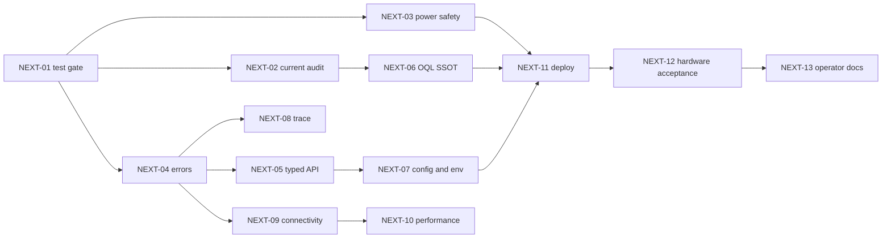

# Kanoniczny plan dalszej standaryzacji i refaktoryzacji

Stan planu: **2026-07-29**. Ten dokument jest bieżącym źródłem prawdy dla
otwartych prac OqlOS/OQL. Zastępuje operacyjnie datowany
[plan z 2026-07-27](refactor-roadmap-2026-07-27.md); datowany plan i
[audyt standaryzacji](STANDARDIZATION_AUDIT_2026-07-27.md) pozostają
historycznymi zapisami pomiarów.

## 1. Zakres i właściciele

| Repozytorium / warstwa | Odpowiedzialność |
| --- | --- |
| `/home/tom/github/oqlos/oqlos` | runtime OQL, firmware i adaptery sprzętu, API OqlOS, walidacja, katalog błędów, UI sprzętowe |
| `/home/tom/github/oqlos/oql-scenario` | **jedyne źródło plików scenariuszy OQL**, manifestu, warstw i korpusu zgodności |
| C2004 / DisplayNet | orkiestracja SOA/POA, frontend operatora, proxy do BoardNet, dystrybucja i przypięcie wersji OqlOS/OQL Scenario |
| BoardNet `.122` | wykonanie sprzętowe OqlOS i diagnostyka urządzeń |
| DisplayNet `.109` | usługi C2004, UI, routing i obserwacja BoardNet |

Zasada graniczna: C2004 nie utrzymuje kopii parsera, runtime ani scenariuszy.
Konsumuje wersjonowany artefakt OqlOS oraz read-only API lub przypięty commit
`oql-scenario`.

## 2. Zweryfikowany punkt bazowy

Pomiary bazowe wykonano 2026-07-28. Wyniki `NEXT-01` i `NEXT-02` odświeżono
2026-07-29; szczegóły metody i pełne wyniki zawiera
[bieżący audyt długu](refactor-audit-2026-07-29.md).

| Kontrola | Wynik |
| --- | --- |
| OqlOS | `main`; `NEXT-01` zapisane w `8d4e396`, `NEXT-03` w `fa2490a`, snapshot analizy z `86935a0`; zewnętrzny przebieg CI oczekuje na push |
| Nazwa języka | publiczne API, CLI i dokumentacja używają OQL; właściwe klasy i funkcje mają nazwy `Oql*`/`*_oql` |
| Zgodność wsteczna | wewnętrzne aliasy i ścieżki `cql_*` nadal istnieją w ograniczonej warstwie kompatybilności |
| Domyślny `pytest -q` | **PASS: 919 testów** w 10,55 s; jawny tryb `prepend`, unikalne nazwy modułów i kontrola pochodzenia importów |
| Test z wheel | **PASS: 904 testy** w 76,96 s z `/tmp`, bez źródeł workspace w `pythonpath`; wheel zawiera statyczne UI i zbudowany frontend |
| Frontend | 145 testów przechodzi; build Vite przechodzi |
| Frontend bundle | ostrzeżenie: główny chunk 538,68 kB po minifikacji; potrzebny podział kodu |
| OQL Scenario | `main`, commit `7b4f939`, worktree czysty; 58 testów przechodzi |
| Analiza statyczna | odświeżona 2026-07-29: OqlOS 194 tras, 80 `dict[str, Any]`, 3 kandydatów HTTP 200 z negatywnym wynikiem, 154 odczyty env i 30 dużych modułów; C2004 odpowiednio 668, 186, 15, 317 i 158 |
| Deploy `.122`/`.109` | niezweryfikowany w tym przebiegu; wcześniejsze logi wskazywały niedostępne `.122:8202` i proxy 502 |

Nie należy wpisywać wcześniejszych wartości `515`, `517` ani `858 passed` jako
aktualnego stanu bez nowego, czystego przebiegu domyślnej komendy testowej.

## 3. Co jest zakończone

- [x] OQL jest jedyną publiczną nazwą języka i formatu scenariuszy.
- [x] Kanoniczne klasy runtime i funkcje parsera mają nazwy OQL; stare nazwy są
  tylko aliasami kompatybilności.
- [x] Publiczny entrypoint CLI wskazuje `oqlos.tools.oql_cli:main`.
- [x] Test architektury ogranicza importy starej implementacji do jawnej listy
  plików kompatybilności.
- [x] OQL v5 ma kanon `TASK:` + `NAME` + `PROMPT` + `TIMER`; `TASK TITLE` jest
  odrzucane w v5, a starsze wersje pozostają czytane przez migrator.
- [x] Błędy sprzętowe mają wspólny typ domenowy oraz mapowanie do `C2004-*` w
  najważniejszych ścieżkach Modbus, motorów i diagnostyki.
- [x] Publiczne logi rozróżniają architekturę SOA (transport/usługa) i POA
  (proces/akcja OQL).
- [x] Podstawowy command trace cewek zachowuje zamiar i wynik w bezpiecznych
  argumentach URL.
- [x] `oql-scenario` deklaruje się jako kanoniczny magazyn scenariuszy i ma
  zielony test manifestu/korpusu/API.

Pozycje te mogą być ponownie otwarte tylko przez konkretną regresję, nie przez
samą obecność kontrolowanego aliasu kompatybilności.

## 4. Backlog pozostałych prac

### NEXT-01 — Naprawić hermetyczną bramkę testów

**Priorytet:** P0. **Repo:** OqlOS. **Zależności:** brak.

**Status 2026-07-29:** implementacja i weryfikacja lokalna zakończone w
`8d4e396`; zamknięcie operacyjne wymaga zielonego przebiegu dodanych jobów
GitHub Actions po pushu.

- [x] nadać unikalne nazwy dwóm testom `test_motor2_idle_policy.py` albo zapewnić
  jednoznaczne pakiety testowe;
- [x] ustawić jeden kanoniczny tryb importu w konfiguracji pytest, bez zależności od
  przypadkowego `PYTHONPATH`;
- [x] dodać asercję, z którego checkoutu jest importowany pakiet `oqlos`;
- [x] uruchamiać pełny suite z clean checkout oraz z wheel/editable install;
- [x] wdrożyć Ruff najpierw dla `F821,F811`, potem zmniejszać kontrolowany baseline.

Dowód lokalny: bieżący `pytest -q` — 908/908; izolowany wheel z bramki
`NEXT-01` — 904/904 (cztery późniejsze testy dotyczą generatora audytu);
`ruff check oqlos tests packages/oqlos-core packages/oqlos-models --select
F821,F811` — zero błędów; frontend — 145/145 i poprawny build Vite. GitHub
Actions buduje frontend, instaluje jawne pakiety workspace i wykonuje osobny
pełny job z wheel poza checkoutem.

**Gotowe, gdy:** zwykłe `pytest -q` przechodzi lokalnie i w CI, a wynik nie
zależy od kolejności kolekcji ani zewnętrznego checkoutu.

### NEXT-02 — Odświeżyć analizę i policzyć rzeczywisty dług

**Priorytet:** P0. **Repo:** OqlOS + C2004. **Zależności:** NEXT-01.

**Status 2026-07-29:** lokalnie zakończone. OqlOS zmierzono na czystym
`86935a0`, C2004 na czystym detached clone `4af234f6`; wyniki i ograniczenia są
w [audycie 2026-07-29](refactor-audit-2026-07-29.md). Zamknięcie operacyjne
wymaga pierwszego zielonego przebiegu joba `static-analysis` po pushu.

- [x] wygenerować ponownie `project/analysis.toon.yaml` i mapę zależności;
- [x] ponownie policzyć publiczne trasy z `dict[str, Any]`, generyczne odpowiedzi
  OpenAPI, odczyty env poza settings, surowe wyjątki i `ok=false` przy HTTP 200;
- [x] zinwentaryzować duże moduły, szczególnie gateway pluginów, Modbus Waveshare,
  główny runtime, bridge MQTT i adapter firmware;
- [x] zapisać datę, commit i komendę generatora przy każdej metryce.

Dowód lokalny: `task analysis:refresh`; 396 plików źródłowych OqlOS, 194
trasy publiczne i zero błędów parsowania. Generator zapisuje commit, stan
worktree, wersję narzędzia i SHA-256 map; CI używa przypiętego
`code2llm==0.5.168`.

**Gotowe, gdy:** backlog odwołuje się wyłącznie do pomiarów z aktualnego
commita, a raport można odtworzyć jedną komendą CI.

### NEXT-03 — Domknąć power telemetry i safety gate

**Priorytet:** P0. **Repo:** OqlOS. **Zależności:** NEXT-01.

**Status 2026-07-29:** implementacja i lokalna weryfikacja zakończone w
`fa2490a`. Pierwszy przebieg CI i weryfikacja na fizycznym BoardNet pozostają
bramkami operacyjnymi przed deployem.

- [x] emitować zmianę `get_throttled` do event streamu;
- [x] objąć wspólną bramką zasilania bezpośrednie endpointy serwisowe i MQTT
  `manage`, nie tylko HUI;
- [x] zawsze zezwalać na bezpieczne `STOP`/deenergize;
- [x] ujednolicić pola `active`, `historical`, `observed_at`, `age_ms`, `source`;
- [ ] opcjonalnie dodać provider INA219/INA260 dla napięcia, prądu i mocy;
- [x] utrzymać `C2004-HW-0014` dla aktywnego undervoltage, a historię raportować jako
  warning, nie aktywną awarię.

Dowód lokalny: maski `0x0`, `0x1`, `0x10000`, `0x10001` mają test kontraktowy;
aktywny bit 0 zatrzymuje komendę przed rozwiązaniem pluginu, a `lung-stop`,
deenergize, pump OFF, valve OFF i coil OFF omijają blokadę. Zmiana stanu trafia
do CQRS/WS jako `hardware.power_state_changed`. Pełny `pytest -q` — 919/919;
Ruff `F821,F811` — zero błędów.

**Gotowe, gdy:** aktywny undervoltage blokuje każdą aktuację przed adapterem,
stan historyczny nie blokuje, STOP działa, a testy masek `0x0`, `0x1`,
`0x10000`, `0x10001` przechodzą.

### NEXT-04 — Ujednolicić błędy SOA, POA i firmware

**Priorytet:** P0. **Repo:** OqlOS + C2004. **Zależności:** NEXT-01.
**Stan:** w toku — pierwsza partia OqlOS zamknięta 2026-07-29.

- zinwentaryzować `HTTPException`, `ValueError`, `RuntimeError`, szerokie
  `except` i odpowiedzi `ok=false`;
- dla każdego przewidywalnego błędu zdefiniować domenę, `C2004-*`, HTTP status,
  severity, retryability, ownera, remediation i `problem_source`;
- zachować jeden `correlation_id` od POA przez SOA do firmware oraz zwrócić
  `component`, `stage`, `operation_id` i bezpieczny upstream target;
- rozróżnić host offline, OqlOS `.122:8202` offline, proxy `/firmware`, Modbus,
  zasilanie, plugin i timeout klienta;
- nie mapować znanego błędu sprzętu na ogólne `C2004-NET-0001` ani
  `C2004-SYS-0000`;
- dodać kontraktowe testy problem details bez tracebacków, sekretów i surowego
  HTML nginx jako głównego komunikatu operatora.

Zamknięta partia OqlOS: `/api/v1/oql/execute` i `/manage` propagują jeden
`correlation_id` przez HTTP i MQTT, a zdalne błędy zwracają status i bezpieczny
komunikat z katalogu C2004 zamiast HTTP 200. Kontrakty CQRS,
`diagnostic-command` i Modbus wizard potwierdzają problem details bez surowego
upstreamu. Skorygowana kontrola AST liczy wyłącznie literalnie zwrócone
negatywne envelope: wynik OqlOS spadł z 3 kandydatów do 0; wcześniejsze trzy
trafienia były słownikami zdarzeń poprzedzającymi typowany wyjątek. Macierz
tej partii znajduje się w [standardzie błędów](ERROR_STANDARDIZATION.md).

Druga kontrola kontraktu kodów wykryła i usunęła rozbieżność 400/422 dla
`api_invalid_recover_scope` i `api_diagnostic_command_invalid` oraz błędne
mapowanie ogólnego HTTP 400 na `C2004-DATA-0002` zamiast
`C2004-DATA-0004`. Granica upstream akceptuje teraz wyłącznie kody istniejące
w katalogu, wymusza katalogowy status i sanitizuje body oraz `correlation_id`.
Pełna bramka po zmianie: 938/938 testów i Ruff `F821,F811` bez błędów.

Pozostały zakres: sklasyfikować 137 surowych wyjątków i 241 szerokich handlerów
OqlOS, rozdzielić pozostałe klasy host/proxy/plugin oraz wykonać analogiczną
inwentaryzację i kontrakty po stronie C2004/POA.

**Gotowe, gdy:** każda publiczna operacja ma macierz błąd → kod → warstwa →
remediation, a ten sam przypadek daje ten sam kod w SOA, POA i firmware.

### NEXT-05 — Typowane requesty, response i OpenAPI

**Priorytet:** P0. **Repo:** OqlOS. **Zależności:** NEXT-04.

- zastąpić pozostałe `dict[str, Any]` ścisłymi modelami Pydantic;
- stosować `StrictBool`, ograniczenia zakresów, enumy, jawne jednostki i
  `extra='forbid'` dla komend aktuacyjnych;
- ujednolicić success envelope na `ok`; nie dodawać nowych pól `success`;
- odpowiedź pojedynczej nieudanej komendy nie może mieć HTTP 200;
- nadać każdej trasie jawny model sukcesu i problem response;
- oznaczyć aliasy v1/v3 jako deprecated i przetestować generowane OpenAPI.

Kolejność: Modbus wizard → coils/HUI → motory → RTC → runtime control.

**Gotowe, gdy:** zły request kończy się 422/`C2004-DATA-0002` przed adapterem,
a statyczna kontrola OpenAPI nie wykrywa generycznych odpowiedzi publicznych.

### NEXT-06 — Jedno źródło scenariuszy i pełne OQL v5

**Priorytet:** P0. **Repo:** OQL Scenario + OqlOS + C2004. **Zależności:**
NEXT-01 i NEXT-02.

- przenieść wszystkie aktywne scenariusze do `oql-scenario`; w innych repo
  pozostawić wyłącznie klienta, cache/artefakt builda lub pin wersji;
- blokować CI, jeśli aktywny `.oql` istnieje poza dozwolonym magazynem;
- dodać wspólny corpus TypeScript/Python: identyczny AST, diagnostyka i plan
  wykonania dla `TASK`, `NAME`, `DESCRIPTION`, `PROMPT`, `TIMER` i eventów;
- generować HELP i kolorowanie edytora z jednej tabeli składni;
- zmigrować nazwę `test-cql-nowy-scenariusz.oql` oraz manifest, zachowując
  czasowy alias starego identyfikatora;
- po sprawdzeniu konsumentów zmienić wewnętrzne ścieżki `cql_cli`,
  `cql_parser`, `_cql_tokenizer`, `_cql_tree_builder` na OQL;
- usuwać aliasy `Cql*`, `parse_cql` i stare formy gramatyki dopiero po okresie
  telemetrycznym bez użyć oraz z opisanym terminem wycofania.

**Gotowe, gdy:** aktywne scenariusze mają jedno repo, publiczny `rg -ni cql`
zwraca zero, a pozostawione aliasy są wyłącznie w wersjonowanym module
compatibility z testem deprecacji.

### NEXT-07 — Kanoniczna konfiguracja i rejestr env

**Priorytet:** P1. **Repo:** OqlOS + C2004. **Zależności:** NEXT-05.

- wskazać właściciela i lokalizację schema środowiska; w OqlOS nie ma obecnie
  katalogu `contracts/environment` opisanego przez stary plan;
- zarejestrować każdą `OQLOS_*`: typ, default, jednostkę, scope, ownera,
  secret, alias i termin usunięcia;
- zabronić nowych bezpośrednich `os.getenv()` poza typowaną warstwą settings;
- utrzymać jeden model `hardware-configuration-v1` i równoważne kodeki
  OQL/YAML/JSON;
- dodać round-trip, lint całego grafu warstw i snake_case nazw deklaracji;
- oddzielić sekrety i parametry hosta od logicznej konfiguracji scenariusza.

**Gotowe, gdy:** różnica kod ↔ rejestr env wynosi zero, a trzy formaty
konfiguracji tworzą równoważny model domenowy.

### NEXT-08 — Wspólny command trace i bezpieczne URL args

**Priorytet:** P1. **Repo:** OqlOS frontend + C2004 frontend. **Zależności:**
NEXT-04 i NEXT-05.

- przenieść `COMMAND`, request args, `RESULT`, `HTTP_STATUS` i `ERRORS` do
  współdzielonego kontraktu używanego przez HUI, motory, RTC i Modbus;
- dodać `REQUEST_ID`, `CORRELATION_ID`, start/finish i czas wykonania;
- stosować whitelistę; nie umieszczać sekretów ani całych payloadów w URL;
- synchronizować iframe parent/child po poprawnym `postMessage` origin;
- nigdy nie wykonywać komendy ponownie tylko dlatego, że jest opisana w URL;
- ujednolicić wpisy konsoli `HTTP_REQUEST`/SOA oraz
  `OQL_ACTION[_START]`/POA.

**Gotowe, gdy:** test E2E sukcesu i błędu dla każdej klasy komendy zachowuje
intencję, wynik i listę kodów, ale reload pozostaje operacją read-only.

### NEXT-09 — Dwukierunkowa łączność i replikacja diagnostyki

**Priorytet:** P1. **Repo:** OqlOS + C2004. **Zależności:** NEXT-04.

- uruchomić watcher BoardNet → DisplayNet niezależny od UI;
- ujednolicić `up/degraded/down/unknown`, timestamp, seq i correlation id;
- zapisywać eventy w ograniczonym JSONL/ring buffer;
- przy niedostępnym peer ustawiać `pending_replication=true`;
- po reconnect wykonywać batch flush maksymalnie 50 z backoffem i dedupe po
  `event_id`;
- raportować `pending`, `dropped`, `last_flush` i event
  `distributed_connectivity_flush`.

**Gotowe, gdy:** po kontrolowanym outage obie strony odtwarzają timeline,
duplikaty są odrzucane, backlog wraca do zera i nie rośnie bez limitu.

### NEXT-10 — Polling i budżety wydajności

**Priorytet:** P2. **Repo:** OqlOS + C2004. **Zależności:** NEXT-09.

- oddzielić szybki cached sensor read od pełnego probe sprzętu;
- zapewnić single-flight, backoff i anulowanie polli po cleanup widoku;
- publikować `observed_at`, `age_ms`, `stale` i źródło próbki;
- dodać metryki p50/p95/p99 i 30-minutowy soak;
- przyjąć początkowo: `/health` p95 < 100 ms, hardware health p95 < 500 ms,
  cached sensor read p95 < 500 ms;
- podzielić frontendowy chunk większy niż 500 kB przez lazy loading.

**Gotowe, gdy:** nie ma nakładających się polli ani kolejki po wolnym ADC,
zdrowy soak nie generuje 503/504, a UI jawnie pokazuje wiek danych.

### NEXT-11 — Powtarzalny deploy `.122` i `.109`

**Priorytet:** P1 przed testami fizycznymi. **Repo:** OqlOS + C2004.
**Zależności:** NEXT-01, NEXT-04, NEXT-06 i NEXT-07.

- budować z clean checkout i przypiętych commitów, nie z kopiowanego worktree;
- zapisywać commit OqlOS, commit OQL Scenario, schema version, checksum obrazów
  i wynik migracji w `CURRENT_STATE`;
- uruchamiać migracje przed restartem i posiadać pin poprzedniej wersji;
- w smoke osobno sprawdzać `.122:8202`, `.109`, proxy `/firmware`, API OQL,
  WebSocket, health, readiness i diagnostykę;
- nie uznawać 502 BoardNet za sukces; przy awarii przerwać test aktuacyjny;
- po wdrożeniu porównać checksums oraz potwierdzić, że nie działa stary runtime
  lub magazyn scenariuszy.

**Gotowe, gdy:** oba hosty raportują oczekiwane commity, wszystkie read-only
smoke są zielone i rollback został próbnie wykonany lub zweryfikowany bez
aktuacji.

### NEXT-12 — Fizyczna walidacja stanowiska

**Priorytet:** P2. **Repo/host:** BoardNet. **Zależności:** NEXT-03 i NEXT-11.

- sprawdzić zasilanie Pi i 12 V pola; zapisać aktywny/historyczny undervoltage;
- potwierdzić RS485, baud/parity/slave oraz stabilną ścieżkę `/dev/serial/by-id`;
- wykonać kontrolowany test DO1–DO8: jedna cewka, krótki impuls, auto-OFF,
  obserwacja operatora i zapis wyniku;
- potwierdzić mapowanie zaworów, pompę DRI0050, Tic249 i krańcówki;
- testy aktuacyjne uruchamiać dopiero po health/readiness/power gate i zgodzie
  operatora.

**Gotowe, gdy:** nieznany stan nie jest prezentowany jako OFF, każde wyjście ma
potwierdzoną funkcję, a raport zawiera czas, operatora, commit i kody błędów.

### NEXT-13 — Domknąć dokumentację operatorską

**Priorytet:** P2. **Repo:** OqlOS + C2004. **Zależności:** NEXT-04–NEXT-12.

- generować stronę HELP wszystkich kodów ERROR z katalogu, nie z ręcznej listy;
- zachować filtrowanie i wydruk wybranego zakresu wraz z remediation;
- opisać architekturę SOA/POA/firmware, źródła konfiguracji i przebieg
  correlation id jednym diagramem;
- dokumentować ustawienia Tic249, w tym `strokeSteps`, prędkość, akcelerację i
  limity, bez duplikowania wartości w scenariuszach;
- aktualizować runbook `.122`/`.109` i procedurę awarii proxy/BoardNet.

**Gotowe, gdy:** operator znajduje kod, przyczynę, właściciela i bezpieczną
procedurę bez czytania kodu źródłowego.

## 5. Kolejność realizacji



Praktyczne fale wdrożeniowe:

1. **Fala 0 — wiarygodny baseline:** NEXT-01, NEXT-02.
2. **Fala 1 — bezpieczeństwo i kontrakty:** NEXT-03, NEXT-04, NEXT-05.
3. **Fala 2 — jedno źródło prawdy:** NEXT-06, NEXT-07.
4. **Fala 3 — obserwowalność:** NEXT-08, NEXT-09, NEXT-10.
5. **Fala 4 — produkcja:** NEXT-11, NEXT-12, NEXT-13.

Stan 2026-07-29: Fala 0 i implementacja `NEXT-03` są zakończone lokalnie.
Następna implementacja to klasyfikacja i ujednolicenie błędów `NEXT-04`.

## 6. Obowiązkowe bramki weryfikacji

### OqlOS

```bash
pytest -q
pytest -q tests/test_oql_public_runtime_api.py
task analysis:refresh
cd frontend
npm run test:unit
npm run build
```

`--import-mode=importlib` może służyć do diagnozy kolizji, ale nie może być
trwałym sposobem ukrycia niespójnej struktury testów.

### OQL Scenario

```bash
cd /home/tom/github/oqlos/oql-scenario
pytest -q
find . -type f -name '*.cql'
rg -ni 'cql' --glob '!archive/**'
```

### Integracja i deploy

- read-only health/readiness wszystkich usług;
- walidacja OpenAPI i katalogu błędów;
- test grafu scenariuszy oraz zgodności manifestu;
- test proxy DisplayNet → BoardNet i watcher w przeciwnym kierunku;
- checksum/commit na obu hostach;
- dopiero potem, osobno autoryzowany smoke aktuacyjny.

## 7. Definition of done każdego zadania

- test pozytywny, negatywny i regresyjny;
- przewidywalny błąd ma właściwy `C2004-*`, HTTP status i remediation;
- odrzucona komenda nie dociera do adaptera;
- brak sekretów, tracebacków i pełnych payloadów w URL/logach;
- dokumentacja, OpenAPI i checksum są aktualne;
- zmiana ma właściciela, rollback i dowód weryfikacji;
- aktywna praca nie jest oznaczana jako zakończona na podstawie starego raportu;
- deploy nie jest „zielony”, jeśli wymagany BoardNet lub proxy zwraca 502/503.

## 8. Zasady aktualizacji planu

- Ten plik przechowuje bieżący status; datowane audyty są snapshotami.
- Po zamknięciu pozycji należy dopisać commit, test i datę, a nie tylko zaznaczyć
  checkbox.
- Nowy dług trafia do istniejącej kategorii lub dostaje kolejny `NEXT-*`.
- Usunięcie kompatybilności wymaga najpierw inwentaryzacji konsumentów i okresu
  bez użyć; nazwa publiczna pozostaje wyłącznie OQL.
- Stan live musi być ponownie zmierzony po każdym deployu `.122`/`.109`.
