# System Architecture Analysis
<!-- generated in 0.01s -->

## Overview

- **Project**: /home/tom/github/oqlos/oqlos
- **Primary Language**: python
- **Languages**: python: 212, javascript: 90, md: 25, yaml: 13, shell: 9
- **Analysis Mode**: static
- **Total Functions**: 2448
- **Total Classes**: 158
- **Modules**: 371
- **Entry Points**: 1512

## Architecture by Module

### frontend.src.pages.MapEditor
- **Functions**: 101
- **File**: `MapEditor.jsx`

### oqlos.core._interpreter_actions
- **Functions**: 49
- **File**: `_interpreter_actions.py`

### frontend.src.utils.url-embed-config
- **Functions**: 48
- **File**: `url-embed-config.js`

### packages.oqlos-core.src.oqlos.core.interpreter
- **Functions**: 48
- **Classes**: 1
- **File**: `interpreter.py`

### frontend.src.pages.HardwareRestart
- **Functions**: 45
- **File**: `HardwareRestart.jsx`

### scripts.oql_v2_to_v4_migrate_db
- **Functions**: 45
- **Classes**: 1
- **File**: `oql_v2_to_v4_migrate_db.py`

### frontend.src.pages.HardwareDemo
- **Functions**: 42
- **File**: `HardwareDemo.jsx`

### oqlos.core.oql_parser
- **Functions**: 38
- **Classes**: 3
- **File**: `oql_parser.py`

### oqlos.api.main
- **Functions**: 38
- **File**: `main.py`

### oqlos.hardware.transport.mqtt_oql_bridge
- **Functions**: 33
- **Classes**: 7
- **File**: `mqtt_oql_bridge.py`

### frontend.src.api.wsClient
- **Functions**: 32
- **Classes**: 1
- **File**: `wsClient.js`

### packages.oqlos-core.src.oqlos.core._action_motor2
- **Functions**: 30
- **File**: `_action_motor2.py`

### oqlos.core.cql_parser
- **Functions**: 30
- **Classes**: 1
- **File**: `cql_parser.py`

### oqlos.core.base
- **Functions**: 29
- **Classes**: 7
- **File**: `base.py`

### oqlos.hardware.client.proxy
- **Functions**: 29
- **Classes**: 1
- **File**: `proxy.py`

### packages.oqlos-core.src.oqlos.core._oql_adapter
- **Functions**: 28
- **Classes**: 1
- **File**: `_oql_adapter.py`

### frontend.src.api.hardwareApi
- **Functions**: 26
- **File**: `hardwareApi.js`

### oqlos.hardware.firmware_adapter
- **Functions**: 26
- **Classes**: 1
- **File**: `firmware_adapter.py`

### oqlos.hardware.gateway
- **Functions**: 25
- **Classes**: 5
- **File**: `gateway.py`

### oqlos.core._cql_tokenizer
- **Functions**: 23
- **File**: `_cql_tokenizer.py`

## Key Entry Points

Main execution flows into the system:

### oqlos.dsl.schema.get_default_dsl_schema
> Return the canonical cross-project schema used by editor clients.
- **Calls**: oqlos.dsl.schema._build_inferred_object_function_map, oqlos.dsl.schema._build_inferred_param_unit_map, DslSchema, DslDialect, DslDialect, DslItem, DslItem, DslItem

### oqlos.hardware.firmware_adapter.FirmwareAdapter.set_peripheral
> Set peripheral value via firmware API.

Routes pump commands to POST /api/v1/hardware/pump and
valve commands to POST /api/v1/hardware/valve/{id} so t
- **Calls**: self._resolve_peripheral, pid.startswith, pid.startswith, pid.startswith, None.put, r.raise_for_status, r.json, self._raise_if_rejected

### scripts.migrate_to_v4.main
- **Calls**: argparse.ArgumentParser, parser.add_argument, parser.add_argument, parser.add_argument, parser.parse_args, None.resolve, examples.hardware.doctor-workflow.print, scripts.migrate_to_v4.find_oql_files

### scripts.fix_brackets_to_v4.main
- **Calls**: argparse.ArgumentParser, parser.add_argument, parser.add_argument, parser.parse_args, Path, frontend.src.pages.ScenarioFiles.list, examples.hardware.doctor-workflow.print, examples.hardware.doctor-workflow.print

### oqlos.tools.plugin_cli.main
- **Calls**: argparse.ArgumentParser, parser.add_subparsers, subparsers.add_parser, subparsers.add_parser, subparsers.add_parser, caps_parser.add_argument, subparsers.add_parser, validate_parser.add_argument

### scripts.oql_v2_to_v4_migrate_db.main
- **Calls**: argparse.ArgumentParser, parser.add_argument, parser.add_argument, parser.add_argument, parser.add_argument, parser.add_argument, parser.add_argument, parser.add_argument

### oqlos.hardware.usb_diagnostics.pi_system_diagnostics
> Raspberry Pi health snapshot: model, temp, throttling, memory, uptime, ports.
- **Calls**: oqlos.hardware.usb_diagnostics._read, _vcgencmd, _vcgencmd, None.splitlines, oqlos.hardware.usb_diagnostics._read, oqlos.hardware.usb_diagnostics._read, sorted, sorted

### oqlos.hardware.rtc_probe.build_rtc_peripheral_status
> Return the runtime status payload for the RTC sidecar.
- **Calls**: oqlos.hardware.rtc_probe._pirtc_request_sync, oqlos.hardware.rtc_probe._pirtc_request_sync, oqlos.hardware.rtc_probe._pirtc_request_sync, oqlos.hardware.rtc_probe.is_rtc_hardware_enabled, isinstance, payload.get, isinstance, payload.get

### oqlos.api.state._handle_start
- **Calls**: oqlos.api.state._extract_scenario_id, oqlos.api.state._extract_inline_dsl, ExecutionRequest, logger.debug, oqlos.api.state._maybe_register_dsl_from_content, asyncio.create_task, logger.debug, HTTPException

### oqlos.api.hardware_modbus_wizard._modbus_wizard_program_isolated
- **Calls**: None.upper, RtuBusSettings, oqlos.api.hardware_modbus_wizard._wizard_check_already_configured, oqlos.api.hardware_modbus_wizard._wizard_verify_config, oqlos.api.hardware_modbus_wizard._wizard_build_result, None.to_dict, uart_register_value, int

### oqlos.reporters.html_report.render_html_report
> Render a self-contained HTML report from an ``oqlos-report-v1`` JSON string.
- **Calls**: json.loads, data.get, data.get, data.get, sc.get, None.join, data.get, data.get

### oqlos.api.hardware_probe_devices._probe_i2c_ads1115
> Probe configured I2C bus(es) for ADS1115.
- **Calls**: os.getenv, os.getenv, os.getenv, os.getenv, oqlos.api.hardware_probe_devices._local_ads1115_probe_allowed, int, frontend.src.pages.ScenarioFiles.list, None.join

### oqlos.hardware.plugin_gateway.PluginHardwareGateway._initialize_plugins
> Initialize all enabled plugins in parallel.
- **Calls**: logger.warning, logger.info, logger.info, None.append, str, config.connection_params.get, logger.info, self._plugin_configs.items

### oqlos.shared.event_server.EventServer._handle_message
- **Calls**: json.loads, self._normalize_event, self.event_store.append, None.get, examples.hardware.doctor-workflow.print, data.get, data.get, data.get

### oqlos.api.hardware_platform._detect_runtime_platform
- **Calls**: oqlos.api.hardware_platform._board_model, oqlos.api.hardware_platform._os_release, oqlos.api.hardware_platform._in_container, oqlos.api.hardware_platform._classify_platform_type, oqlos.api.hardware_platform._selected_piadc_platform, topology._modbus_runtime_serial_ports, platform.system, None.lower

### oqlos.api.hardware_peripherals_routes.read_modbus_adc_raw
> Return raw Modbus ADC diagnostics for HUI troubleshooting.
- **Calls**: router.get, health.get, isinstance, modbus_adc_health.get, plugin.execute_command, result.get, health.get, result.get

### scripts.scenarios_export.main
- **Calls**: argparse.ArgumentParser, parser.add_argument, parser.add_mutually_exclusive_group, group.add_argument, group.add_argument, group.add_argument, parser.add_argument, parser.add_argument

### oqlos.tools.hardware_diagnose.__main__.main
- **Calls**: argparse.ArgumentParser, parser.add_argument, parser.add_argument, parser.add_argument, parser.add_argument, parser.add_argument, parser.add_argument, parser.add_argument

### oqlos.tools.xml_import.generators.generate_dsl
> Generate human-readable DSL text from parsed report.
- **Calls**: frontend.src.pages.HardwareStatus.a, frontend.src.pages.HardwareStatus.a, frontend.src.pages.HardwareStatus.a, frontend.src.pages.HardwareStatus.a, frontend.src.pages.HardwareStatus.a, frontend.src.pages.HardwareStatus.a, frontend.src.pages.HardwareStatus.a, frontend.src.pages.HardwareStatus.a

### oqlos.hardware.plugins.motor.MotorPlugin.__init__
- **Calls**: None.__init__, None.rstrip, self.config.connection_params.get, self.config.connection_params.get, params.get, int, str, int

### oqlos.api.oql_mqtt.oql_ws
> Bidirectional OQL channel: client sends OQL frames, receives results.

Inbound frame: ``{"oql": "...", "kind": "command", "mode": "execute"}``.
Outbou
- **Calls**: router.websocket, _controller.subscribe_events, asyncio.create_task, websocket.accept, oqlos.api.oql_mqtt._pump_events, pump_task.cancel, _controller.unsubscribe_events, websocket.send_json

### packages.oqlos-core.src.oqlos.core._firmware_executor.FirmwareExecutor._execute_plugin_action
> Execute action using the new plugin gateway system.
- **Calls**: self.vars.interpolate, self._resolve_gateway_result, self._is_success, self.out.error, self.normalizer.normalize_pump_power, self._plugin_gateway.set_pump, self.vars.set, self.out.step

### oqlos.hardware.client.autorepair.analyze_repair_needs
> Return whether host stack restart is recommended and human-readable reasons.
- **Calls**: oqlos.hardware.diagnosis_plugin_health.health_map, oqlos.hardware.client.autorepair._plugin_repair_reasons, reasons.extend, diagnostics.get, str, isinstance, isinstance, identify.get

### oqlos.shared.logs_query.LogsQueryService.query_logs
> Query logs with filtering, pagination. Returns dict ready for API response.
- **Calls**: self._connect, conditions.append, params.append, conditions.append, params.append, conditions.append, params.append, conditions.append

### oqlos.api.execution.execute_step
> Execute a single DSL step within the current (or new) execution.

Expected payload::
    {
        "scenarioId": "scn-xxx",
        "step": { "action"
- **Calls**: router.post, payload.get, payload.get, payload.get, Step, HTTPException, hasattr, _ctrl.state_manager.executions.get

### oqlos.api.hardware_modbus_waveshare._build_waveshare_diagnose_report
- **Calls**: topology._modbus_io_device_ids, int, sorted, topology._modbus_runtime_serial_ports, oqlos.api.hardware_modbus_waveshare._resolve_waveshare_ports, int, str, int

### oqlos.api.hardware_modbus_wizard._modbus_wizard_probe_isolated
- **Calls**: oqlos.api.hardware_modbus_wizard._collect_wizard_serial_candidates, diagnose_shared_bus, report.to_dict, all_scans.append, frontend.src.pages.ScenarioFiles.list, bool, int, str

### oqlos.api.editor.execute_scenario
> Execute a scenario file using oqlos runtime.
- **Calls**: router.post, oqlos.api.editor._safe_path, full_path.read_text, oqlos.api.editor._normalize_oql_mode, oqlos.api.oql_mqtt.get_oql_controller, CqlInterpreter, interpreter.parse, interpreter.execute

### oqlos.core._interpreter_actions.exec_action_shell
> Execute shell/export helpers in dry-run mode.
- **Calls**: oqlos.core._interpreter_actions._drop_command_token, None.upper, oqlos.core._interpreter_actions._record_failure, interp.sensor_values.get, interp.vars.set, interp.out.step, interp.vars.set, interp.out.step

### oqlos.core.executor.ScenarioOrchestrator.execute_scenario
> Execute a scenario with specified goals
- **Calls**: self.state_manager.scenarios.get, bus.dispatch, sum, self._build_step_plan, bus.dispatch, ValueError, StartExecutionCommand, bus.dispatch

## Process Flows

Key execution flows identified:

### Flow 1: get_default_dsl_schema
```
get_default_dsl_schema [oqlos.dsl.schema]
  └─> _build_inferred_object_function_map
      └─> _normalize_name_list
          └─ →> set
      └─> _normalize_name_list
  └─> _build_inferred_param_unit_map
      └─> _normalize_name_list
          └─ →> set
      └─> _normalize_name_list
```

### Flow 2: set_peripheral
```
set_peripheral [oqlos.hardware.firmware_adapter.FirmwareAdapter]
```

### Flow 3: main
```
main [scripts.migrate_to_v4]
```

### Flow 4: pi_system_diagnostics
```
pi_system_diagnostics [oqlos.hardware.usb_diagnostics]
  └─> _read
  └─> _read
```

### Flow 5: build_rtc_peripheral_status
```
build_rtc_peripheral_status [oqlos.hardware.rtc_probe]
  └─> _pirtc_request_sync
      └─> get_pirtc_base_url
  └─> _pirtc_request_sync
      └─> get_pirtc_base_url
```

### Flow 6: _handle_start
```
_handle_start [oqlos.api.state]
  └─> _extract_scenario_id
  └─> _extract_inline_dsl
```

### Flow 7: _modbus_wizard_program_isolated
```
_modbus_wizard_program_isolated [oqlos.api.hardware_modbus_wizard]
  └─> _wizard_check_already_configured
  └─> _wizard_verify_config
```

### Flow 8: render_html_report
```
render_html_report [oqlos.reporters.html_report]
```

### Flow 9: _probe_i2c_ads1115
```
_probe_i2c_ads1115 [oqlos.api.hardware_probe_devices]
  └─> _local_ads1115_probe_allowed
```

### Flow 10: _initialize_plugins
```
_initialize_plugins [oqlos.hardware.plugin_gateway.PluginHardwareGateway]
```

## Key Classes

### packages.oqlos-core.src.oqlos.core.interpreter.CqlInterpreter
> CQL interpreter with three modes:
  - validate: parse + check structure
  - dry-run:  simulate execu
- **Methods**: 51
- **Key Methods**: packages.oqlos-core.src.oqlos.core.interpreter.CqlInterpreter.__init__, packages.oqlos-core.src.oqlos.core.interpreter.CqlInterpreter.sensor_values, packages.oqlos-core.src.oqlos.core.interpreter.CqlInterpreter.sensor_values, packages.oqlos-core.src.oqlos.core.interpreter.CqlInterpreter._firmware, packages.oqlos-core.src.oqlos.core.interpreter.CqlInterpreter._firmware, packages.oqlos-core.src.oqlos.core.interpreter.CqlInterpreter._firmware_url, packages.oqlos-core.src.oqlos.core.interpreter.CqlInterpreter._firmware_url, packages.oqlos-core.src.oqlos.core.interpreter.CqlInterpreter._coerce_float, packages.oqlos-core.src.oqlos.core.interpreter.CqlInterpreter._resolve_peripheral_id, packages.oqlos-core.src.oqlos.core.interpreter.CqlInterpreter._get_pump_flow_full_scale_lpm
- **Inherits**: BaseInterpreter

### oqlos.hardware.client.proxy.OqlosHardwareProxy
- **Methods**: 28
- **Key Methods**: oqlos.hardware.client.proxy.OqlosHardwareProxy.__init__, oqlos.hardware.client.proxy.OqlosHardwareProxy.candidate_bases, oqlos.hardware.client.proxy.OqlosHardwareProxy.proxy_info, oqlos.hardware.client.proxy.OqlosHardwareProxy.close, oqlos.hardware.client.proxy.OqlosHardwareProxy._get_client, oqlos.hardware.client.proxy.OqlosHardwareProxy._proxy_oqlos, oqlos.hardware.client.proxy.OqlosHardwareProxy._proxy_oqlos_request, oqlos.hardware.client.proxy.OqlosHardwareProxy._degraded_oqlos_payload, oqlos.hardware.client.proxy.OqlosHardwareProxy.health, oqlos.hardware.client.proxy.OqlosHardwareProxy.identify

### oqlos.core.cql_parser._ParseState
> Encapsulates the parsing state to simplify the main loop.
- **Methods**: 26
- **Key Methods**: oqlos.core.cql_parser._ParseState.__init__, oqlos.core.cql_parser._ParseState.parse, oqlos.core.cql_parser._ParseState._peek_next_significant_indent, oqlos.core.cql_parser._ParseState._flush_pending_inline_if, oqlos.core.cql_parser._ParseState._attach_pending_inline_if, oqlos.core.cql_parser._ParseState._get_line_info, oqlos.core.cql_parser._ParseState._process_line, oqlos.core.cql_parser._ParseState._try_skip_block, oqlos.core.cql_parser._ParseState._try_intervals_block, oqlos.core.cql_parser._ParseState._try_top_level

### frontend.src.api.wsClient.WsCqrsClient
- **Methods**: 25
- **Key Methods**: frontend.src.api.wsClient.WsCqrsClient.super, frontend.src.api.wsClient.WsCqrsClient.connected, frontend.src.api.wsClient.WsCqrsClient.connect, frontend.src.api.wsClient.WsCqrsClient.reject, frontend.src.api.wsClient.WsCqrsClient.resolve, frontend.src.api.wsClient.WsCqrsClient.reject, frontend.src.api.wsClient.WsCqrsClient.disconnect, frontend.src.api.wsClient.WsCqrsClient.command, frontend.src.api.wsClient.WsCqrsClient.query, frontend.src.api.wsClient.WsCqrsClient.subscribe

### oqlos.hardware.plugin_gateway.PluginHardwareGateway
> Simplified hardware gateway using plugin architecture.

Instead of hardcoded adapters, this gateway 
- **Methods**: 23
- **Key Methods**: oqlos.hardware.plugin_gateway.PluginHardwareGateway.__init__, oqlos.hardware.plugin_gateway.PluginHardwareGateway._load_hardware_schema, oqlos.hardware.plugin_gateway.PluginHardwareGateway._parse_plugin_configs, oqlos.hardware.plugin_gateway.PluginHardwareGateway._apply_env_overrides, oqlos.hardware.plugin_gateway.PluginHardwareGateway._apply_plugin_enable_env_overrides, oqlos.hardware.plugin_gateway.PluginHardwareGateway._apply_shared_modbus_bus_env_overrides, oqlos.hardware.plugin_gateway.PluginHardwareGateway._apply_modbus_env_overrides, oqlos.hardware.plugin_gateway.PluginHardwareGateway.modbus_preflight_report, oqlos.hardware.plugin_gateway.PluginHardwareGateway._log_modbus_preflight, oqlos.hardware.plugin_gateway.PluginHardwareGateway.ensure_initialized

### oqlos.hardware.firmware_adapter.FirmwareAdapter
> HTTP bridge between CQL interpreter and firmware simulator.
- **Methods**: 23
- **Key Methods**: oqlos.hardware.firmware_adapter.FirmwareAdapter.__init__, oqlos.hardware.firmware_adapter.FirmwareAdapter._get_client, oqlos.hardware.firmware_adapter.FirmwareAdapter.close, oqlos.hardware.firmware_adapter.FirmwareAdapter._get_lung_motor_url, oqlos.hardware.firmware_adapter.FirmwareAdapter.is_available, oqlos.hardware.firmware_adapter.FirmwareAdapter._resolve_peripheral, oqlos.hardware.firmware_adapter.FirmwareAdapter._raise_if_rejected, oqlos.hardware.firmware_adapter.FirmwareAdapter.set_peripheral, oqlos.hardware.firmware_adapter.FirmwareAdapter.pump_off, oqlos.hardware.firmware_adapter.FirmwareAdapter.pump_set

### oqlos.hardware.plugins.lung.LungPlugin
> Plugin for Pololu Tic T249 stepper motor (artificial lung).

Configuration:
    connection_type: "ht
- **Methods**: 20
- **Key Methods**: oqlos.hardware.plugins.lung.LungPlugin.__init__, oqlos.hardware.plugins.lung.LungPlugin.validate_config, oqlos.hardware.plugins.lung.LungPlugin.connect, oqlos.hardware.plugins.lung.LungPlugin.disconnect, oqlos.hardware.plugins.lung.LungPlugin._health_check_http, oqlos.hardware.plugins.lung.LungPlugin.health_check, oqlos.hardware.plugins.lung.LungPlugin._runtime_status, oqlos.hardware.plugins.lung.LungPlugin._runtime_block_reason, oqlos.hardware.plugins.lung.LungPlugin._handle_reciprocate_http, oqlos.hardware.plugins.lung.LungPlugin._handle_reciprocate_usb
- **Inherits**: HardwarePlugin

### oqlos.hardware.plugins.motor.MotorPlugin
> Plugin for DFRobot DRI0050 PWM motor driver.

Configuration:
    connection_type: "http"
    connect
- **Methods**: 20
- **Key Methods**: oqlos.hardware.plugins.motor.MotorPlugin.__init__, oqlos.hardware.plugins.motor.MotorPlugin.validate_config, oqlos.hardware.plugins.motor.MotorPlugin.connect, oqlos.hardware.plugins.motor.MotorPlugin.disconnect, oqlos.hardware.plugins.motor.MotorPlugin._health_check_http, oqlos.hardware.plugins.motor.MotorPlugin._health_check_modbus_rtu, oqlos.hardware.plugins.motor.MotorPlugin.health_check, oqlos.hardware.plugins.motor.MotorPlugin._base_url_is_local, oqlos.hardware.plugins.motor.MotorPlugin._validate_power_pct, oqlos.hardware.plugins.motor.MotorPlugin._handle_set_speed_http
- **Inherits**: HardwarePlugin

### oqlos.core.executor.ScenarioOrchestrator
- **Methods**: 18
- **Key Methods**: oqlos.core.executor.ScenarioOrchestrator.__init__, oqlos.core.executor.ScenarioOrchestrator.current_execution, oqlos.core.executor.ScenarioOrchestrator._sanitize_identifier, oqlos.core.executor.ScenarioOrchestrator._build_eval_context, oqlos.core.executor.ScenarioOrchestrator._sanitize_expression, oqlos.core.executor.ScenarioOrchestrator._build_step_plan, oqlos.core.executor.ScenarioOrchestrator._execute_goal_steps, oqlos.core.executor.ScenarioOrchestrator.execute_scenario, oqlos.core.executor.ScenarioOrchestrator.execute_step, oqlos.core.executor.ScenarioOrchestrator._execute_lung_step

### oqlos.hardware.plugins.modbus.ModbusPlugin
> Plugin for Waveshare Modbus RTU IO 8CH valve controller.

Configuration:
    connection_type: "modbu
- **Methods**: 16
- **Key Methods**: oqlos.hardware.plugins.modbus.ModbusPlugin.__init__, oqlos.hardware.plugins.modbus.ModbusPlugin._validate_rtu_params, oqlos.hardware.plugins.modbus.ModbusPlugin._validate_tcp_params, oqlos.hardware.plugins.modbus.ModbusPlugin.validate_config, oqlos.hardware.plugins.modbus.ModbusPlugin.connect, oqlos.hardware.plugins.modbus.ModbusPlugin.disconnect, oqlos.hardware.plugins.modbus.ModbusPlugin._health_check_rtu, oqlos.hardware.plugins.modbus.ModbusPlugin._health_check_tcp, oqlos.hardware.plugins.modbus.ModbusPlugin.health_check, oqlos.hardware.plugins.modbus.ModbusPlugin._execute_set_coil
- **Inherits**: HardwarePlugin

### oqlos.hardware.plugins.modbus_adc.ModbusAdcPlugin
> Plugin for Waveshare Modbus RTU Analog Input 8CH.

The module exposes AI1-AI8 through input register
- **Methods**: 16
- **Key Methods**: oqlos.hardware.plugins.modbus_adc.ModbusAdcPlugin.__init__, oqlos.hardware.plugins.modbus_adc.ModbusAdcPlugin.validate_config, oqlos.hardware.plugins.modbus_adc.ModbusAdcPlugin.connect, oqlos.hardware.plugins.modbus_adc.ModbusAdcPlugin.disconnect, oqlos.hardware.plugins.modbus_adc.ModbusAdcPlugin.health_check, oqlos.hardware.plugins.modbus_adc.ModbusAdcPlugin.execute_command, oqlos.hardware.plugins.modbus_adc.ModbusAdcPlugin._read_registers, oqlos.hardware.plugins.modbus_adc.ModbusAdcPlugin._format_channels, oqlos.hardware.plugins.modbus_adc.ModbusAdcPlugin._format_channel, oqlos.hardware.plugins.modbus_adc.ModbusAdcPlugin._peripheral_for_channel
- **Inherits**: HardwarePlugin

### oqlos.hardware.plugins.registry.PluginRegistry
> Central registry for hardware plugins.

Manages:
- Plugin discovery and registration
- Plugin lifecy
- **Methods**: 14
- **Key Methods**: oqlos.hardware.plugins.registry.PluginRegistry.register, oqlos.hardware.plugins.registry.PluginRegistry.unregister, oqlos.hardware.plugins.registry.PluginRegistry.get_plugin_class, oqlos.hardware.plugins.registry.PluginRegistry.list_plugins, oqlos.hardware.plugins.registry.PluginRegistry.create_instance, oqlos.hardware.plugins.registry.PluginRegistry.get_instance, oqlos.hardware.plugins.registry.PluginRegistry.connect_plugin, oqlos.hardware.plugins.registry.PluginRegistry.disconnect_plugin, oqlos.hardware.plugins.registry.PluginRegistry.health_check, oqlos.hardware.plugins.registry.PluginRegistry.health_check_all

### oqlos.core.base.InterpreterOutput
> Collects interpreter output lines for display or testing, and optionally broadcasts events.
- **Methods**: 11
- **Key Methods**: oqlos.core.base.InterpreterOutput.__init__, oqlos.core.base.InterpreterOutput.emit, oqlos.core.base.InterpreterOutput._broadcast_event, oqlos.core.base.InterpreterOutput._emit_status, oqlos.core.base.InterpreterOutput.info, oqlos.core.base.InterpreterOutput.ok, oqlos.core.base.InterpreterOutput.fail, oqlos.core.base.InterpreterOutput.warn, oqlos.core.base.InterpreterOutput.error, oqlos.core.base.InterpreterOutput.step

### oqlos.shared.event_store.EventStore
> Append-only event store with optional JSON file persistence.
- **Methods**: 11
- **Key Methods**: oqlos.shared.event_store.EventStore.__init__, oqlos.shared.event_store.EventStore.append, oqlos.shared.event_store.EventStore.get_all, oqlos.shared.event_store.EventStore.get_recent, oqlos.shared.event_store.EventStore.get_by_correlation, oqlos.shared.event_store.EventStore.clear, oqlos.shared.event_store.EventStore.to_json, oqlos.shared.event_store.EventStore.from_json, oqlos.shared.event_store.EventStore.count, oqlos.shared.event_store.EventStore._save

### oqlos.api.hardware_mapping_store.MappingStore
- **Methods**: 11
- **Key Methods**: oqlos.api.hardware_mapping_store.MappingStore.__init__, oqlos.api.hardware_mapping_store.MappingStore.file_path, oqlos.api.hardware_mapping_store.MappingStore.storage_backend, oqlos.api.hardware_mapping_store.MappingStore._load_from_disk, oqlos.api.hardware_mapping_store.MappingStore.save, oqlos.api.hardware_mapping_store.MappingStore.get, oqlos.api.hardware_mapping_store.MappingStore.replace, oqlos.api.hardware_mapping_store.MappingStore.reset, oqlos.api.hardware_mapping_store.MappingStore.parse_text, oqlos.api.hardware_mapping_store.MappingStore.import_text

### packages.oqlos-core.src.oqlos.core._firmware_executor.FirmwareExecutor
> Executes hardware actions via plugin gateway or legacy firmware.
- **Methods**: 11
- **Key Methods**: packages.oqlos-core.src.oqlos.core._firmware_executor.FirmwareExecutor.__init__, packages.oqlos-core.src.oqlos.core._firmware_executor.FirmwareExecutor._get_firmware, packages.oqlos-core.src.oqlos.core._firmware_executor.FirmwareExecutor._resolve_gateway_result, packages.oqlos-core.src.oqlos.core._firmware_executor.FirmwareExecutor._is_success, packages.oqlos-core.src.oqlos.core._firmware_executor.FirmwareExecutor.resolve_peripheral_id, packages.oqlos-core.src.oqlos.core._firmware_executor.FirmwareExecutor.normalize_peripheral_value, packages.oqlos-core.src.oqlos.core._firmware_executor.FirmwareExecutor.refresh_sensors_from_firmware, packages.oqlos-core.src.oqlos.core._firmware_executor.FirmwareExecutor.execute_firmware_action, packages.oqlos-core.src.oqlos.core._firmware_executor.FirmwareExecutor._execute_plugin_action, packages.oqlos-core.src.oqlos.core._firmware_executor.FirmwareExecutor._execute_legacy_firmware_action

### oqlos.hardware.plugins.base.HardwarePlugin
> Base interface for hardware integration plugins.

Each plugin must:
- Define its configuration schem
- **Methods**: 10
- **Key Methods**: oqlos.hardware.plugins.base.HardwarePlugin.__init__, oqlos.hardware.plugins.base.HardwarePlugin.connect, oqlos.hardware.plugins.base.HardwarePlugin.disconnect, oqlos.hardware.plugins.base.HardwarePlugin.health_check, oqlos.hardware.plugins.base.HardwarePlugin.validate_config, oqlos.hardware.plugins.base.HardwarePlugin.execute_command, oqlos.hardware.plugins.base.HardwarePlugin.get_capabilities, oqlos.hardware.plugins.base.HardwarePlugin.status, oqlos.hardware.plugins.base.HardwarePlugin.is_connected, oqlos.hardware.plugins.base.HardwarePlugin.__repr__
- **Inherits**: ABC

### oqlos.hardware.transport.mqtt_oql_bridge._PahoAsyncClient
> Wraps a paho client and bridges its network thread to an asyncio loop.

Subclasses override :meth:`_
- **Methods**: 9
- **Key Methods**: oqlos.hardware.transport.mqtt_oql_bridge._PahoAsyncClient.__init__, oqlos.hardware.transport.mqtt_oql_bridge._PahoAsyncClient.start, oqlos.hardware.transport.mqtt_oql_bridge._PahoAsyncClient.stop, oqlos.hardware.transport.mqtt_oql_bridge._PahoAsyncClient._subscriptions, oqlos.hardware.transport.mqtt_oql_bridge._PahoAsyncClient._last_will, oqlos.hardware.transport.mqtt_oql_bridge._PahoAsyncClient._on_payload, oqlos.hardware.transport.mqtt_oql_bridge._PahoAsyncClient._handle_connect, oqlos.hardware.transport.mqtt_oql_bridge._PahoAsyncClient._handle_message, oqlos.hardware.transport.mqtt_oql_bridge._PahoAsyncClient._publish

### oqlos.hardware.transport.mqtt_oql_bridge.OqlMqttController
> Publishes OQL and awaits a correlated response.
- **Methods**: 9
- **Key Methods**: oqlos.hardware.transport.mqtt_oql_bridge.OqlMqttController.__init__, oqlos.hardware.transport.mqtt_oql_bridge.OqlMqttController._subscriptions, oqlos.hardware.transport.mqtt_oql_bridge.OqlMqttController._on_payload, oqlos.hardware.transport.mqtt_oql_bridge.OqlMqttController._resolve_response, oqlos.hardware.transport.mqtt_oql_bridge.OqlMqttController._fan_out_event, oqlos.hardware.transport.mqtt_oql_bridge.OqlMqttController.execute, oqlos.hardware.transport.mqtt_oql_bridge.OqlMqttController.manage, oqlos.hardware.transport.mqtt_oql_bridge.OqlMqttController.subscribe_events, oqlos.hardware.transport.mqtt_oql_bridge.OqlMqttController.unsubscribe_events
- **Inherits**: _PahoAsyncClient

### oqlos.hardware.transport.mqtt_oql_bridge.OqlMqttAgent
> Subscribes to OQL requests, executes them locally, and replies.

``gateway`` MUST be the already-ini
- **Methods**: 9
- **Key Methods**: oqlos.hardware.transport.mqtt_oql_bridge.OqlMqttAgent.__init__, oqlos.hardware.transport.mqtt_oql_bridge.OqlMqttAgent._subscriptions, oqlos.hardware.transport.mqtt_oql_bridge.OqlMqttAgent._last_will, oqlos.hardware.transport.mqtt_oql_bridge.OqlMqttAgent.start, oqlos.hardware.transport.mqtt_oql_bridge.OqlMqttAgent.stop, oqlos.hardware.transport.mqtt_oql_bridge.OqlMqttAgent._on_payload, oqlos.hardware.transport.mqtt_oql_bridge.OqlMqttAgent._handle_request, oqlos.hardware.transport.mqtt_oql_bridge.OqlMqttAgent._run_manage, oqlos.hardware.transport.mqtt_oql_bridge.OqlMqttAgent._run_oql
- **Inherits**: _PahoAsyncClient

## Data Transformation Functions

Key functions that process and transform data:

### oqlos.core.base.BaseInterpreter.parse
> Parse source into an AST / structure.

### oqlos.core._dsl_helpers._parse_numeric_value
> Extract a numeric value from DSL snippets like `5 bar` or `7.5l`.
- **Output to**: re.search, float, None.replace, match.group, value.is_integer

### oqlos.core._cql_tree_builder._parse_metadata_kv
> Parse top-level SCENARIO/DEVICE_TYPE/DEVICE_MODEL/MANUFACTURER lines.
- **Output to**: RE_METADATA_KV.match, m.group, None.strip, None.strip, m.group

### oqlos.core._cql_tree_builder._parse_scenario_line
> Parse @Namespace.Name scenario header.
- **Output to**: RE_SCENARIO.match, None.rsplit, CqlScenario, doc.scenarios.append, m.group

### oqlos.core._cql_tree_builder._parse_scenario_attrs
> Parse scenario-level attributes (description, intervals ref).
- **Output to**: RE_DESC.match, RE_INTERVALS_REF.match, m.group, x.strip, None.split

### oqlos.core._cql_tree_builder._parse_goal_line
> Parse GOAL: (simple CQL) or named goal (ConnectGo 2-space indent).
- **Output to**: RE_CONFIG_SIMPLE.match, RE_GOAL_SIMPLE.match, CqlGoal, RE_CONFIG_NAMED.match, CqlGoal

### oqlos.core._cql_tree_builder._parse_goal_attrs
> Parse goal-level attributes (description, editable, alarm).
- **Output to**: RE_DESC.match, RE_EDITABLE.match, RE_ALARM.match, m.group, m.group

### oqlos.core._cql_tree_builder._parse_step_line
> Parse a numbered step line.
- **Output to**: RE_STEP_NUM.match, CqlStep, m.group, None.strip, m.group

### oqlos.core._cql_tree_builder._parse_action_line
> Try to match any action type and append to *actions_list*.
- **Output to**: RE_DESC.match, parser, actions_list.append

### oqlos.core._interpreter_actions._format_set_command
- **Output to**: oqlos.core._interpreter_actions._oql_quote, oqlos.core._interpreter_actions._oql_quote

### oqlos.core._interpreter_actions.parse_wait_secs
> Parse a WAIT value to seconds. Default unit is ms.
- **Output to**: None.strip, re.search, float, low.replace, match.group

### oqlos.core.oql_parser.parse_duration
> Parse ``3s``, ``500ms``, ``3000`` (bare number defaults to ``ms``).
- **Output to**: oqlos.core.oql_parser._compact_duration, DUR_RE.match, ValueError, oqlos.core.oql_parser.to_num, match.group

### oqlos.core.oql_parser.parse_SET
- **Output to**: oqlos.core.oql_parser._require, oqlos.core.oql_parser._split_set_value_unit, OqlCmd, None.upper, oqlos.core.oql_parser.parse_WAIT

### oqlos.core.oql_parser._make_single_field_parser
> Factory: require one token, return OqlCmd(cmd, {field: tokens[0]}).
- **Output to**: oqlos.core.oql_parser._require, OqlCmd

### oqlos.core.oql_parser.parse_WAIT
- **Output to**: oqlos.core.oql_parser._require, None.strip, oqlos.core.oql_parser.parse_duration, oqlos.core.oql_parser.duration_to_ms, OqlCmd

### oqlos.core.oql_parser.parse_IF_DELTA
- **Output to**: oqlos.core.oql_parser._require, None.replace, DELTA_RE.match, oqlos.core.oql_parser.to_num, abs

### oqlos.core.oql_parser.parse_CHECK
- **Output to**: CHECK_RE.match, OqlCmd, rest.strip, ValueError, oqlos.core.oql_parser.to_num

### oqlos.core.oql_parser.parse_IF
- **Output to**: IF_RE.match, OqlCmd, rest.strip, ValueError, match.group

### oqlos.core.oql_parser._make_minmax_parser
> Factory: require sensor + value [unit], return OqlCmd(cmd, {sensor, value, unit}).
- **Output to**: oqlos.core.oql_parser._require, oqlos.core.oql_parser._split_value_unit, OqlCmd

### oqlos.core.oql_parser.parse_SAMPLE
- **Output to**: oqlos.core.oql_parser._require, None.upper, OqlCmd, ValueError, len

### oqlos.core.oql_parser._make_message_parser
> Factory: join all tokens as a message, return OqlCmd(cmd, {message}).
- **Output to**: None.join, OqlCmd

### oqlos.core.oql_parser._make_call_parser
> Factory: require one token + rest as args, return OqlCmd(cmd, {field, args}).
- **Output to**: oqlos.core.oql_parser._require, OqlCmd

### oqlos.core.oql_parser.parse_REPEAT
- **Output to**: OqlCmd, OqlCmd, None.upper

### oqlos.core.oql_parser._parse_and_append_command
> Parse a regular command and append it to the current block.
- **Output to**: current.cmds.append, oqlos.core.oql_parser.parse_CHECK, doc.errors.append, oqlos.core.oql_parser.parse_IF, DISPATCHERS.get

### oqlos.core.oql_parser._validate_oql_version
> Emit doc errors for unsupported or missing OQL version declarations.
- **Output to**: str, doc.errors.append, doc.errors.append, re.match, None.join

## Behavioral Patterns

### recursion__expand_repeat_block_lines
- **Type**: recursion
- **Confidence**: 0.90
- **Functions**: oqlos.core.oql_parser._expand_repeat_block_lines

### recursion__load_includes
- **Type**: recursion
- **Confidence**: 0.90
- **Functions**: packages.oqlos-core.src.oqlos.core._oql_adapter._load_includes

### recursion__safe_resolve
- **Type**: recursion
- **Confidence**: 0.90
- **Functions**: oqlos.core.executor._safe_resolve

### recursion_command_error_message
- **Type**: recursion
- **Confidence**: 0.90
- **Functions**: oqlos.hardware.client.tic249_error_messages.command_error_message

### recursion_extract_code_from_json
- **Type**: recursion
- **Confidence**: 0.90
- **Functions**: scripts.oql_validator_common.extract_code_from_json

### recursion__do_sleep
- **Type**: recursion
- **Confidence**: 0.90
- **Functions**: packages.oqlos-core.src.oqlos.core.interpreter.CqlInterpreter._do_sleep

### state_machine_StateManager
- **Type**: state_machine
- **Confidence**: 0.70
- **Functions**: oqlos.core.state.StateManager.__init__, oqlos.core.state.StateManager.peripherals, oqlos.core.state.StateManager.executions, oqlos.core.state.StateManager.initialize_peripherals, oqlos.core.state.StateManager.broadcast_event

### state_machine_EventBridge
- **Type**: state_machine
- **Confidence**: 0.70
- **Functions**: oqlos.core.base.EventBridge.__init__, oqlos.core.base.EventBridge.connect, oqlos.core.base.EventBridge.disconnect, oqlos.core.base.EventBridge.send_event, oqlos.core.base.EventBridge.connected

### state_machine__ParseState
- **Type**: state_machine
- **Confidence**: 0.70
- **Functions**: oqlos.core.cql_parser._ParseState.__init__, oqlos.core.cql_parser._ParseState.parse, oqlos.core.cql_parser._ParseState._peek_next_significant_indent, oqlos.core.cql_parser._ParseState._flush_pending_inline_if, oqlos.core.cql_parser._ParseState._attach_pending_inline_if

### state_machine_WsCqrsClient
- **Type**: state_machine
- **Confidence**: 0.70
- **Functions**: frontend.src.api.wsClient.WsCqrsClient.super, frontend.src.api.wsClient.WsCqrsClient.connected, frontend.src.api.wsClient.WsCqrsClient.connect, frontend.src.api.wsClient.WsCqrsClient.reject, frontend.src.api.wsClient.WsCqrsClient.resolve

### state_machine_HardwareProtocol
- **Type**: state_machine
- **Confidence**: 0.70
- **Functions**: oqlos.hardware.protocol.HardwareProtocol.connect, oqlos.hardware.protocol.HardwareProtocol.read, oqlos.hardware.protocol.HardwareProtocol.write, oqlos.hardware.protocol.HardwareProtocol.discover, oqlos.hardware.protocol.HardwareProtocol.health_check

### state_machine_HardwarePlugin
- **Type**: state_machine
- **Confidence**: 0.70
- **Functions**: oqlos.hardware.plugins.base.HardwarePlugin.__init__, oqlos.hardware.plugins.base.HardwarePlugin.connect, oqlos.hardware.plugins.base.HardwarePlugin.disconnect, oqlos.hardware.plugins.base.HardwarePlugin.health_check, oqlos.hardware.plugins.base.HardwarePlugin.validate_config

### state_machine_PluginRegistry
- **Type**: state_machine
- **Confidence**: 0.70
- **Functions**: oqlos.hardware.plugins.registry.PluginRegistry.register, oqlos.hardware.plugins.registry.PluginRegistry.unregister, oqlos.hardware.plugins.registry.PluginRegistry.get_plugin_class, oqlos.hardware.plugins.registry.PluginRegistry.list_plugins, oqlos.hardware.plugins.registry.PluginRegistry.create_instance

### state_machine_PiadcPlugin
- **Type**: state_machine
- **Confidence**: 0.70
- **Functions**: oqlos.hardware.plugins.piadc.PiadcPlugin.__init__, oqlos.hardware.plugins.piadc.PiadcPlugin.validate_config, oqlos.hardware.plugins.piadc.PiadcPlugin.connect, oqlos.hardware.plugins.piadc.PiadcPlugin.disconnect, oqlos.hardware.plugins.piadc.PiadcPlugin.health_check

### state_machine_ModbusPlugin
- **Type**: state_machine
- **Confidence**: 0.70
- **Functions**: oqlos.hardware.plugins.modbus.ModbusPlugin.__init__, oqlos.hardware.plugins.modbus.ModbusPlugin._validate_rtu_params, oqlos.hardware.plugins.modbus.ModbusPlugin._validate_tcp_params, oqlos.hardware.plugins.modbus.ModbusPlugin.validate_config, oqlos.hardware.plugins.modbus.ModbusPlugin.connect

## Public API Surface

Functions exposed as public API (no underscore prefix):

- `oqlos.dsl.schema.get_default_dsl_schema` - 75 calls
- `oqlos.hardware.firmware_adapter.FirmwareAdapter.set_peripheral` - 60 calls
- `scripts.migrate_to_v4.main` - 46 calls
- `scripts.fix_brackets_to_v4.main` - 42 calls
- `oqlos.tools.plugin_cli.main` - 36 calls
- `oqlos.hardware.usb_diagnostics.list_usb_devices` - 33 calls
- `oqlos.tools.cql_cli.formatting.canonicalize_oql_line` - 31 calls
- `packages.oqlos-core.src.oqlos.core._oql_adapter.oql_doc_to_cql` - 30 calls
- `scripts.oql_v2_to_v4_migrate_db.main` - 30 calls
- `oqlos.core.motor2_runtime.normalize_motor2_runtime_config` - 29 calls
- `oqlos.hardware.hui_lung_recipe.get_hui_lung_reciprocate_args` - 29 calls
- `oqlos.hardware.diagnosis.build_diagnosis_report` - 28 calls
- `oqlos.hardware.usb_diagnostics.pi_system_diagnostics` - 28 calls
- `oqlos.tools.hardware_diagnose.modbus_probe.probe_options_from_args` - 27 calls
- `oqlos.hardware.rtc_probe.build_rtc_peripheral_status` - 27 calls
- `oqlos.hardware.client.modbus_repair.rewrite_modbus_repair` - 26 calls
- `oqlos.tools.hardware_diagnose.doctor_format.format_detection` - 25 calls
- `oqlos.hardware.client.resolvers.extract_command_failure` - 25 calls
- `oqlos.hardware.client.identify_enrich_adapters.enrich_adapter_entry` - 25 calls
- `oqlos.hardware.client.identify_enrich.enrich_identify_payload` - 25 calls
- `oqlos.reporters.html_report.render_html_report` - 25 calls
- `scripts.scenarios_export.export_all_zip` - 25 calls
- `setup_hardware_and_run_oql.run_oql_scenario` - 24 calls
- `oqlos.shared.logger.configure_oqlos_logging` - 23 calls
- `oqlos.api.hardware_peripherals_routes.read_modbus_adc_raw` - 23 calls
- `scripts.scenarios_export.main` - 23 calls
- `oqlos.tools.gen_error_docs.generate_markdown` - 22 calls
- `oqlos.tools.hardware_diagnose.doctor_modbus_analysis.analyze_modbus_adc_config` - 22 calls
- `oqlos.tools.cql_cli.commands.handle_list_command` - 22 calls
- `oqlos.core.oql_parser.parse_oql` - 21 calls
- `oqlos.core.parser.parse_dsl_to_goal_with_issues` - 21 calls
- `oqlos.tools.hardware_diagnose.doctor_format.format_doctor` - 21 calls
- `oqlos.tools.hardware_diagnose.__main__.main` - 21 calls
- `oqlos.tools.xml_import.generators.generate_dsl` - 21 calls
- `oqlos.api.oql_mqtt.oql_ws` - 21 calls
- `scripts.migrate_to_v4.check_database` - 21 calls
- `scripts.oql_v2_to_v4_migrate_db.migrate_v2_to_v4` - 21 calls
- `scripts.scenarios_export.export_one_bash` - 21 calls
- `oqlos.tools.hardware_diagnose.health.cmd_diagnose` - 20 calls
- `oqlos.tools.hardware_diagnose.doctor_modbus_analysis.analyze_modbus_config` - 20 calls

## System Interactions

How components interact:

```mermaid
graph TD
    get_default_dsl_sche --> _build_inferred_obje
    get_default_dsl_sche --> _build_inferred_para
    get_default_dsl_sche --> DslSchema
    get_default_dsl_sche --> DslDialect
    set_peripheral --> _resolve_peripheral
    set_peripheral --> startswith
    set_peripheral --> put
    main --> ArgumentParser
    main --> add_argument
    main --> parse_args
    main --> Path
    main --> add_subparsers
    main --> add_parser
    pi_system_diagnostic --> _read
    pi_system_diagnostic --> _vcgencmd
    pi_system_diagnostic --> splitlines
    build_rtc_peripheral --> _pirtc_request_sync
    build_rtc_peripheral --> is_rtc_hardware_enab
    build_rtc_peripheral --> isinstance
    _handle_start --> _extract_scenario_id
    _handle_start --> _extract_inline_dsl
    _handle_start --> ExecutionRequest
    _handle_start --> debug
    _handle_start --> _maybe_register_dsl_
    _modbus_wizard_progr --> upper
    _modbus_wizard_progr --> RtuBusSettings
    _modbus_wizard_progr --> _wizard_check_alread
    _modbus_wizard_progr --> _wizard_verify_confi
    _modbus_wizard_progr --> _wizard_build_result
    render_html_report --> loads
```



## Reverse Engineering Guidelines

1. **Entry Points**: Start analysis from the entry points listed above
2. **Core Logic**: Focus on classes with many methods
3. **Data Flow**: Follow data transformation functions
4. **Process Flows**: Use the flow diagrams for execution paths
5. **API Surface**: Public API functions reveal the interface

## Context for LLM

Maintain the identified architectural patterns and public API surface when suggesting changes.