# System Architecture Analysis

## Overview

- **Project**: /home/tom/github/oqlos/oqlos
- **Primary Language**: python
- **Languages**: python: 96, shell: 2
- **Analysis Mode**: static
- **Total Functions**: 704
- **Total Classes**: 82
- **Modules**: 98
- **Entry Points**: 478

## Architecture by Module

### oqlos.core.interpreter
- **Functions**: 38
- **Classes**: 1
- **File**: `interpreter.py`

### oqlos.core._interpreter_actions
- **Functions**: 36
- **File**: `_interpreter_actions.py`

### oqlos.core.base
- **Functions**: 28
- **Classes**: 7
- **File**: `base.py`

### oqlos.core.cql_parser
- **Functions**: 27
- **Classes**: 1
- **File**: `cql_parser.py`

### oqlos.core._cql_tokenizer
- **Functions**: 25
- **File**: `_cql_tokenizer.py`

### oqlos.hardware.gateway
- **Functions**: 25
- **Classes**: 5
- **File**: `gateway.py`

### oqlos.hardware.firmware_adapter
- **Functions**: 23
- **Classes**: 1
- **File**: `firmware_adapter.py`

### oqlos.core.executor
- **Functions**: 21
- **Classes**: 1
- **File**: `executor.py`

### oqlos.hardware.plugins.base
- **Functions**: 19
- **Classes**: 8
- **File**: `base.py`

### oqlos.tools.xml_import.generators
- **Functions**: 18
- **File**: `generators.py`

### oqlos.hardware.plugins.lung
- **Functions**: 17
- **Classes**: 1
- **File**: `lung.py`

### oqlos.hardware.plugins.motor
- **Functions**: 17
- **Classes**: 1
- **File**: `motor.py`

### oqlos.api.state
- **Functions**: 16
- **File**: `state.py`

### oqlos.api.scenarios
- **Functions**: 16
- **File**: `scenarios.py`

### oqlos.api.execution
- **Functions**: 16
- **File**: `execution.py`

### oqlos.api.hardware
- **Functions**: 16
- **File**: `hardware.py`

### oqlos.hardware.plugin_gateway
- **Functions**: 14
- **Classes**: 1
- **File**: `plugin_gateway.py`

### oqlos.hardware.plugins.registry
- **Functions**: 14
- **Classes**: 1
- **File**: `registry.py`

### oqlos.tools.plugin_cli
- **Functions**: 13
- **File**: `plugin_cli.py`

### oqlos.core._dsl_helpers
- **Functions**: 12
- **File**: `_dsl_helpers.py`

## Key Entry Points

Main execution flows into the system:

### oqlos.dsl.schema.get_default_dsl_schema
> Return the canonical cross-project schema used by editor clients.
- **Calls**: oqlos.dsl.schema._build_inferred_object_function_map, oqlos.dsl.schema._build_inferred_param_unit_map, DslSchema, DslDialect, DslDialect, DslItem, DslItem, DslItem

### oqlos.hardware.firmware_adapter.FirmwareAdapter.set_peripheral
> Set peripheral value via firmware API.

Routes pump commands to POST /api/v1/hardware/pump and
valve commands to POST /api/v1/hardware/valve/{id} so t
- **Calls**: self._resolve_peripheral, pid.startswith, pid.startswith, pid.startswith, None.put, r.raise_for_status, r.json, isinstance

### oqlos.tools.plugin_cli.main
- **Calls**: argparse.ArgumentParser, parser.add_subparsers, subparsers.add_parser, subparsers.add_parser, subparsers.add_parser, caps_parser.add_argument, subparsers.add_parser, validate_parser.add_argument

### oqlos.core._interpreter_actions.exec_action_assert
> Execute ASSERT_* actions for dry-run diagnostics and API checks.
- **Calls**: None.upper, oqlos.core._interpreter_actions._drop_command_token, oqlos.core._interpreter_actions._record_failure, int, int, interp.out.step, oqlos.core._interpreter_actions._get_nested_value, interp.out.step

### oqlos.tools.hardware_diagnose.__main__.main
- **Calls**: argparse.ArgumentParser, parser.add_argument, parser.add_argument, parser.add_argument, parser.add_argument, parser.add_argument, parser.add_argument, parser.add_argument

### oqlos.core.interpreter.CqlInterpreter._evaluate_inline_condition_expression
> Evaluate flat IF expressions, including OR/AND chains.
- **Calls**: self.out.step, token.upper, self._INLINE_IF_CLAUSE_RE.match, None.strip, None.strip, None.strip, self._resolve_condition_rhs, CqlCondition

### oqlos.api.state._handle_start
- **Calls**: oqlos.api.state._extract_scenario_id, oqlos.api.state._extract_inline_dsl, ExecutionRequest, logger.debug, oqlos.api.state._maybe_register_dsl_from_content, asyncio.create_task, logger.debug, HTTPException

### oqlos.shared.event_server.EventServer._handle_message
- **Calls**: json.loads, self._normalize_event, self.event_store.append, None.get, print, data.get, data.get, data.get

### oqlos.tools.xml_import.generators.generate_dsl
> Generate human-readable DSL text from parsed report.
- **Calls**: a, a, a, a, a, a, a, a

### oqlos.core._interpreter_actions.exec_action_func
> Execute FUNC action using simple arithmetic over literals and variables.
- **Calls**: None.upper, interp.vars.set, interp.out.step, token.strip, oqlos.core._interpreter_actions._resolve_numeric_token, None.strip, None.split, token.strip

### oqlos.shared.logs_query.LogsQueryService.query_logs
> Query logs with filtering, pagination. Returns dict ready for API response.
- **Calls**: self._connect, conditions.append, params.append, conditions.append, params.append, conditions.append, params.append, conditions.append

### oqlos.core._interpreter_actions.exec_action_shell
> Execute shell/export helpers in dry-run mode.
- **Calls**: oqlos.core._interpreter_actions._drop_command_token, None.upper, oqlos.core._interpreter_actions._record_failure, interp.sensor_values.get, interp.vars.set, interp.out.step, interp.vars.set, interp.out.step

### oqlos.tools.xml_import.generators.generate_cql
> Generate CQL (Connex Query Language) text from parsed report.
- **Calls**: a, a, a, a, a, a, sorted, op.lp.split

### setup_hardware_and_run_oql.main
- **Calls**: argparse.ArgumentParser, parser.add_argument, parser.add_argument, parser.add_argument, parser.add_argument, parser.add_argument, parser.add_argument, parser.add_argument

### oqlos.utils.sample_data.load_sample_scenarios
> Load sample scenarios for testing
- **Calls**: Scenario, Goal, Goal, Goal, Step, Step, Step, Step

### oqlos.tools.xml_import.generators.generate_goals_json
> Generate JSON goals structure for REST API.
- **Calls**: sorted, op.lp.split, None.append, goal_groups.items, oqlos.tools.xml_import.generators._build_validation_criteria, oqlos.tools.xml_import.generators._generate_cql_for_goal, any, all_goals.append

### oqlos.tools.xml_import.parser.parse_xml
> Parse c10 XML report file into DeviceReport.
- **Calls**: ET.parse, tree.getroot, root.attrib.get, root.findall, DeviceReport, oqlos.tools.xml_import.parser._populate_report_fields, oqlos.tools.xml_import.parser._parse_intervals, oqlos.core.base.VariableStore.set

### oqlos.core._firmware_executor.FirmwareExecutor._execute_plugin_action
> Execute action using the new plugin gateway system.
- **Calls**: self.vars.interpolate, self._plugin_gateway.set_pump, self.out.error, self.normalizer.normalize_pump_power, self.vars.set, self.out.step, self.out.error, self._plugin_gateway.set_valve

### oqlos.core.cql_parser._ParseState._try_hierarchy
> Handle scenario/goal/step/action hierarchy.

Refactored from monolithic CC=40 function into orchestrator
calling focused handlers (each CC<10).
- **Calls**: self._handle_scenario, self._handle_scenario_attrs, self._handle_goal, self._handle_goal_attrs, self._handle_step, _ensure_step_for_actions, self._init_block_stack, self._handle_block_control

### oqlos.hardware.firmware_adapter.FirmwareAdapter.read_sensor
> Read a sensor value by CQL name (AI01, AI02, etc.).
- **Calls**: _SENSOR_MAP.get, sensor_name.lower, None.get, r.raise_for_status, float, None.get, self.read_state, state.get

### oqlos.hardware.plugins.modbus.ModbusPlugin.connect
> Connect to modbus device.
- **Calls**: self.config.connection_params.get, self.config.connection_params.get, self.config.connection_params.get, ModbusSerialClient, self._client.connect, logger.error, logger.info, logger.error

### oqlos.api.hardware.hardware_identify
> Return full hardware identification: registry + live probe results.
- **Calls**: router.get, asyncio.create_task, asyncio.to_thread, asyncio.to_thread, health.get, sum, None.health, asyncio.gather

### oqlos.reporters.junit.JUnitReporter.generate
> Serialise *result* to JUnit XML string.

Args:
    result:     Completed ScriptResult (from CqlInterpreter.execute).
    suite_name: Override testsuit
- **Calls**: None.strftime, ET.Element, ET.SubElement, ET.indent, ET.tostring, ET.SubElement, enumerate, self._add_testcase

### oqlos.core.executor.ScenarioOrchestrator.execute_scenario
> Execute a scenario with specified goals
- **Calls**: self.state_manager.scenarios.get, ExecutionStatus, sum, self._build_step_plan, ValueError, None.timestamp, len, self.log_event

### oqlos.tools.xml_import._utils.normalize_flow_value
> Normalize flow value to standard format (e.g., '5 l/min').
- **Calls**: re.sub, re.sub, re.match, None.strip, raw.lower, None.replace, re.sub, None.replace

### oqlos.hardware.plugins.modbus.ModbusPlugin.execute_command
> Execute modbus command.
- **Calls**: params.get, params.get, self._client.write_coil, params.get, params.get, valve_coil_map.get, str, isinstance

### oqlos.api.execution.execute_step
> Execute a single DSL step within the current (or new) execution.

Expected payload::
    {
        "scenarioId": "scn-xxx",
        "step": { "action"
- **Calls**: router.post, payload.get, payload.get, payload.get, Step, HTTPException, hasattr, _ctrl.state_manager.executions.get

### oqlos.api.execution.execution_logs_stream
> Stream execution logs for terminal view
- **Calls**: router.get, StreamingResponse, range, generate_logs, oqlos.api.execution._resolve_step_label, asyncio.sleep, json.dumps, asyncio.sleep

### oqlos.hardware.gateway._ModbusAdapter.__init__
- **Calls**: oqlos.hardware.discovery.probe_waveshare_modbus, str, int, None.upper, ModbusSerialClient, logger.info, self._discovery.get, self._discovery.get

### oqlos.hardware.plugins.modbus.ModbusPlugin.validate_config
> Validate modbus-specific configuration.
- **Calls**: self.config.connection_params.get, self.config.connection_params.get, self.config.connection_params.get, errors.append, errors.append, errors.append, self.config.connection_params.get, self.config.connection_params.get

## Process Flows

Key execution flows identified:

### Flow 1: get_default_dsl_schema
```
get_default_dsl_schema [oqlos.dsl.schema]
  └─> _build_inferred_object_function_map
      └─> _normalize_name_list
          └─ →> set
      └─> _normalize_name_list
  └─> _build_inferred_param_unit_map
      └─> _normalize_name_list
          └─ →> set
      └─> _normalize_name_list
```

### Flow 2: set_peripheral
```
set_peripheral [oqlos.hardware.firmware_adapter.FirmwareAdapter]
```

### Flow 3: main
```
main [oqlos.tools.plugin_cli]
```

### Flow 4: exec_action_assert
```
exec_action_assert [oqlos.core._interpreter_actions]
  └─> _drop_command_token
      └─> _extract_action_tokens
  └─> _record_failure
```

### Flow 5: _evaluate_inline_condition_expression
```
_evaluate_inline_condition_expression [oqlos.core.interpreter.CqlInterpreter]
```

### Flow 6: _handle_start
```
_handle_start [oqlos.api.state]
  └─> _extract_scenario_id
  └─> _extract_inline_dsl
```

### Flow 7: _handle_message
```
_handle_message [oqlos.shared.event_server.EventServer]
```

### Flow 8: generate_dsl
```
generate_dsl [oqlos.tools.xml_import.generators]
```

### Flow 9: exec_action_func
```
exec_action_func [oqlos.core._interpreter_actions]
  └─> _resolve_numeric_token
```

### Flow 10: query_logs
```
query_logs [oqlos.shared.logs_query.LogsQueryService]
```

## Key Classes

### oqlos.core.interpreter.CqlInterpreter
> CQL interpreter with three modes:
  - validate: parse + check structure
  - dry-run:  simulate execu
- **Methods**: 41
- **Key Methods**: oqlos.core.interpreter.CqlInterpreter.__init__, oqlos.core.interpreter.CqlInterpreter.sensor_values, oqlos.core.interpreter.CqlInterpreter.sensor_values, oqlos.core.interpreter.CqlInterpreter._firmware, oqlos.core.interpreter.CqlInterpreter._firmware, oqlos.core.interpreter.CqlInterpreter._firmware_url, oqlos.core.interpreter.CqlInterpreter._firmware_url, oqlos.core.interpreter.CqlInterpreter._coerce_float, oqlos.core.interpreter.CqlInterpreter._resolve_peripheral_id, oqlos.core.interpreter.CqlInterpreter._get_pump_flow_full_scale_lpm
- **Inherits**: BaseInterpreter

### oqlos.core.cql_parser._ParseState
> Encapsulates the parsing state to simplify the main loop.
- **Methods**: 23
- **Key Methods**: oqlos.core.cql_parser._ParseState.__init__, oqlos.core.cql_parser._ParseState.parse, oqlos.core.cql_parser._ParseState._peek_next_significant_indent, oqlos.core.cql_parser._ParseState._flush_pending_inline_if, oqlos.core.cql_parser._ParseState._attach_pending_inline_if, oqlos.core.cql_parser._ParseState._get_line_info, oqlos.core.cql_parser._ParseState._process_line, oqlos.core.cql_parser._ParseState._try_skip_block, oqlos.core.cql_parser._ParseState._try_intervals_block, oqlos.core.cql_parser._ParseState._try_top_level

### oqlos.hardware.firmware_adapter.FirmwareAdapter
> HTTP bridge between CQL interpreter and firmware simulator.
- **Methods**: 22
- **Key Methods**: oqlos.hardware.firmware_adapter.FirmwareAdapter.__init__, oqlos.hardware.firmware_adapter.FirmwareAdapter._get_client, oqlos.hardware.firmware_adapter.FirmwareAdapter.close, oqlos.hardware.firmware_adapter.FirmwareAdapter._get_lung_motor_url, oqlos.hardware.firmware_adapter.FirmwareAdapter.is_available, oqlos.hardware.firmware_adapter.FirmwareAdapter._resolve_peripheral, oqlos.hardware.firmware_adapter.FirmwareAdapter.set_peripheral, oqlos.hardware.firmware_adapter.FirmwareAdapter.pump_off, oqlos.hardware.firmware_adapter.FirmwareAdapter.pump_set, oqlos.hardware.firmware_adapter.FirmwareAdapter.valve_open

### oqlos.core.executor.ScenarioOrchestrator
- **Methods**: 17
- **Key Methods**: oqlos.core.executor.ScenarioOrchestrator.__init__, oqlos.core.executor.ScenarioOrchestrator._sanitize_identifier, oqlos.core.executor.ScenarioOrchestrator._build_eval_context, oqlos.core.executor.ScenarioOrchestrator._sanitize_expression, oqlos.core.executor.ScenarioOrchestrator._build_step_plan, oqlos.core.executor.ScenarioOrchestrator._execute_goal_steps, oqlos.core.executor.ScenarioOrchestrator.execute_scenario, oqlos.core.executor.ScenarioOrchestrator.execute_step, oqlos.core.executor.ScenarioOrchestrator._execute_lung_step, oqlos.core.executor.ScenarioOrchestrator._execute_valve_step

### oqlos.hardware.plugins.lung.LungPlugin
> Plugin for Pololu Tic T249 stepper motor (artificial lung).

Configuration:
    connection_type: "ht
- **Methods**: 17
- **Key Methods**: oqlos.hardware.plugins.lung.LungPlugin.__init__, oqlos.hardware.plugins.lung.LungPlugin.validate_config, oqlos.hardware.plugins.lung.LungPlugin.connect, oqlos.hardware.plugins.lung.LungPlugin.disconnect, oqlos.hardware.plugins.lung.LungPlugin.health_check, oqlos.hardware.plugins.lung.LungPlugin._handle_reciprocate_http, oqlos.hardware.plugins.lung.LungPlugin._handle_reciprocate_usb, oqlos.hardware.plugins.lung.LungPlugin._handle_stop_http, oqlos.hardware.plugins.lung.LungPlugin._handle_stop_usb, oqlos.hardware.plugins.lung.LungPlugin._handle_move_http
- **Inherits**: HardwarePlugin

### oqlos.hardware.plugins.motor.MotorPlugin
> Plugin for DFRobot DRI0050 PWM motor driver.

Configuration:
    connection_type: "http"
    connect
- **Methods**: 17
- **Key Methods**: oqlos.hardware.plugins.motor.MotorPlugin.__init__, oqlos.hardware.plugins.motor.MotorPlugin.validate_config, oqlos.hardware.plugins.motor.MotorPlugin.connect, oqlos.hardware.plugins.motor.MotorPlugin.disconnect, oqlos.hardware.plugins.motor.MotorPlugin.health_check, oqlos.hardware.plugins.motor.MotorPlugin._validate_power_pct, oqlos.hardware.plugins.motor.MotorPlugin._handle_set_speed_http, oqlos.hardware.plugins.motor.MotorPlugin._handle_set_speed_cli, oqlos.hardware.plugins.motor.MotorPlugin._handle_set_speed_modbus, oqlos.hardware.plugins.motor.MotorPlugin._handle_stop_http
- **Inherits**: HardwarePlugin

### oqlos.hardware.plugin_gateway.PluginHardwareGateway
> Simplified hardware gateway using plugin architecture.

Instead of hardcoded adapters, this gateway 
- **Methods**: 15
- **Key Methods**: oqlos.hardware.plugin_gateway.PluginHardwareGateway.__init__, oqlos.hardware.plugin_gateway.PluginHardwareGateway._load_hardware_schema, oqlos.hardware.plugin_gateway.PluginHardwareGateway._load_plugin_configs, oqlos.hardware.plugin_gateway.PluginHardwareGateway._create_default_configs, oqlos.hardware.plugin_gateway.PluginHardwareGateway._parse_plugin_configs, oqlos.hardware.plugin_gateway.PluginHardwareGateway.ensure_initialized, oqlos.hardware.plugin_gateway.PluginHardwareGateway._initialize_plugins, oqlos.hardware.plugin_gateway.PluginHardwareGateway.is_real, oqlos.hardware.plugin_gateway.PluginHardwareGateway.set_valve, oqlos.hardware.plugin_gateway.PluginHardwareGateway.set_pump

### oqlos.hardware.plugins.registry.PluginRegistry
> Central registry for hardware plugins.

Manages:
- Plugin discovery and registration
- Plugin lifecy
- **Methods**: 14
- **Key Methods**: oqlos.hardware.plugins.registry.PluginRegistry.register, oqlos.hardware.plugins.registry.PluginRegistry.unregister, oqlos.hardware.plugins.registry.PluginRegistry.get_plugin_class, oqlos.hardware.plugins.registry.PluginRegistry.list_plugins, oqlos.hardware.plugins.registry.PluginRegistry.create_instance, oqlos.hardware.plugins.registry.PluginRegistry.get_instance, oqlos.hardware.plugins.registry.PluginRegistry.connect_plugin, oqlos.hardware.plugins.registry.PluginRegistry.disconnect_plugin, oqlos.hardware.plugins.registry.PluginRegistry.health_check, oqlos.hardware.plugins.registry.PluginRegistry.health_check_all

### oqlos.shared.event_store.EventStore
> Append-only event store with optional JSON file persistence.
- **Methods**: 11
- **Key Methods**: oqlos.shared.event_store.EventStore.__init__, oqlos.shared.event_store.EventStore.append, oqlos.shared.event_store.EventStore.get_all, oqlos.shared.event_store.EventStore.get_recent, oqlos.shared.event_store.EventStore.get_by_correlation, oqlos.shared.event_store.EventStore.clear, oqlos.shared.event_store.EventStore.to_json, oqlos.shared.event_store.EventStore.from_json, oqlos.shared.event_store.EventStore.count, oqlos.shared.event_store.EventStore._save

### oqlos.core.base.InterpreterOutput
> Collects interpreter output lines for display or testing, and optionally broadcasts events.
- **Methods**: 10
- **Key Methods**: oqlos.core.base.InterpreterOutput.__init__, oqlos.core.base.InterpreterOutput.emit, oqlos.core.base.InterpreterOutput._broadcast_event, oqlos.core.base.InterpreterOutput.info, oqlos.core.base.InterpreterOutput.ok, oqlos.core.base.InterpreterOutput.fail, oqlos.core.base.InterpreterOutput.warn, oqlos.core.base.InterpreterOutput.error, oqlos.core.base.InterpreterOutput.step, oqlos.core.base.InterpreterOutput.output_yaml

### oqlos.hardware.plugins.base.HardwarePlugin
> Base interface for hardware integration plugins.

Each plugin must:
- Define its configuration schem
- **Methods**: 10
- **Key Methods**: oqlos.hardware.plugins.base.HardwarePlugin.__init__, oqlos.hardware.plugins.base.HardwarePlugin.connect, oqlos.hardware.plugins.base.HardwarePlugin.disconnect, oqlos.hardware.plugins.base.HardwarePlugin.health_check, oqlos.hardware.plugins.base.HardwarePlugin.validate_config, oqlos.hardware.plugins.base.HardwarePlugin.execute_command, oqlos.hardware.plugins.base.HardwarePlugin.get_capabilities, oqlos.hardware.plugins.base.HardwarePlugin.status, oqlos.hardware.plugins.base.HardwarePlugin.is_connected, oqlos.hardware.plugins.base.HardwarePlugin.__repr__
- **Inherits**: ABC

### oqlos.core._firmware_executor.FirmwareExecutor
> Executes hardware actions via plugin gateway or legacy firmware.
- **Methods**: 9
- **Key Methods**: oqlos.core._firmware_executor.FirmwareExecutor.__init__, oqlos.core._firmware_executor.FirmwareExecutor._get_firmware, oqlos.core._firmware_executor.FirmwareExecutor.resolve_peripheral_id, oqlos.core._firmware_executor.FirmwareExecutor.normalize_peripheral_value, oqlos.core._firmware_executor.FirmwareExecutor.refresh_sensors_from_firmware, oqlos.core._firmware_executor.FirmwareExecutor.execute_firmware_action, oqlos.core._firmware_executor.FirmwareExecutor._execute_plugin_action, oqlos.core._firmware_executor.FirmwareExecutor._execute_legacy_firmware_action, oqlos.core._firmware_executor.FirmwareExecutor.exec_set_peripheral

### oqlos.hardware.drivers.mqtt.MqttDriver
> MQTT driver for the Hardware Abstraction Layer.
Mapped to ProtocolType.MQTT.
- **Methods**: 9
- **Key Methods**: oqlos.hardware.drivers.mqtt.MqttDriver.__init__, oqlos.hardware.drivers.mqtt.MqttDriver.connect, oqlos.hardware.drivers.mqtt.MqttDriver._on_connect, oqlos.hardware.drivers.mqtt.MqttDriver._on_message, oqlos.hardware.drivers.mqtt.MqttDriver.read, oqlos.hardware.drivers.mqtt.MqttDriver.write, oqlos.hardware.drivers.mqtt.MqttDriver.discover, oqlos.hardware.drivers.mqtt.MqttDriver.health_check, oqlos.hardware.drivers.mqtt.MqttDriver.disconnect
- **Inherits**: HardwareProtocol

### oqlos.hardware.gateway.HardwareGateway
> Single entry-point for all physical hardware I/O.

In *mock* mode every call is a no-op that logs th
- **Methods**: 8
- **Key Methods**: oqlos.hardware.gateway.HardwareGateway.__init__, oqlos.hardware.gateway.HardwareGateway.is_real, oqlos.hardware.gateway.HardwareGateway.set_valve, oqlos.hardware.gateway.HardwareGateway.set_pump, oqlos.hardware.gateway.HardwareGateway.read_sensor, oqlos.hardware.gateway.HardwareGateway.set_lung, oqlos.hardware.gateway.HardwareGateway.stop_lung, oqlos.hardware.gateway.HardwareGateway.health

### oqlos.core._value_normalizers.ValueNormalizer
> Normalizes DSL values to hardware-compatible formats.
- **Methods**: 7
- **Key Methods**: oqlos.core._value_normalizers.ValueNormalizer.__init__, oqlos.core._value_normalizers.ValueNormalizer.coerce_float, oqlos.core._value_normalizers.ValueNormalizer._get_pump_flow_full_scale_lpm, oqlos.core._value_normalizers.ValueNormalizer.normalize_pump_power, oqlos.core._value_normalizers.ValueNormalizer.normalize_valve_value, oqlos.core._value_normalizers.ValueNormalizer.normalize_lung_value, oqlos.core._value_normalizers.ValueNormalizer.coerce_generic_peripheral_value

### oqlos.core.base.VariableStore
> Hierarchical key-value store with interpolation support.
- **Methods**: 7
- **Key Methods**: oqlos.core.base.VariableStore.__init__, oqlos.core.base.VariableStore.set, oqlos.core.base.VariableStore.get, oqlos.core.base.VariableStore.has, oqlos.core.base.VariableStore.all, oqlos.core.base.VariableStore.clear, oqlos.core.base.VariableStore.interpolate

### oqlos.hardware.plugins.modbus.ModbusPlugin
> Plugin for Waveshare Modbus RTU IO 8CH valve controller.

Configuration:
    connection_type: "modbu
- **Methods**: 7
- **Key Methods**: oqlos.hardware.plugins.modbus.ModbusPlugin.__init__, oqlos.hardware.plugins.modbus.ModbusPlugin.validate_config, oqlos.hardware.plugins.modbus.ModbusPlugin.connect, oqlos.hardware.plugins.modbus.ModbusPlugin.disconnect, oqlos.hardware.plugins.modbus.ModbusPlugin.health_check, oqlos.hardware.plugins.modbus.ModbusPlugin.execute_command, oqlos.hardware.plugins.modbus.ModbusPlugin.get_capabilities
- **Inherits**: HardwarePlugin

### oqlos.hardware.drivers.gpio.GpioDriver
> Driver for direct GPIO control.
Supports basic I/O operations and edge detection.
- **Methods**: 7
- **Key Methods**: oqlos.hardware.drivers.gpio.GpioDriver.__init__, oqlos.hardware.drivers.gpio.GpioDriver.connect, oqlos.hardware.drivers.gpio.GpioDriver.read, oqlos.hardware.drivers.gpio.GpioDriver.write, oqlos.hardware.drivers.gpio.GpioDriver.discover, oqlos.hardware.drivers.gpio.GpioDriver.health_check, oqlos.hardware.drivers.gpio.GpioDriver.disconnect
- **Inherits**: HardwareProtocol

### oqlos.hardware.plugins.piadc.PiadcPlugin
> Plugin for piADC (ADS1115) 16-bit ADC sensor.

Configuration:
    connection_type: "http"
    connec
- **Methods**: 7
- **Key Methods**: oqlos.hardware.plugins.piadc.PiadcPlugin.__init__, oqlos.hardware.plugins.piadc.PiadcPlugin.validate_config, oqlos.hardware.plugins.piadc.PiadcPlugin.connect, oqlos.hardware.plugins.piadc.PiadcPlugin.disconnect, oqlos.hardware.plugins.piadc.PiadcPlugin.health_check, oqlos.hardware.plugins.piadc.PiadcPlugin.execute_command, oqlos.hardware.plugins.piadc.PiadcPlugin.get_capabilities
- **Inherits**: HardwarePlugin

### oqlos.hardware.drivers.spi.SpiDriver
> SPI driver for HAL.
Address format: "bus.device" (e.g. "0.0")
- **Methods**: 7
- **Key Methods**: oqlos.hardware.drivers.spi.SpiDriver.__init__, oqlos.hardware.drivers.spi.SpiDriver.connect, oqlos.hardware.drivers.spi.SpiDriver.read, oqlos.hardware.drivers.spi.SpiDriver.write, oqlos.hardware.drivers.spi.SpiDriver.discover, oqlos.hardware.drivers.spi.SpiDriver.health_check, oqlos.hardware.drivers.spi.SpiDriver.disconnect
- **Inherits**: HardwareProtocol

## Data Transformation Functions

Key functions that process and transform data:

### oqlos.core._dsl_helpers._parse_numeric_value
> Extract a numeric value from DSL snippets like `5 bar` or `7.5l`.
- **Output to**: re.search, float, None.replace, match.group, value.is_integer

### oqlos.core._interpreter_actions.parse_wait_secs
> Parse a WAIT value to seconds. Default unit is ms.
- **Output to**: None.strip, re.search, float, low.replace, match.group

### oqlos.core.parser._dispatch_simple_parser
> Dispatch to the appropriate simple-line parser.
- **Output to**: oqlos.core._line_parsers._parse_task_part, oqlos.core._line_parsers._parse_set_line, oqlos.core._line_parsers._parse_pump_line

### oqlos.core.parser._parse_runtime_line
> Parse one runtime-relevant DSL line into executable firmware steps.
- **Output to**: oqlos.core._dsl_helpers._normalize_quote_syntax, re.match, re.match, oqlos.core._func_resolver._parse_func_call, oqlos.core.parser._try_action_or_condition

### oqlos.core.parser.parse_dsl_to_goal_with_issues
> Parse DSL and return a runtime goal plus invalid runtime lines.
- **Output to**: oqlos.core._func_resolver._collect_function_definitions, enumerate, Goal, isinstance, None.rstrip

### oqlos.core.parser.parse_dsl_to_goal
> Parse DSL string to a runtime Goal with Steps.

DSL supported forms:
  - GOAL: <name>
  - → <Action>
- **Output to**: oqlos.core.parser.parse_dsl_to_goal_with_issues

### oqlos.core._func_resolver._parse_func_call
> Expand an in-goal FUNC call into its defined runtime steps.
- **Output to**: oqlos.core._func_resolver._extract_func_name, oqlos.core._func_resolver._guard_recursion, func_defs.get, parse_line_fn

### oqlos.core.executor.ScenarioOrchestrator._execute_validate_step
> Execute validation step
- **Output to**: self._sanitize_expression, self._build_eval_context, oqlos.core.executor.safe_eval_condition, logger.debug, self.log_event

### oqlos.core.executor.ScenarioOrchestrator.validate_goal
> Validate goal completion
- **Output to**: oqlos.core.executor.safe_eval_condition, self.log_event, self.log_event

### oqlos.core._cql_tokenizer._make_args_parser
> Factory: match regex, return CqlAction(kind, args=group(1)).
- **Output to**: regex.match, CqlAction, m.group

### oqlos.core._cql_tokenizer._make_keyword_parser
> Factory: match regex (no captures), return CqlAction(kind).
- **Output to**: regex.match, CqlAction

### oqlos.core._cql_tokenizer._make_method_parser
> Factory: match regex, return CqlAction(kind, method=group(1), args=stripped).
- **Output to**: regex.match, CqlAction, m.group

### oqlos.core._cql_tokenizer._parse_condition_value
> Parse the leading numeric token and any remaining unit text.
- **Output to**: raw_value.split, float, len, None.join

### oqlos.core._line_parsers._parse_task_part
> Parse a single section of an inline TASK line.
- **Output to**: oqlos.core._dsl_helpers._normalize_quote_syntax, re.match, None.strip, None.strip, oqlos.core._dsl_helpers._map_peripheral

### oqlos.core._line_parsers._parse_pump_line
> Parse dedicated pump control like `PUMP '5 bar'` (legacy: `PUMP [5 bar]`).
- **Output to**: oqlos.core._dsl_helpers._normalize_quote_syntax, None.strip, raw_value.lower, Step, re.match

### oqlos.core._line_parsers._parse_set_line
> Parse `SET 'zawór 2' '1'` or legacy `SET [zawór 2] = [1]`.
- **Output to**: oqlos.core._dsl_helpers._normalize_quote_syntax, None.strip, None.strip, param_raw.lower, oqlos.core._dsl_helpers._map_peripheral

### oqlos.core._line_parsers._parse_inline_task
> Parse an inline TASK line with multiple AND segments.
- **Output to**: re.match, None.strip, re.split, part.strip, oqlos.core._line_parsers._parse_task_part

### oqlos.core._line_parsers._parse_action_line
> Parse a single action line starting with → or AND.
- **Output to**: oqlos.core._dsl_helpers._normalize_quote_syntax, re.match, None.strip, None.strip, oqlos.core._dsl_helpers._map_peripheral

### oqlos.core._line_parsers._parse_if_condition
> Parse an IF condition line: `IF 'param' = 'value'` or legacy bracket form.
- **Output to**: oqlos.core._dsl_helpers._normalize_quote_syntax, steps.append, re.match, re.match, None.lower

### oqlos.core.interpreter.CqlInterpreter.parse
- **Output to**: oqlos.core.cql_parser.parse_cql

### oqlos.core.cql_parser._ParseState.parse
> Parse all lines and return the document.
- **Output to**: self._flush_pending_inline_if, self._process_line

### oqlos.core.cql_parser._ParseState._process_line
> Process a single line based on current state.
- **Output to**: self._get_line_info, self._try_skip_block, self._try_intervals_block, self._try_top_level, self._try_hierarchy

### oqlos.core.cql_parser.parse_cql
> Parse CQL source into AST.
- **Output to**: CqlDocument, source.split, _ParseState, state.parse

### oqlos.core.cql_parser._validate_intervals
> Validate scenario interval references against defined intervals.
- **Output to**: issues.append

### oqlos.core.cql_parser.validate_cql
> Validate a parsed CQL document. Returns list of issues.
- **Output to**: oqlos.core.cql_parser._collect_all_goals, issues.extend, issues.append, oqlos.core.cql_parser._validate_intervals, issues.append

## Behavioral Patterns

### recursion__safe_resolve
- **Type**: recursion
- **Confidence**: 0.90
- **Functions**: oqlos.core.executor._safe_resolve

### recursion__do_sleep
- **Type**: recursion
- **Confidence**: 0.90
- **Functions**: oqlos.core.interpreter.CqlInterpreter._do_sleep

### state_machine_StateManager
- **Type**: state_machine
- **Confidence**: 0.70
- **Functions**: oqlos.core.state.StateManager.__init__, oqlos.core.state.StateManager.initialize_peripherals, oqlos.core.state.StateManager.broadcast_event

### state_machine__ParseState
- **Type**: state_machine
- **Confidence**: 0.70
- **Functions**: oqlos.core.cql_parser._ParseState.__init__, oqlos.core.cql_parser._ParseState.parse, oqlos.core.cql_parser._ParseState._peek_next_significant_indent, oqlos.core.cql_parser._ParseState._flush_pending_inline_if, oqlos.core.cql_parser._ParseState._attach_pending_inline_if

### state_machine_EventBridge
- **Type**: state_machine
- **Confidence**: 0.70
- **Functions**: oqlos.core.base.EventBridge.__init__, oqlos.core.base.EventBridge.connect, oqlos.core.base.EventBridge.disconnect, oqlos.core.base.EventBridge.send_event, oqlos.core.base.EventBridge.connected

### state_machine_HardwareProtocol
- **Type**: state_machine
- **Confidence**: 0.70
- **Functions**: oqlos.hardware.protocol.HardwareProtocol.connect, oqlos.hardware.protocol.HardwareProtocol.read, oqlos.hardware.protocol.HardwareProtocol.write, oqlos.hardware.protocol.HardwareProtocol.discover, oqlos.hardware.protocol.HardwareProtocol.health_check

### state_machine_HardwarePlugin
- **Type**: state_machine
- **Confidence**: 0.70
- **Functions**: oqlos.hardware.plugins.base.HardwarePlugin.__init__, oqlos.hardware.plugins.base.HardwarePlugin.connect, oqlos.hardware.plugins.base.HardwarePlugin.disconnect, oqlos.hardware.plugins.base.HardwarePlugin.health_check, oqlos.hardware.plugins.base.HardwarePlugin.validate_config

### state_machine_PluginRegistry
- **Type**: state_machine
- **Confidence**: 0.70
- **Functions**: oqlos.hardware.plugins.registry.PluginRegistry.register, oqlos.hardware.plugins.registry.PluginRegistry.unregister, oqlos.hardware.plugins.registry.PluginRegistry.get_plugin_class, oqlos.hardware.plugins.registry.PluginRegistry.list_plugins, oqlos.hardware.plugins.registry.PluginRegistry.create_instance

### state_machine_ModbusPlugin
- **Type**: state_machine
- **Confidence**: 0.70
- **Functions**: oqlos.hardware.plugins.modbus.ModbusPlugin.__init__, oqlos.hardware.plugins.modbus.ModbusPlugin.validate_config, oqlos.hardware.plugins.modbus.ModbusPlugin.connect, oqlos.hardware.plugins.modbus.ModbusPlugin.disconnect, oqlos.hardware.plugins.modbus.ModbusPlugin.health_check

### state_machine_LungPlugin
- **Type**: state_machine
- **Confidence**: 0.70
- **Functions**: oqlos.hardware.plugins.lung.LungPlugin.__init__, oqlos.hardware.plugins.lung.LungPlugin.validate_config, oqlos.hardware.plugins.lung.LungPlugin.connect, oqlos.hardware.plugins.lung.LungPlugin.disconnect, oqlos.hardware.plugins.lung.LungPlugin.health_check

### state_machine_GpioDriver
- **Type**: state_machine
- **Confidence**: 0.70
- **Functions**: oqlos.hardware.drivers.gpio.GpioDriver.__init__, oqlos.hardware.drivers.gpio.GpioDriver.connect, oqlos.hardware.drivers.gpio.GpioDriver.read, oqlos.hardware.drivers.gpio.GpioDriver.write, oqlos.hardware.drivers.gpio.GpioDriver.discover

### state_machine_MotorPlugin
- **Type**: state_machine
- **Confidence**: 0.70
- **Functions**: oqlos.hardware.plugins.motor.MotorPlugin.__init__, oqlos.hardware.plugins.motor.MotorPlugin.validate_config, oqlos.hardware.plugins.motor.MotorPlugin.connect, oqlos.hardware.plugins.motor.MotorPlugin.disconnect, oqlos.hardware.plugins.motor.MotorPlugin.health_check

### state_machine_MqttDriver
- **Type**: state_machine
- **Confidence**: 0.70
- **Functions**: oqlos.hardware.drivers.mqtt.MqttDriver.__init__, oqlos.hardware.drivers.mqtt.MqttDriver.connect, oqlos.hardware.drivers.mqtt.MqttDriver._on_connect, oqlos.hardware.drivers.mqtt.MqttDriver._on_message, oqlos.hardware.drivers.mqtt.MqttDriver.read

### state_machine_PiadcPlugin
- **Type**: state_machine
- **Confidence**: 0.70
- **Functions**: oqlos.hardware.plugins.piadc.PiadcPlugin.__init__, oqlos.hardware.plugins.piadc.PiadcPlugin.validate_config, oqlos.hardware.plugins.piadc.PiadcPlugin.connect, oqlos.hardware.plugins.piadc.PiadcPlugin.disconnect, oqlos.hardware.plugins.piadc.PiadcPlugin.health_check

### state_machine_SpiDriver
- **Type**: state_machine
- **Confidence**: 0.70
- **Functions**: oqlos.hardware.drivers.spi.SpiDriver.__init__, oqlos.hardware.drivers.spi.SpiDriver.connect, oqlos.hardware.drivers.spi.SpiDriver.read, oqlos.hardware.drivers.spi.SpiDriver.write, oqlos.hardware.drivers.spi.SpiDriver.discover

## Public API Surface

Functions exposed as public API (no underscore prefix):

- `oqlos.dsl.schema.get_default_dsl_schema` - 75 calls
- `oqlos.hardware.firmware_adapter.FirmwareAdapter.set_peripheral` - 53 calls
- `oqlos.tools.plugin_cli.main` - 42 calls
- `oqlos.core._interpreter_actions.exec_action_assert` - 38 calls
- `oqlos.tools.hardware_diagnose.__main__.main` - 34 calls
- `setup_hardware_and_run_oql.run_oql_scenario` - 24 calls
- `oqlos.core.parser.parse_dsl_to_goal_with_issues` - 21 calls
- `oqlos.tools.xml_import.generators.generate_dsl` - 21 calls
- `oqlos.tools.cql_cli.commands.handle_list_command` - 21 calls
- `oqlos.core._interpreter_actions.exec_action_func` - 20 calls
- `oqlos.tools.hardware_diagnose.health.cmd_diagnose` - 20 calls
- `oqlos.shared.logs_query.LogsQueryService.query_logs` - 20 calls
- `oqlos.core._interpreter_actions.exec_action_shell` - 19 calls
- `oqlos.tools.xml_import.generators.generate_cql` - 19 calls
- `setup_hardware_and_run_oql.main` - 18 calls
- `oqlos.tools.plugin_cli.cmd_peripherals` - 18 calls
- `oqlos.utils.sample_data.load_sample_scenarios` - 18 calls
- `oqlos.tools.xml_import._utils.normalize_set_value` - 17 calls
- `oqlos.tools.xml_import.generators.generate_goals_json` - 17 calls
- `setup_hardware_and_run_oql.setup_env_file` - 16 calls
- `oqlos.tools.xml_import.parser.parse_xml` - 16 calls
- `oqlos.hardware.discovery.list_serial_ports` - 16 calls
- `oqlos.tools.hardware_diagnose.benchmark.run_benchmark` - 15 calls
- `oqlos.tools.cql_cli.utils.validate_directory` - 15 calls
- `oqlos.hardware.firmware_adapter.FirmwareAdapter.read_sensor` - 15 calls
- `oqlos.hardware.plugins.modbus.ModbusPlugin.connect` - 15 calls
- `oqlos.api.scenarios.fetch_scenarios` - 15 calls
- `oqlos.api.hardware.hardware_identify` - 15 calls
- `oqlos.reporters.junit.JUnitReporter.generate` - 15 calls
- `oqlos.core.executor.ScenarioOrchestrator.execute_scenario` - 14 calls
- `oqlos.tools.xml_import._utils.normalize_flow_value` - 14 calls
- `oqlos.tools.cql_cli.preflight.check_firmware_state` - 14 calls
- `oqlos.hardware.plugins.modbus.ModbusPlugin.execute_command` - 14 calls
- `oqlos.api.execution.execute_step` - 14 calls
- `oqlos.api.execution.execution_logs_stream` - 14 calls
- `oqlos.tools.hardware_diagnose.report.save_diagnostic_report` - 13 calls
- `oqlos.tools.cql_cli.main.create_cmd_parser` - 13 calls
- `oqlos.hardware.plugins.modbus.ModbusPlugin.validate_config` - 13 calls
- `oqlos.hardware.plugins.motor.MotorPlugin.execute_command` - 13 calls
- `oqlos.shared.logs_query.LogsQueryService.get_stats` - 13 calls

## System Interactions

How components interact:

```mermaid
graph TD
    get_default_dsl_sche --> _build_inferred_obje
    get_default_dsl_sche --> _build_inferred_para
    get_default_dsl_sche --> DslSchema
    get_default_dsl_sche --> DslDialect
    set_peripheral --> _resolve_peripheral
    set_peripheral --> startswith
    set_peripheral --> put
    main --> ArgumentParser
    main --> add_subparsers
    main --> add_parser
    exec_action_assert --> upper
    exec_action_assert --> _drop_command_token
    exec_action_assert --> _record_failure
    exec_action_assert --> int
    main --> add_argument
    _evaluate_inline_con --> step
    _evaluate_inline_con --> upper
    _evaluate_inline_con --> match
    _evaluate_inline_con --> strip
    _handle_start --> _extract_scenario_id
    _handle_start --> _extract_inline_dsl
    _handle_start --> ExecutionRequest
    _handle_start --> debug
    _handle_start --> _maybe_register_dsl_
    _handle_message --> loads
    _handle_message --> _normalize_event
    _handle_message --> append
    _handle_message --> get
    _handle_message --> print
    generate_dsl --> a
```



## Reverse Engineering Guidelines

1. **Entry Points**: Start analysis from the entry points listed above
2. **Core Logic**: Focus on classes with many methods
3. **Data Flow**: Follow data transformation functions
4. **Process Flows**: Use the flow diagrams for execution paths
5. **API Surface**: Public API functions reveal the interface

## Context for LLM

Maintain the identified architectural patterns and public API surface when suggesting changes.