# System Architecture Analysis
<!-- generated in 0.00s -->

## Overview

- **Project**: /home/tom/github/oqlos/oqlos
- **Primary Language**: python
- **Languages**: python: 107, md: 11, yaml: 10, json: 5, yml: 4
- **Analysis Mode**: static
- **Total Functions**: 981
- **Total Classes**: 95
- **Modules**: 142
- **Entry Points**: 581

## Architecture by Module

### oqlos.core._interpreter_actions
- **Functions**: 48
- **File**: `_interpreter_actions.py`

### oqlos.core.interpreter
- **Functions**: 46
- **Classes**: 1
- **File**: `interpreter.py`

### oqlos.core.oql_parser
- **Functions**: 31
- **Classes**: 3
- **File**: `oql_parser.py`

### oqlos.hardware.control_proxy
- **Functions**: 31
- **Classes**: 3
- **File**: `control_proxy.py`

### oqlos.api.hardware
- **Functions**: 31
- **File**: `hardware.py`

### oqlos.core.cql_parser
- **Functions**: 30
- **Classes**: 1
- **File**: `cql_parser.py`

### oqlos.core.base
- **Functions**: 28
- **Classes**: 7
- **File**: `base.py`

### oqlos.core._cql_tokenizer
- **Functions**: 27
- **File**: `_cql_tokenizer.py`

### oqlos.tools.hardware_diagnose.doctor
- **Functions**: 27
- **File**: `doctor.py`

### oqlos.hardware.gateway
- **Functions**: 25
- **Classes**: 5
- **File**: `gateway.py`

### oqlos.hardware.firmware_adapter
- **Functions**: 24
- **Classes**: 1
- **File**: `firmware_adapter.py`

### oqlos.core.executor
- **Functions**: 21
- **Classes**: 1
- **File**: `executor.py`

### oqlos.hardware.plugins.base
- **Functions**: 21
- **Classes**: 9
- **File**: `base.py`

### oqlos.hardware.plugins.lung
- **Functions**: 19
- **Classes**: 1
- **File**: `lung.py`

### oqlos.tools.xml_import.generators
- **Functions**: 18
- **File**: `generators.py`

### oqlos.hardware.plugins.motor
- **Functions**: 18
- **Classes**: 1
- **File**: `motor.py`

### scripts.oql_v2_to_v4_migrate_db
- **Functions**: 17
- **Classes**: 1
- **File**: `oql_v2_to_v4_migrate_db.py`

### oqlos.tools.hardware_diagnose.modbus_probe
- **Functions**: 16
- **File**: `modbus_probe.py`

### oqlos.tools.cql_cli.main
- **Functions**: 16
- **Classes**: 1
- **File**: `main.py`

### oqlos.api.state
- **Functions**: 16
- **File**: `state.py`

## Key Entry Points

Main execution flows into the system:

### oqlos.dsl.schema.get_default_dsl_schema
> Return the canonical cross-project schema used by editor clients.
- **Calls**: oqlos.dsl.schema._build_inferred_object_function_map, oqlos.dsl.schema._build_inferred_param_unit_map, DslSchema, DslDialect, DslDialect, DslItem, DslItem, DslItem

### scripts.migrate_to_v4.main
- **Calls**: argparse.ArgumentParser, parser.add_argument, parser.add_argument, parser.add_argument, parser.parse_args, None.resolve, examples.hardware.doctor-workflow.print, scripts.migrate_to_v4.find_oql_files

### oqlos.hardware.firmware_adapter.FirmwareAdapter.set_peripheral
> Set peripheral value via firmware API.

Routes pump commands to POST /api/v1/hardware/pump and
valve commands to POST /api/v1/hardware/valve/{id} so t
- **Calls**: self._resolve_peripheral, pid.startswith, pid.startswith, pid.startswith, None.put, r.raise_for_status, r.json, self._raise_if_rejected

### scripts.oql_v2_to_v4_migrate_db.main
- **Calls**: argparse.ArgumentParser, parser.add_argument, parser.add_argument, parser.add_argument, parser.add_argument, parser.add_argument, parser.add_argument, parser.add_argument

### oqlos.tools.hardware_diagnose.__main__.main
- **Calls**: argparse.ArgumentParser, parser.add_argument, parser.add_argument, parser.add_argument, parser.add_argument, parser.add_argument, parser.add_argument, parser.add_argument

### scripts.fix_brackets_to_v4.main
- **Calls**: argparse.ArgumentParser, parser.add_argument, parser.add_argument, parser.parse_args, Path, list, examples.hardware.doctor-workflow.print, examples.hardware.doctor-workflow.print

### oqlos.tools.plugin_cli.main
- **Calls**: argparse.ArgumentParser, parser.add_subparsers, subparsers.add_parser, subparsers.add_parser, subparsers.add_parser, caps_parser.add_argument, subparsers.add_parser, validate_parser.add_argument

### oqlos.api.hardware.hardware_identify
> Return hardware identification with conditional live scanning for low latency.
- **Calls**: router.get, Query, None.lower, oqlos.core.base.VariableStore.set, health.get, bool, health.get, sum

### oqlos.api.state._handle_start
- **Calls**: oqlos.api.state._extract_scenario_id, oqlos.api.state._extract_inline_dsl, ExecutionRequest, logger.debug, oqlos.api.state._maybe_register_dsl_from_content, asyncio.create_task, logger.debug, HTTPException

### oqlos.reporters.html_report.render_html_report
> Render a self-contained HTML report from an ``oqlos-report-v1`` JSON string.
- **Calls**: json.loads, data.get, data.get, data.get, sc.get, None.join, data.get, data.get

### oqlos.reporters.json_reporter.report_json
> Format a ScriptResult as the canonical ``data.json`` for report rendering.

Schema::
    {
      "$schema": "oqlos-report-v1",
      "generated_at": "
- **Calls**: json.dumps, None.append, list, dict, variables.pop, variables.pop, variables.pop, None.isoformat

### oqlos.shared.event_server.EventServer._handle_message
- **Calls**: json.loads, self._normalize_event, self.event_store.append, None.get, examples.hardware.doctor-workflow.print, data.get, data.get, data.get

### scripts.scenarios_export.main
- **Calls**: argparse.ArgumentParser, parser.add_argument, parser.add_mutually_exclusive_group, group.add_argument, group.add_argument, group.add_argument, parser.add_argument, parser.add_argument

### oqlos.tools.xml_import.generators.generate_dsl
> Generate human-readable DSL text from parsed report.
- **Calls**: a, a, a, a, a, a, a, a

### oqlos.hardware.firmware_adapter.FirmwareAdapter._raise_if_rejected
> Raise when a hardware endpoint reports logical failure in JSON.
- **Calls**: data.get, isinstance, data.get, isinstance, ok.get, data.get, isinstance, RuntimeError

### oqlos.shared.logs_query.LogsQueryService.query_logs
> Query logs with filtering, pagination. Returns dict ready for API response.
- **Calls**: self._connect, conditions.append, params.append, conditions.append, params.append, conditions.append, params.append, conditions.append

### oqlos.core._interpreter_actions.exec_action_shell
> Execute shell/export helpers in dry-run mode.
- **Calls**: oqlos.core._interpreter_actions._drop_command_token, None.upper, oqlos.core._interpreter_actions._record_failure, interp.sensor_values.get, interp.vars.set, interp.out.step, interp.vars.set, interp.out.step

### oqlos.tools.xml_import.generators.generate_cql
> Generate CQL (Connex Query Language) text from parsed report.
- **Calls**: a, a, a, a, a, a, sorted, op.lp.split

### oqlos.hardware.plugins.modbus.ModbusPlugin.validate_config
> Validate modbus-specific configuration.
- **Calls**: self.config.connection_params.get, self.config.connection_params.get, self.config.connection_params.get, self.config.connection_params.get, errors.append, errors.append, errors.append, errors.append

### oqlos.hardware.plugins.modbus.ModbusPlugin.health_check
> Check modbus health and compatibility.
- **Calls**: PluginHealth, PluginHealth, PluginHealth, PluginHealth, PluginHealth, asyncio.wait_for, PluginHealth, result.isError

### setup_hardware_and_run_oql.main
- **Calls**: argparse.ArgumentParser, parser.add_argument, parser.add_argument, parser.add_argument, parser.add_argument, parser.add_argument, parser.add_argument, parser.add_argument

### oqlos.core._line_parsers._parse_action_line
> Parse a single action line starting with → or AND.
- **Calls**: oqlos.core._dsl_helpers._normalize_quote_syntax, re.match, None.strip, None.strip, oqlos.core._dsl_helpers._map_peripheral, oqlos.core._dsl_helpers._map_action_value, None.strip, steps.append

### oqlos.hardware.plugins.modbus.ModbusPlugin.execute_command
> Execute modbus command.
- **Calls**: params.get, params.get, params.get, params.get, valve_coil_map.get, str, isinstance, asyncio.wait_for

### oqlos.core.interpreter.CqlInterpreter._resolve_windowed_delta_sensor_value
> Compute delta rate for Δ-sensor over a configured time window.
- **Calls**: time.monotonic, self.vars.get, max, float, float, self._coerce_float, isinstance, self._coerce_float

### oqlos.core.interpreter.CqlInterpreter._eval_condition_clause
> Evaluate a single condition clause (sensor op value).

Returns: (ok_result, description, error_status)
    - ok_result: bool if successful, None if er
- **Calls**: self._INLINE_IF_CLAUSE_RE.match, None.strip, None.strip, None.strip, self._resolve_condition_rhs, CqlCondition, self._resolve_sensor_value, self._sensor_eval.compare_sensor

### oqlos.tools.xml_import.generators.generate_goals_json
> Generate JSON goals structure for REST API.
- **Calls**: sorted, op.lp.split, None.append, goal_groups.items, oqlos.tools.xml_import.generators._build_validation_criteria, oqlos.tools.xml_import.generators._generate_cql_for_goal, any, all_goals.append

### oqlos.hardware.plugins.lung.LungPlugin.health_check
> Check lung motor health and compatibility.
- **Calls**: oqlos.hardware.plugins._shared.not_connected_health, oqlos.core.base.VariableStore.set, PluginHealth, PluginHealth, oqlos.hardware.plugins._shared.health_check_exception, checked.add, self._client.get, PluginHealth

### oqlos.core.oql_parser.parse_IF_DELTA
- **Calls**: oqlos.core.oql_parser._require, None.replace, DELTA_RE.match, oqlos.core.oql_parser.to_num, abs, OqlCmd, oqlos.core.oql_parser.duration_to_ms, None.strip

### oqlos.tools.plugin_cli.cmd_peripherals
> Show peripheral definitions for a plugin (from loaded config).
- **Calls**: oqlos.tools.plugin_cli._default_config_path, configs.get, examples.hardware.doctor-workflow.print, cfg.peripherals.items, PluginRegistry.load_configs_from_yaml, examples.hardware.doctor-workflow.print, sys.exit, examples.hardware.doctor-workflow.print

### oqlos.tools.xml_import.parser.parse_xml
> Parse c10 XML report file into DeviceReport.
- **Calls**: ET.parse, tree.getroot, root.attrib.get, root.findall, DeviceReport, oqlos.tools.xml_import.parser._populate_report_fields, oqlos.tools.xml_import.parser._parse_intervals, oqlos.core.base.VariableStore.set

## Process Flows

Key execution flows identified:

### Flow 1: get_default_dsl_schema
```
get_default_dsl_schema [oqlos.dsl.schema]
  └─> _build_inferred_object_function_map
      └─> _normalize_name_list
          └─ →> set
      └─> _normalize_name_list
  └─> _build_inferred_param_unit_map
      └─> _normalize_name_list
          └─ →> set
      └─> _normalize_name_list
```

### Flow 2: main
```
main [scripts.migrate_to_v4]
```

### Flow 3: set_peripheral
```
set_peripheral [oqlos.hardware.firmware_adapter.FirmwareAdapter]
```

### Flow 4: hardware_identify
```
hardware_identify [oqlos.api.hardware]
  └─ →> set
```

### Flow 5: _handle_start
```
_handle_start [oqlos.api.state]
  └─> _extract_scenario_id
  └─> _extract_inline_dsl
```

### Flow 6: render_html_report
```
render_html_report [oqlos.reporters.html_report]
```

### Flow 7: report_json
```
report_json [oqlos.reporters.json_reporter]
```

### Flow 8: _handle_message
```
_handle_message [oqlos.shared.event_server.EventServer]
  └─ →> print
```

### Flow 9: generate_dsl
```
generate_dsl [oqlos.tools.xml_import.generators]
```

### Flow 10: _raise_if_rejected
```
_raise_if_rejected [oqlos.hardware.firmware_adapter.FirmwareAdapter]
```

## Key Classes

### oqlos.core.interpreter.CqlInterpreter
> CQL interpreter with three modes:
  - validate: parse + check structure
  - dry-run:  simulate execu
- **Methods**: 49
- **Key Methods**: oqlos.core.interpreter.CqlInterpreter.__init__, oqlos.core.interpreter.CqlInterpreter.sensor_values, oqlos.core.interpreter.CqlInterpreter.sensor_values, oqlos.core.interpreter.CqlInterpreter._firmware, oqlos.core.interpreter.CqlInterpreter._firmware, oqlos.core.interpreter.CqlInterpreter._firmware_url, oqlos.core.interpreter.CqlInterpreter._firmware_url, oqlos.core.interpreter.CqlInterpreter._coerce_float, oqlos.core.interpreter.CqlInterpreter._resolve_peripheral_id, oqlos.core.interpreter.CqlInterpreter._get_pump_flow_full_scale_lpm
- **Inherits**: BaseInterpreter

### oqlos.core.cql_parser._ParseState
> Encapsulates the parsing state to simplify the main loop.
- **Methods**: 26
- **Key Methods**: oqlos.core.cql_parser._ParseState.__init__, oqlos.core.cql_parser._ParseState.parse, oqlos.core.cql_parser._ParseState._peek_next_significant_indent, oqlos.core.cql_parser._ParseState._flush_pending_inline_if, oqlos.core.cql_parser._ParseState._attach_pending_inline_if, oqlos.core.cql_parser._ParseState._get_line_info, oqlos.core.cql_parser._ParseState._process_line, oqlos.core.cql_parser._ParseState._try_skip_block, oqlos.core.cql_parser._ParseState._try_intervals_block, oqlos.core.cql_parser._ParseState._try_top_level

### oqlos.hardware.firmware_adapter.FirmwareAdapter
> HTTP bridge between CQL interpreter and firmware simulator.
- **Methods**: 23
- **Key Methods**: oqlos.hardware.firmware_adapter.FirmwareAdapter.__init__, oqlos.hardware.firmware_adapter.FirmwareAdapter._get_client, oqlos.hardware.firmware_adapter.FirmwareAdapter.close, oqlos.hardware.firmware_adapter.FirmwareAdapter._get_lung_motor_url, oqlos.hardware.firmware_adapter.FirmwareAdapter.is_available, oqlos.hardware.firmware_adapter.FirmwareAdapter._resolve_peripheral, oqlos.hardware.firmware_adapter.FirmwareAdapter._raise_if_rejected, oqlos.hardware.firmware_adapter.FirmwareAdapter.set_peripheral, oqlos.hardware.firmware_adapter.FirmwareAdapter.pump_off, oqlos.hardware.firmware_adapter.FirmwareAdapter.pump_set

### oqlos.hardware.plugins.lung.LungPlugin
> Plugin for Pololu Tic T249 stepper motor (artificial lung).

Configuration:
    connection_type: "ht
- **Methods**: 19
- **Key Methods**: oqlos.hardware.plugins.lung.LungPlugin.__init__, oqlos.hardware.plugins.lung.LungPlugin.validate_config, oqlos.hardware.plugins.lung.LungPlugin.connect, oqlos.hardware.plugins.lung.LungPlugin.disconnect, oqlos.hardware.plugins.lung.LungPlugin.health_check, oqlos.hardware.plugins.lung.LungPlugin._runtime_status, oqlos.hardware.plugins.lung.LungPlugin._runtime_block_reason, oqlos.hardware.plugins.lung.LungPlugin._handle_reciprocate_http, oqlos.hardware.plugins.lung.LungPlugin._handle_reciprocate_usb, oqlos.hardware.plugins.lung.LungPlugin._handle_stop_http
- **Inherits**: HardwarePlugin

### oqlos.hardware.plugins.motor.MotorPlugin
> Plugin for DFRobot DRI0050 PWM motor driver.

Configuration:
    connection_type: "http"
    connect
- **Methods**: 18
- **Key Methods**: oqlos.hardware.plugins.motor.MotorPlugin.__init__, oqlos.hardware.plugins.motor.MotorPlugin.validate_config, oqlos.hardware.plugins.motor.MotorPlugin.connect, oqlos.hardware.plugins.motor.MotorPlugin.disconnect, oqlos.hardware.plugins.motor.MotorPlugin.health_check, oqlos.hardware.plugins.motor.MotorPlugin._base_url_is_local, oqlos.hardware.plugins.motor.MotorPlugin._validate_power_pct, oqlos.hardware.plugins.motor.MotorPlugin._handle_set_speed_http, oqlos.hardware.plugins.motor.MotorPlugin._handle_set_speed_cli, oqlos.hardware.plugins.motor.MotorPlugin._handle_set_speed_modbus
- **Inherits**: HardwarePlugin

### oqlos.core.executor.ScenarioOrchestrator
- **Methods**: 17
- **Key Methods**: oqlos.core.executor.ScenarioOrchestrator.__init__, oqlos.core.executor.ScenarioOrchestrator._sanitize_identifier, oqlos.core.executor.ScenarioOrchestrator._build_eval_context, oqlos.core.executor.ScenarioOrchestrator._sanitize_expression, oqlos.core.executor.ScenarioOrchestrator._build_step_plan, oqlos.core.executor.ScenarioOrchestrator._execute_goal_steps, oqlos.core.executor.ScenarioOrchestrator.execute_scenario, oqlos.core.executor.ScenarioOrchestrator.execute_step, oqlos.core.executor.ScenarioOrchestrator._execute_lung_step, oqlos.core.executor.ScenarioOrchestrator._execute_valve_step

### oqlos.hardware.control_proxy.OqlosHardwareProxy
> Proxy and command mapper for runtime hardware control via OqlOS.
- **Methods**: 17
- **Key Methods**: oqlos.hardware.control_proxy.OqlosHardwareProxy.__init__, oqlos.hardware.control_proxy.OqlosHardwareProxy.candidate_bases, oqlos.hardware.control_proxy.OqlosHardwareProxy.proxy_info, oqlos.hardware.control_proxy.OqlosHardwareProxy.close, oqlos.hardware.control_proxy.OqlosHardwareProxy._get_client, oqlos.hardware.control_proxy.OqlosHardwareProxy._proxy_oqlos, oqlos.hardware.control_proxy.OqlosHardwareProxy._proxy_oqlos_request, oqlos.hardware.control_proxy.OqlosHardwareProxy.health, oqlos.hardware.control_proxy.OqlosHardwareProxy.identify, oqlos.hardware.control_proxy.OqlosHardwareProxy.peripheral_status

### oqlos.hardware.plugin_gateway.PluginHardwareGateway
> Simplified hardware gateway using plugin architecture.

Instead of hardcoded adapters, this gateway 
- **Methods**: 16
- **Key Methods**: oqlos.hardware.plugin_gateway.PluginHardwareGateway.__init__, oqlos.hardware.plugin_gateway.PluginHardwareGateway._load_hardware_schema, oqlos.hardware.plugin_gateway.PluginHardwareGateway._parse_plugin_configs, oqlos.hardware.plugin_gateway.PluginHardwareGateway._apply_env_overrides, oqlos.hardware.plugin_gateway.PluginHardwareGateway.ensure_initialized, oqlos.hardware.plugin_gateway.PluginHardwareGateway._initialize_plugins, oqlos.hardware.plugin_gateway.PluginHardwareGateway.is_real, oqlos.hardware.plugin_gateway.PluginHardwareGateway.set_valve, oqlos.hardware.plugin_gateway.PluginHardwareGateway.set_pump, oqlos.hardware.plugin_gateway.PluginHardwareGateway.read_sensor

### oqlos.hardware.plugins.registry.PluginRegistry
> Central registry for hardware plugins.

Manages:
- Plugin discovery and registration
- Plugin lifecy
- **Methods**: 14
- **Key Methods**: oqlos.hardware.plugins.registry.PluginRegistry.register, oqlos.hardware.plugins.registry.PluginRegistry.unregister, oqlos.hardware.plugins.registry.PluginRegistry.get_plugin_class, oqlos.hardware.plugins.registry.PluginRegistry.list_plugins, oqlos.hardware.plugins.registry.PluginRegistry.create_instance, oqlos.hardware.plugins.registry.PluginRegistry.get_instance, oqlos.hardware.plugins.registry.PluginRegistry.connect_plugin, oqlos.hardware.plugins.registry.PluginRegistry.disconnect_plugin, oqlos.hardware.plugins.registry.PluginRegistry.health_check, oqlos.hardware.plugins.registry.PluginRegistry.health_check_all

### oqlos.shared.event_store.EventStore
> Append-only event store with optional JSON file persistence.
- **Methods**: 11
- **Key Methods**: oqlos.shared.event_store.EventStore.__init__, oqlos.shared.event_store.EventStore.append, oqlos.shared.event_store.EventStore.get_all, oqlos.shared.event_store.EventStore.get_recent, oqlos.shared.event_store.EventStore.get_by_correlation, oqlos.shared.event_store.EventStore.clear, oqlos.shared.event_store.EventStore.to_json, oqlos.shared.event_store.EventStore.from_json, oqlos.shared.event_store.EventStore.count, oqlos.shared.event_store.EventStore._save

### oqlos.core.base.InterpreterOutput
> Collects interpreter output lines for display or testing, and optionally broadcasts events.
- **Methods**: 10
- **Key Methods**: oqlos.core.base.InterpreterOutput.__init__, oqlos.core.base.InterpreterOutput.emit, oqlos.core.base.InterpreterOutput._broadcast_event, oqlos.core.base.InterpreterOutput.info, oqlos.core.base.InterpreterOutput.ok, oqlos.core.base.InterpreterOutput.fail, oqlos.core.base.InterpreterOutput.warn, oqlos.core.base.InterpreterOutput.error, oqlos.core.base.InterpreterOutput.step, oqlos.core.base.InterpreterOutput.output_yaml

### oqlos.hardware.plugins.base.HardwarePlugin
> Base interface for hardware integration plugins.

Each plugin must:
- Define its configuration schem
- **Methods**: 10
- **Key Methods**: oqlos.hardware.plugins.base.HardwarePlugin.__init__, oqlos.hardware.plugins.base.HardwarePlugin.connect, oqlos.hardware.plugins.base.HardwarePlugin.disconnect, oqlos.hardware.plugins.base.HardwarePlugin.health_check, oqlos.hardware.plugins.base.HardwarePlugin.validate_config, oqlos.hardware.plugins.base.HardwarePlugin.execute_command, oqlos.hardware.plugins.base.HardwarePlugin.get_capabilities, oqlos.hardware.plugins.base.HardwarePlugin.status, oqlos.hardware.plugins.base.HardwarePlugin.is_connected, oqlos.hardware.plugins.base.HardwarePlugin.__repr__
- **Inherits**: ABC

### oqlos.core._firmware_executor.FirmwareExecutor
> Executes hardware actions via plugin gateway or legacy firmware.
- **Methods**: 9
- **Key Methods**: oqlos.core._firmware_executor.FirmwareExecutor.__init__, oqlos.core._firmware_executor.FirmwareExecutor._get_firmware, oqlos.core._firmware_executor.FirmwareExecutor.resolve_peripheral_id, oqlos.core._firmware_executor.FirmwareExecutor.normalize_peripheral_value, oqlos.core._firmware_executor.FirmwareExecutor.refresh_sensors_from_firmware, oqlos.core._firmware_executor.FirmwareExecutor.execute_firmware_action, oqlos.core._firmware_executor.FirmwareExecutor._execute_plugin_action, oqlos.core._firmware_executor.FirmwareExecutor._execute_legacy_firmware_action, oqlos.core._firmware_executor.FirmwareExecutor.exec_set_peripheral

### oqlos.hardware.plugins.modbus.ModbusPlugin
> Plugin for Waveshare Modbus RTU IO 8CH valve controller.

Configuration:
    connection_type: "modbu
- **Methods**: 9
- **Key Methods**: oqlos.hardware.plugins.modbus.ModbusPlugin.__init__, oqlos.hardware.plugins.modbus.ModbusPlugin.validate_config, oqlos.hardware.plugins.modbus.ModbusPlugin.connect, oqlos.hardware.plugins.modbus.ModbusPlugin.disconnect, oqlos.hardware.plugins.modbus.ModbusPlugin.health_check, oqlos.hardware.plugins.modbus.ModbusPlugin.execute_command, oqlos.hardware.plugins.modbus.ModbusPlugin._rtu_timeout, oqlos.hardware.plugins.modbus.ModbusPlugin._device_id, oqlos.hardware.plugins.modbus.ModbusPlugin.get_capabilities
- **Inherits**: HardwarePlugin

### oqlos.hardware.drivers.mqtt.MqttDriver
> MQTT driver for the Hardware Abstraction Layer.
Mapped to ProtocolType.MQTT.
- **Methods**: 9
- **Key Methods**: oqlos.hardware.drivers.mqtt.MqttDriver.__init__, oqlos.hardware.drivers.mqtt.MqttDriver.connect, oqlos.hardware.drivers.mqtt.MqttDriver._on_connect, oqlos.hardware.drivers.mqtt.MqttDriver._on_message, oqlos.hardware.drivers.mqtt.MqttDriver.read, oqlos.hardware.drivers.mqtt.MqttDriver.write, oqlos.hardware.drivers.mqtt.MqttDriver.discover, oqlos.hardware.drivers.mqtt.MqttDriver.health_check, oqlos.hardware.drivers.mqtt.MqttDriver.disconnect
- **Inherits**: HardwareProtocol

### oqlos.hardware.gateway.HardwareGateway
> Single entry-point for all physical hardware I/O.

In *mock* mode every call is a no-op that logs th
- **Methods**: 8
- **Key Methods**: oqlos.hardware.gateway.HardwareGateway.__init__, oqlos.hardware.gateway.HardwareGateway.is_real, oqlos.hardware.gateway.HardwareGateway.set_valve, oqlos.hardware.gateway.HardwareGateway.set_pump, oqlos.hardware.gateway.HardwareGateway.read_sensor, oqlos.hardware.gateway.HardwareGateway.set_lung, oqlos.hardware.gateway.HardwareGateway.stop_lung, oqlos.hardware.gateway.HardwareGateway.health

### oqlos.hardware.plugins.piadc.PiadcPlugin
> Plugin for piADC (ADS1115) 16-bit ADC sensor.

Configuration:
    connection_type: "http"
    connec
- **Methods**: 8
- **Key Methods**: oqlos.hardware.plugins.piadc.PiadcPlugin.__init__, oqlos.hardware.plugins.piadc.PiadcPlugin.validate_config, oqlos.hardware.plugins.piadc.PiadcPlugin.connect, oqlos.hardware.plugins.piadc.PiadcPlugin.disconnect, oqlos.hardware.plugins.piadc.PiadcPlugin.health_check, oqlos.hardware.plugins.piadc.PiadcPlugin._read_blocker, oqlos.hardware.plugins.piadc.PiadcPlugin.execute_command, oqlos.hardware.plugins.piadc.PiadcPlugin.get_capabilities
- **Inherits**: HardwarePlugin

### oqlos.core.base.VariableStore
> Hierarchical key-value store with interpolation support.
- **Methods**: 7
- **Key Methods**: oqlos.core.base.VariableStore.__init__, oqlos.core.base.VariableStore.set, oqlos.core.base.VariableStore.get, oqlos.core.base.VariableStore.has, oqlos.core.base.VariableStore.all, oqlos.core.base.VariableStore.clear, oqlos.core.base.VariableStore.interpolate

### oqlos.core._value_normalizers.ValueNormalizer
> Normalizes DSL values to hardware-compatible formats.
- **Methods**: 7
- **Key Methods**: oqlos.core._value_normalizers.ValueNormalizer.__init__, oqlos.core._value_normalizers.ValueNormalizer.coerce_float, oqlos.core._value_normalizers.ValueNormalizer._get_pump_flow_full_scale_lpm, oqlos.core._value_normalizers.ValueNormalizer.normalize_pump_power, oqlos.core._value_normalizers.ValueNormalizer.normalize_valve_value, oqlos.core._value_normalizers.ValueNormalizer.normalize_lung_value, oqlos.core._value_normalizers.ValueNormalizer.coerce_generic_peripheral_value

### oqlos.hardware.drivers.gpio.GpioDriver
> Driver for direct GPIO control.
Supports basic I/O operations and edge detection.
- **Methods**: 7
- **Key Methods**: oqlos.hardware.drivers.gpio.GpioDriver.__init__, oqlos.hardware.drivers.gpio.GpioDriver.connect, oqlos.hardware.drivers.gpio.GpioDriver.read, oqlos.hardware.drivers.gpio.GpioDriver.write, oqlos.hardware.drivers.gpio.GpioDriver.discover, oqlos.hardware.drivers.gpio.GpioDriver.health_check, oqlos.hardware.drivers.gpio.GpioDriver.disconnect
- **Inherits**: HardwareProtocol

## Data Transformation Functions

Key functions that process and transform data:

### oqlos.core.base.BaseInterpreter.parse
> Parse source into an AST / structure.

### oqlos.core._dsl_helpers._parse_numeric_value
> Extract a numeric value from DSL snippets like `5 bar` or `7.5l`.
- **Output to**: re.search, float, None.replace, match.group, value.is_integer

### oqlos.core._cql_tree_builder._parse_metadata_kv
> Parse top-level SCENARIO/DEVICE_TYPE/DEVICE_MODEL/MANUFACTURER lines.
- **Output to**: RE_METADATA_KV.match, m.group, None.strip, None.strip, m.group

### oqlos.core._cql_tree_builder._parse_scenario_line
> Parse @Namespace.Name scenario header.
- **Output to**: RE_SCENARIO.match, None.rsplit, CqlScenario, doc.scenarios.append, m.group

### oqlos.core._cql_tree_builder._parse_scenario_attrs
> Parse scenario-level attributes (description, intervals ref).
- **Output to**: RE_DESC.match, RE_INTERVALS_REF.match, m.group, x.strip, None.split

### oqlos.core._cql_tree_builder._parse_goal_line
> Parse GOAL: (simple CQL) or named goal (ConnectGo 2-space indent).
- **Output to**: RE_CONFIG_SIMPLE.match, RE_GOAL_SIMPLE.match, CqlGoal, RE_CONFIG_NAMED.match, CqlGoal

### oqlos.core._cql_tree_builder._parse_goal_attrs
> Parse goal-level attributes (description, editable, alarm).
- **Output to**: RE_DESC.match, RE_EDITABLE.match, RE_ALARM.match, m.group, m.group

### oqlos.core._cql_tree_builder._parse_step_line
> Parse a numbered step line.
- **Output to**: RE_STEP_NUM.match, CqlStep, m.group, None.strip, m.group

### oqlos.core._cql_tree_builder._parse_action_line
> Try to match any action type and append to *actions_list*.
- **Output to**: RE_DESC.match, parser, actions_list.append

### oqlos.core._interpreter_actions.parse_wait_secs
> Parse a WAIT value to seconds. Default unit is ms.
- **Output to**: None.strip, re.search, float, low.replace, match.group

### oqlos.core.oql_parser.parse_duration
> Parse ``3s``, ``500ms``, ``3000`` (bare number defaults to ``ms``).
- **Output to**: DUR_RE.match, ValueError, oqlos.core.oql_parser.to_num, match.group, match.group

### oqlos.core.oql_parser.parse_SET
- **Output to**: oqlos.core.oql_parser._require, oqlos.core.oql_parser._split_value_unit, OqlCmd

### oqlos.core.oql_parser.parse_GET
- **Output to**: oqlos.core.oql_parser._require, OqlCmd

### oqlos.core.oql_parser.parse_WAIT
- **Output to**: oqlos.core.oql_parser._require, oqlos.core.oql_parser.parse_duration, oqlos.core.oql_parser.duration_to_ms, OqlCmd

### oqlos.core.oql_parser.parse_IF_DELTA
- **Output to**: oqlos.core.oql_parser._require, None.replace, DELTA_RE.match, oqlos.core.oql_parser.to_num, abs

### oqlos.core.oql_parser.parse_SAVE
- **Output to**: oqlos.core.oql_parser._require, OqlCmd

### oqlos.core.oql_parser.parse_CHECK
- **Output to**: CHECK_RE.match, OqlCmd, rest.strip, ValueError, oqlos.core.oql_parser.to_num

### oqlos.core.oql_parser.parse_IF
- **Output to**: IF_RE.match, OqlCmd, rest.strip, ValueError, match.group

### oqlos.core.oql_parser.parse_MIN
- **Output to**: oqlos.core.oql_parser._require, oqlos.core.oql_parser._split_value_unit, OqlCmd

### oqlos.core.oql_parser.parse_MAX
- **Output to**: oqlos.core.oql_parser._require, oqlos.core.oql_parser._split_value_unit, OqlCmd

### oqlos.core.oql_parser.parse_SAMPLE
- **Output to**: oqlos.core.oql_parser._require, None.upper, OqlCmd, ValueError, len

### oqlos.core.oql_parser.parse_LOG
- **Output to**: None.join, OqlCmd

### oqlos.core.oql_parser.parse_ERROR
- **Output to**: None.join, OqlCmd

### oqlos.core.oql_parser.parse_CORRECT
- **Output to**: None.join, OqlCmd

### oqlos.core.oql_parser.parse_CALL
- **Output to**: oqlos.core.oql_parser._require, OqlCmd

## Behavioral Patterns

### recursion__safe_resolve
- **Type**: recursion
- **Confidence**: 0.90
- **Functions**: oqlos.core.executor._safe_resolve

### recursion__load_includes
- **Type**: recursion
- **Confidence**: 0.90
- **Functions**: oqlos.core._oql_adapter._load_includes

### recursion__cmd_to_actions
- **Type**: recursion
- **Confidence**: 0.90
- **Functions**: oqlos.core._oql_adapter._cmd_to_actions

### recursion__do_sleep
- **Type**: recursion
- **Confidence**: 0.90
- **Functions**: oqlos.core.interpreter.CqlInterpreter._do_sleep

### recursion__extract_code_from_json
- **Type**: recursion
- **Confidence**: 0.90
- **Functions**: scripts.oql_v4_validator._extract_code_from_json

### recursion__extract_code_from_json
- **Type**: recursion
- **Confidence**: 0.90
- **Functions**: scripts.oql_v2_validator._extract_code_from_json

### state_machine_StateManager
- **Type**: state_machine
- **Confidence**: 0.70
- **Functions**: oqlos.core.state.StateManager.__init__, oqlos.core.state.StateManager.initialize_peripherals, oqlos.core.state.StateManager.broadcast_event

### state_machine_EventBridge
- **Type**: state_machine
- **Confidence**: 0.70
- **Functions**: oqlos.core.base.EventBridge.__init__, oqlos.core.base.EventBridge.connect, oqlos.core.base.EventBridge.disconnect, oqlos.core.base.EventBridge.send_event, oqlos.core.base.EventBridge.connected

### state_machine__ParseState
- **Type**: state_machine
- **Confidence**: 0.70
- **Functions**: oqlos.core.cql_parser._ParseState.__init__, oqlos.core.cql_parser._ParseState.parse, oqlos.core.cql_parser._ParseState._peek_next_significant_indent, oqlos.core.cql_parser._ParseState._flush_pending_inline_if, oqlos.core.cql_parser._ParseState._attach_pending_inline_if

### state_machine_HardwareProtocol
- **Type**: state_machine
- **Confidence**: 0.70
- **Functions**: oqlos.hardware.protocol.HardwareProtocol.connect, oqlos.hardware.protocol.HardwareProtocol.read, oqlos.hardware.protocol.HardwareProtocol.write, oqlos.hardware.protocol.HardwareProtocol.discover, oqlos.hardware.protocol.HardwareProtocol.health_check

### state_machine_HardwarePlugin
- **Type**: state_machine
- **Confidence**: 0.70
- **Functions**: oqlos.hardware.plugins.base.HardwarePlugin.__init__, oqlos.hardware.plugins.base.HardwarePlugin.connect, oqlos.hardware.plugins.base.HardwarePlugin.disconnect, oqlos.hardware.plugins.base.HardwarePlugin.health_check, oqlos.hardware.plugins.base.HardwarePlugin.validate_config

### state_machine_PluginRegistry
- **Type**: state_machine
- **Confidence**: 0.70
- **Functions**: oqlos.hardware.plugins.registry.PluginRegistry.register, oqlos.hardware.plugins.registry.PluginRegistry.unregister, oqlos.hardware.plugins.registry.PluginRegistry.get_plugin_class, oqlos.hardware.plugins.registry.PluginRegistry.list_plugins, oqlos.hardware.plugins.registry.PluginRegistry.create_instance

### state_machine_PiadcPlugin
- **Type**: state_machine
- **Confidence**: 0.70
- **Functions**: oqlos.hardware.plugins.piadc.PiadcPlugin.__init__, oqlos.hardware.plugins.piadc.PiadcPlugin.validate_config, oqlos.hardware.plugins.piadc.PiadcPlugin.connect, oqlos.hardware.plugins.piadc.PiadcPlugin.disconnect, oqlos.hardware.plugins.piadc.PiadcPlugin.health_check

### state_machine_ModbusPlugin
- **Type**: state_machine
- **Confidence**: 0.70
- **Functions**: oqlos.hardware.plugins.modbus.ModbusPlugin.__init__, oqlos.hardware.plugins.modbus.ModbusPlugin.validate_config, oqlos.hardware.plugins.modbus.ModbusPlugin.connect, oqlos.hardware.plugins.modbus.ModbusPlugin.disconnect, oqlos.hardware.plugins.modbus.ModbusPlugin.health_check

### state_machine_LungPlugin
- **Type**: state_machine
- **Confidence**: 0.70
- **Functions**: oqlos.hardware.plugins.lung.LungPlugin.__init__, oqlos.hardware.plugins.lung.LungPlugin.validate_config, oqlos.hardware.plugins.lung.LungPlugin.connect, oqlos.hardware.plugins.lung.LungPlugin.disconnect, oqlos.hardware.plugins.lung.LungPlugin.health_check

## Public API Surface

Functions exposed as public API (no underscore prefix):

- `scripts.oql_v2_to_v4_migrate_db.migrate_v2_to_v4` - 168 calls
- `oqlos.core.oql_parser.parse_oql` - 75 calls
- `oqlos.dsl.schema.get_default_dsl_schema` - 75 calls
- `scripts.migrate_to_v4.main` - 70 calls
- `oqlos.hardware.firmware_adapter.FirmwareAdapter.set_peripheral` - 60 calls
- `scripts.migrate_to_v4.migrate_content` - 51 calls
- `scripts.oql_v2_to_v4_migrate_db.main` - 46 calls
- `oqlos.tools.hardware_diagnose.doctor.format_doctor` - 44 calls
- `oqlos.tools.hardware_diagnose.__main__.main` - 43 calls
- `scripts.fix_brackets_to_v4.main` - 42 calls
- `oqlos.tools.hardware_diagnose.doctor.format_detection` - 38 calls
- `oqlos.tools.plugin_cli.main` - 36 calls
- `oqlos.api.hardware.hardware_identify` - 34 calls
- `oqlos.core._oql_adapter.oql_doc_to_cql` - 30 calls
- `oqlos.tools.hardware_diagnose.modbus_probe.probe_options_from_args` - 27 calls
- `oqlos.reporters.html_report.render_html_report` - 25 calls
- `scripts.scenarios_export.export_all_zip` - 25 calls
- `setup_hardware_and_run_oql.run_oql_scenario` - 24 calls
- `oqlos.reporters.json_reporter.report_json` - 24 calls
- `scripts.scenarios_export.main` - 23 calls
- `oqlos.core.parser.parse_dsl_to_goal_with_issues` - 21 calls
- `oqlos.tools.xml_import.generators.generate_dsl` - 21 calls
- `oqlos.tools.cql_cli.commands.handle_list_command` - 21 calls
- `scripts.migrate_to_v4.check_database` - 21 calls
- `scripts.scenarios_export.export_one_bash` - 21 calls
- `oqlos.tools.hardware_diagnose.health.cmd_diagnose` - 20 calls
- `oqlos.shared.logs_query.LogsQueryService.query_logs` - 20 calls
- `oqlos.core._interpreter_actions.exec_action_shell` - 19 calls
- `oqlos.tools.xml_import.generators.generate_cql` - 19 calls
- `oqlos.hardware.plugins.modbus.ModbusPlugin.validate_config` - 19 calls
- `oqlos.hardware.plugins.modbus.ModbusPlugin.health_check` - 19 calls
- `setup_hardware_and_run_oql.main` - 18 calls
- `oqlos.hardware.plugins.modbus.ModbusPlugin.execute_command` - 18 calls
- `oqlos.utils.sample_data.load_sample_scenarios` - 18 calls
- `oqlos.tools.xml_import._utils.normalize_set_value` - 17 calls
- `oqlos.tools.xml_import.generators.generate_goals_json` - 17 calls
- `oqlos.hardware.plugins.lung.LungPlugin.health_check` - 17 calls
- `scripts.scenarios_export.import_scenarios` - 17 calls
- `setup_hardware_and_run_oql.setup_env_file` - 16 calls
- `oqlos.core.oql_parser.parse_IF_DELTA` - 16 calls

## System Interactions

How components interact:

```mermaid
graph TD
    get_default_dsl_sche --> _build_inferred_obje
    get_default_dsl_sche --> _build_inferred_para
    get_default_dsl_sche --> DslSchema
    get_default_dsl_sche --> DslDialect
    main --> ArgumentParser
    main --> add_argument
    main --> parse_args
    set_peripheral --> _resolve_peripheral
    set_peripheral --> startswith
    set_peripheral --> put
    main --> Path
    main --> add_subparsers
    main --> add_parser
    hardware_identify --> get
    hardware_identify --> Query
    hardware_identify --> lower
    hardware_identify --> set
    _handle_start --> _extract_scenario_id
    _handle_start --> _extract_inline_dsl
    _handle_start --> ExecutionRequest
    _handle_start --> debug
    _handle_start --> _maybe_register_dsl_
    render_html_report --> loads
    render_html_report --> get
    report_json --> dumps
    report_json --> append
    report_json --> list
    report_json --> dict
    report_json --> pop
    _handle_message --> loads
```



## Reverse Engineering Guidelines

1. **Entry Points**: Start analysis from the entry points listed above
2. **Core Logic**: Focus on classes with many methods
3. **Data Flow**: Follow data transformation functions
4. **Process Flows**: Use the flow diagrams for execution paths
5. **API Surface**: Public API functions reveal the interface

## Context for LLM

Maintain the identified architectural patterns and public API surface when suggesting changes.